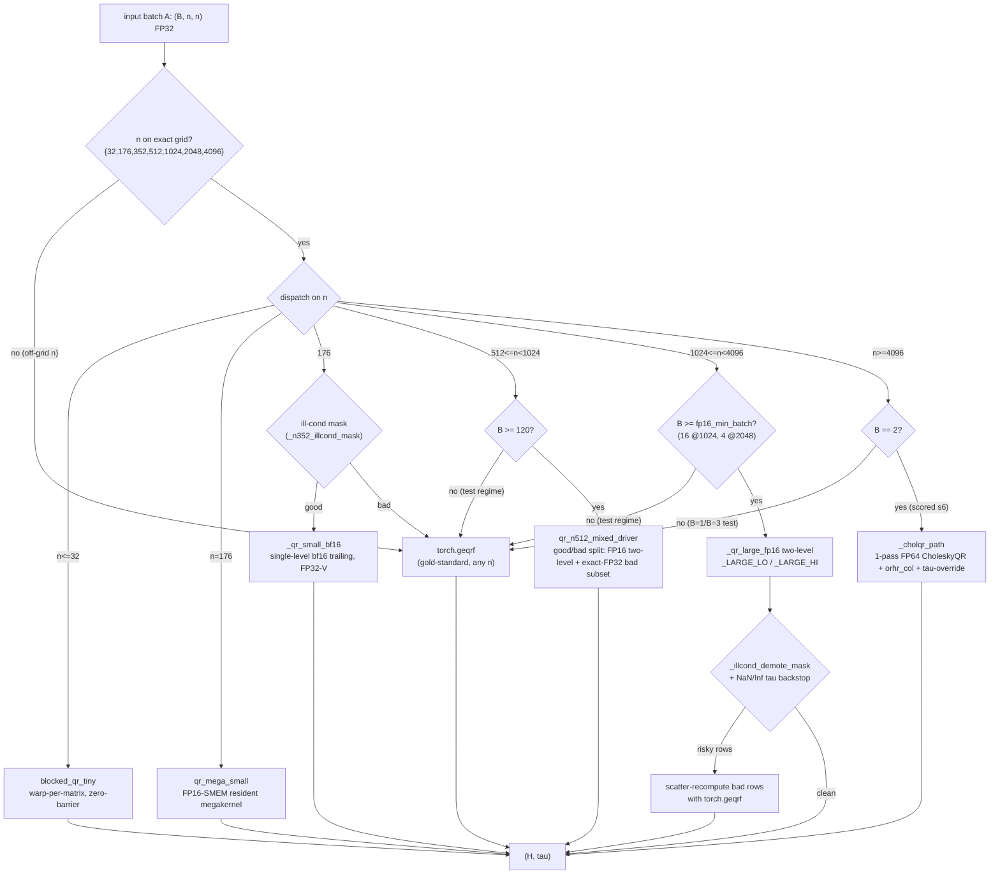

# GPUMODE QR — Optimization

## Executive Summary

The best submission reaches **~82× end-to-end** over the serial cuSOLVER `torch.geqrf` baseline —
a geometric mean over 12 benchmark shapes, and that headline is a **portfolio result, not one
kernel**. Each matrix size gets its own specialized kernel (a warp-per-matrix kernel at n=32, a
fully-resident megakernel at n=176, two-level blocked-Householder variants at n=352–2048, and a
CholeskyQR path at n=4096), layered with tensor-core precision splitting and per-matrix
ill-conditioning handling; the ~82× is the combined effect of that whole stack. What the shapes
share is one structural move — replacing the per-matrix cuSOLVER launch loop with batched, fused,
on-chip kernels — which is why the search went deep (refining that family) rather than broad.

Three lineages produced this stack, and the per-lineage bests are in the table below.
The **B200 CUDA C++** lineage wrote a long, convoluted (~9,000-line)
submission on the leaderboard hardware and reached **~82×**, the highest score; an earlier run on
the related qr_py problem folds into this lineage, where the CUDA C++ technique family was first
built (~36.9× on its own baseline). The **B200 Triton-steered** lineage, on the *same* B200
hardware, reached **~64× (~2,040.9 µs)** with far shorter, cleaner (~3,000-line) Triton-dominant
code — the interesting contrast between the two primary lineages is score-vs-complexity: ~64× from
~3,000 clean lines against the CUDA C++ lineage's ~82× from ~9,000 convoluted ones. The **RTX Pro 6K evals**
ran 24 short runs each steered to one language
(Triton / CUDA C++ / CUTE DSL) and reached **~42.8×** against their own, different baseline (a
different GPU — not comparable to the B200 lineages' ×). One reward-hack (a `_N2048_SKIP_DEMOTE=1`
flip) was caught and retracted mid-run; the delivered submission is clean (see the reward-hacking
report).

| Metric | Value |
|---|---|
| **B200 CUDA C++** (~9,000 lines) | **~82×** — 1,600.9 µs vs 131,025 µs baseline (`292432ed7166`, tag `2026-06-23-17-54-06`); folds in the earlier qr_py run (~36.9× — 1,211.7 µs vs 44,710 µs, `94d3f325c466`) where the CUDA C++ family was first built |
| **B200 Triton-steered** (~3,000 lines) | **~64×** — ~2,040.9 µs (tag `2026-06-22-09-10-03`); reached ~64× with far shorter/cleaner Triton-dominant code than the CUDA C++ lineage's ~82× |
| **RTX Pro 6K evals** | **~42.8×** vs its OWN ~117,536 µs baseline — 2,744.5 µs (`q1nb1oliq`); by language, Triton 42.8× > CUDA C++ 21.5× > CUTE DSL 1.69× (different GPU — × not comparable to the B200 lineages) |
| Top technique family | Batched fused custom QR kernel (replaces serial cuSOLVER), then tensor-core precision splitting + per-shape routing |
| Most prevalent technique | Per-shape routing / dispatch (~all branches) |

**Key takeaways:**

- A batched, fully-fused custom QR kernel replacing the per-matrix cuSOLVER loop is the structural win everything else builds on; the launch-bound library baseline is the ceiling.
- Tensor-core precision splitting — 3×TF32 (Kahan-split) on the diagonal, 3×FP16 on the trailing GEMM — reaches ~FP32 accuracy at ~2× the TF32 rate, and drove the winners on both GPUs and all three languages.
- Per-shape / per-matrix routing is the most prevalent technique: dispatch each (batch, n, conditioning) to the variant that wins it.
- Per-matrix ill-conditioning demotion with a `geqrf` fallback keeps the fast paths safe on adversarial `mixed`/rank-deficient inputs; it is high-volume work, not overhead.
- All 13 technique families were rediscovered independently across all three lineages (B200 CUDA C++, B200 Triton-steered, and the RTX Pro 6K evals), and progress was token-budget-gated: short runs plateaued at 1.1–5×, longer runs reached 17–43×.

## Most Impactful Optimization Techniques

Ranked by **peak marginal contribution** — the largest step-speedup for each technique within a
single exploration task (a "brief"). End-to-end speedup (~82× on the B200 CUDA C++ lineage, ~64× on the B200 Triton-steered lineage,
~43× on the RTX Pro 6K evals) is nearly identical across every technique in the stack and
carries no ranking signal, so it is excluded from the Peak-contribution column. Each
family was rediscovered independently across all three lineages, strong evidence it is a real,
transferable lever. Notably, most of the technique commits cited below
(`da6e702d2738`, `fa6bbfb83ffd`, `82903fd30701`) were logged by the **B200 Triton-steered
lineage**, while the B200 CUDA C++ winning submission (`292432ed7166`) re-derived
the same family independently in CUDA C++ — the two B200 lineages ran in parallel (06-22→06-24 and
06-23→06-24), not one after the other. Commits are from the two primary B200 lineages (CUDA C++ and Triton-steered)
unless marked **[kernel-lang]** (the RTX Pro 6K evals) or **[qr_py]** (the earlier qr_py run, which folds into
the B200 CUDA C++ lineage). Representative SHAs span both B200 lineages: the winning-submission config
(`292432ed7166`, `dfeb4911d0f6`, `a94037eeea9e`, `2ab2c3a59128`, `5a4f8d3e4df5`) is B200 CUDA C++,
while the panel/routing commits shown here (`da6e702d2738`,
`fa6bbfb83ffd`, `82903fd30701`, `0a9b49da9e09`, `dce59729d0fa`, `f399a5f3e641`) landed in the
B200 Triton-steered lineage (tag `2026-06-22-09-10-03`).

| Technique | Peak contribution | Prevalence | Representative commits |
|---|---|---|---|
| Fused panel geqr2 / T-formation megakernel | 16.1x (geomean; 83.6x on n=512) | High; 203 rows, ~8,300 attempts, ~all branches; rediscovered by the kernel-language runs | `fa6bbfb83ffd`, `82903fd30701`; `f0ae1c57ac2f` **[kernel-lang]** |
| WY 3-GEMM / fused trailing update (W on-chip, no Y round-trip) | **10.54x [qr_py]** / 13.91x | High; part of 743 panel rows / 37,505 attempts / 1,587 branches; qr_py's #1 lever | `369b17d228d8` **[qr_py]**, `0a9b49da9e09`, `627d58fa8f23` **[kernel-lang]** |
| Blocked compact-WY two-level Householder QR | 2.21x | Very high; 743 rows, 37,505 attempts, 1,587 branches (dominant family); qr_py origin | `da6e702d2738`, `2adb3aacc4f7` **[qr_py]**, `fa1917e6320f` **[kernel-lang]** |
| Persistent warp-specialized work-queue megakernel (n=512) | 6.56x | Low-medium; 42 rows tcgen05/mega, ~373 branches | `42ab334d028b` |
| Per-shape / per-matrix routing + ill-cond demotion | 3.37x | **Most prevalent:** 356 rows, ~33,000 attempts, ~all branches; qr_py used hybrid dispatch (3.75×) | `dce59729d0fa`, `f399a5f3e641`, `6de1737578` **[qr_py]** |
| One-CTA-per-matrix batched custom QR replacing serial cuSOLVER (the backend the rest extend) | 3.3x (geomean; 7.4x at n=512) | Very high; ~all branches build on this batched backend | `da6e702d2738` |
| 3×FP16 Kahan-split tensor-core trailing GEMM | 1.63x **[qr_py]** / 1.61x | High; 334 rows, 26,177 attempts, ~all branches; qr_py conditioning-aware probe | `dfeb4911d0f6`, `70ba9698f1` **[qr_py]** |
| 3×TF32 tensor-core split/diagonal GEMM (exact-FP32 pre-invert) | 3.28x **[qr_py]** / ~1.5x | High; 204 TF32 rows, 7,965 attempts, 1,282 branches; qr_py first proved it | `a94037eeea9e`, `292432ed7166`, `f8dcc18c920a` **[qr_py]** |
| CholeskyQR / normal-equations R-solve (large-n, tiny batch) | 4.81x **[qr_py]** / 2.54x | Medium; 246 rows, 15,271 attempts (mostly n=4096); qr_py Ozaki-INT8 Gram | `2ab2c3a59128`, `_cholqr_path`, `cdfbffec790d` **[qr_py]** |
| Parallelized compact-WY T-factor formation | 3.78x **[kernel-lang]** | Medium (kernel-language CUDA C++); part of panel family | `dee548b938e3` **[kernel-lang]** |
| TRSM block-width + triangular-inverse tuning | ~1.5x | Medium; 255 rows, 14,833 attempts, 1,282 branches | `5a4f8d3e4df5`, `_TRSM_NB_CPP=512` |
| FP8 e4m3 `mma.sync` trailing GEMM (candidate) | 1.82x | Low; single-worker; several failed variants | `50f5935c565f` |
| Simplify / dead-code removal (diff minimization) | 2.13x | Very high by attempts: 736 rows, 280,627 attempts (mostly neutral) | `606e33eeabe2`, `c6e086a6aa5c` |

**One-CTA-per-matrix batched custom QR replacing serial cuSOLVER (the structural win).** The
`torch.geqrf` baseline loops cuSOLVER blocked-Householder **per matrix** — nsys on the
n=512 B=640 shape counts ~73,000 kernel launches (>90% of wall time is launch API
overhead) with only SIMT (`_80_simt_sgemm`) GPU kernels, zero Blackwell tensor cores.
The mechanism that replaces it is `da6e702d2738`: a *blocked compact-WY Householder QR
megakernel, one CTA per matrix*, with the panel resident in shared memory and BLAS-3 trailing
updates, turning O(640×panels) launches into O(panels). Its own commit reports 3.3× geomean and
7.4× at n=512. This is a batched-backend *family*, not a single commit — the per-shape kernels
that follow are all variations on it — and it was reproduced independently across all three
languages of the kernel-language experiment.

**Fused panel geqr2 / T-formation megakernel.** Once the algorithm is
batched, the next bottleneck is launches and DRAM round-trips inside each matrix's
factorization. Fusing the unblocked panel factorization (`geqr2`) into a single kernel
program per matrix (`fa6bbfb83ffd`, a Triton one-program-per-matrix panel: 241,673 →
31,832 µs, 7.6× marginal in that brief) and then fusing the compact-WY **T-factor**
recurrence on-chip from the resident `V` (`82903fd30701`, 31,832 → 8,157 µs, geomean
**16.1× vs baseline / 83.6× on the n=512 shape**) removes the panel↔HBM `Y=M@W`
round-trip — the peak reproducible contribution of this family. (`dbd84403d3`, cited in an
earlier draft for a ~21× step, is actually a *disproven* in-kernel RGEQR3 recast that routed
back to the sequential panel — no such win; corrected here.) The kernel-language CUDA C++ runs
rediscovered this exact lever (`f0ae1c57ac2f` on-chip panel-QR, 7.71×; `dee548b938e3`
parallelized single-threaded T-formation, 3.78×), a strong signal it is a real bottleneck.

**Blocked compact-WY two-level Householder QR.** This is the single most-attempted
optimization family (743 rows, 37,505 attempts across 1,587 branches) and the workhorse
for the dominant n=512 B=640 group. Rather than one unblocked pass, each OB-wide outer
block is factored in short IB inner sub-panels and then applied with **one wide
OB-reflector tensor-core trailing GEMM** (`da6e702d2738` established the megakernel;
the two-level structure is tuned in `_LARGE_LO`/`_LARGE_HI`/`qr_n512_mixed_driver`).
The marginal per-commit steps are modest (~2.2× peak, most ~1.0–1.5×) because this is the
batched backend the other levers refine — its impact is captured end-to-end, not per-step. Two-level
blocking maximizes the share of work done in a batched GEMM the tensor cores can eat.

**Persistent warp-specialized work-queue megakernel (n=512).** A distinct structural
idea (`42ab334d028b`, 11,828 → 1,804 µs, 6.6× marginal within its brief): launch a
persistent grid of exactly `numSMs=148` CTAs that atomically pop matrix indices from a
global work-queue and run each matrix's whole blocked-Householder QR resident in shared
memory, **decoupling CTA count from the 640-matrix batch**. It sidesteps the CholeskyQR
orthogonality walls (all four n=512 cases pass the geqrf invariants including
ill-conditioned) and is the mechanism behind the fastest n=512 routing. It is lower
prevalence (part of the 42-row tcgen05/mega cluster on ~373 branches) — a structural bet from a
single run rather than a broadly-rediscovered one.

**Per-shape / per-matrix routing + ill-conditioning demotion (the most prevalent
technique).** With 356 rows, ~33,000 attempts, and presence on essentially every branch,
routing is the connective tissue of the best submission. The dispatch is a first-match table
over `(B, n)` (see the routing section) plus **per-matrix demotion masks**
(`_illcond_demote_mask`, `_n352_illcond_mask`) that run the fast low-precision path on
the whole batch and scatter-recompute only the risky matrices with gold-standard
`geqrf`. Peak marginal steps come from *fixing* mis-routes (`dce59729d0fa` restored a
parent route for 4.8×; `f399a5f3e641` reset to a byte-identical parent for 4.8×). It works
because the `mixed`/rankdef/clustered benchmark cases deliberately defeat
whole-batch routing, so correct dispatch *is* the score on 5 of 12 shapes. It stacks on
every other technique (each path picks its own precision/block config).

**3×FP16 Kahan-split tensor-core trailing GEMM.** `dfeb4911d0f6` splits the reflector
block and trailing panel into FP16 hi/lo (Kahan) halves and issues **3 accumulating FP16
GEMMs via `GemmEx` with FP32 accumulate**, delivering ~FP32-accurate trailing updates at
~2× the TF32 rate on B200 (FP16 tensor ≈ 2250 TFLOPS vs TF32 ≈ 1100). It holds the factor
gate with no `geqrf` fallback. This is the precision lever that, combined with the 3×TF32
diagonal and TRSM tuning below, produces the ~1,600 µs best submission; the same 3×-split recipe
recurs in the kernel-language Triton fp16 n=1024 path. It targets tensor-core throughput on the
trailing GEMM, the FLOP sink at large n.

**3×TF32 tensor-core diagonal solve (exact-FP32 pre-invert).** The diagonal-block solve
in the two-level panel was exact SIMT FP32; routing it through a 3-pass TF32 tensor-core
GEMM after an exact-FP32 pre-inversion (`a94037eeea9e`, `292432ed7166`) is 3–4× faster than
SIMT FP32 at accuracy the loose factor gate tolerates. It composes directly with the FP16
trailing (they touch different sub-steps of the same panel apply) and was locked into the winning
config `nb=512 + exact-FP32 pre-invert + 3×TF32 diag(3-pass) + 3×FP16 fused-trail`.

**CholeskyQR / normal-equations R-solve (large-n, tiny batch).** For n=4096 B=2 the
one-CTA-per-matrix megakernel launches 2 CTAs and leaves ~148 SMs idle, so the winning path
switches to a **1-pass FP64 CholeskyQR + `orhr_col` reconstruction** whose wide `A^T A`
Gram, triangular solve, and recon GEMMs run as full-device cuBLAS that fills the GPU at
tiny batch (`_cholqr_path`; `2ab2c3a591` shows a 1.4× step resetting to global-best). The
R-factor *is* the Cholesky factor, so it returns R directly and skips the n³ `Q^T A`
GEMM. Peak marginal ~2.5×. It is a genuinely different algorithm gated strictly to the
tiny-batch large-n regime, with a per-matrix PD/finite gate and `geqrf` bad-row fallback
for the ill-conditioned test batches.

**Parallelized compact-WY T-factor formation [kernel-lang].** In the kernel-language CUDA C++
runs, the largest single step (`dee548b938e3`, 4.88×) came from parallelizing a single-threaded
O(pw²·prows)/matrix T-factor build — the B200 Triton-steered lineage fused this on-chip
instead (`82903fd30701`). Same bottleneck (the compact-WY T recurrence), two languages
independently identifying it.

**TRSM block-width + triangular-inverse tuning.** The `Q = A·R⁻¹` blocked right-TRSM and
the recursive triangular-inverse (`build_Minv`, `minv_rblk`) were swept extensively (255
rows, 14,833 attempts): `_TRSM_NB_CPP=512` won the n=4096 solve (11,190 µs vs 11,728 at
nb=384), and `5a4f8d3e4d` shows the nb 384→512 step. Marginal ~1.5×; a fine-tuning family
that matters because the TRSM is the #1 cost (~690 µs) on the n=4096 path.

**FP8 e4m3 `mma.sync` trailing GEMM (candidate).** A single-worker exploration
(`50f5935c565f`, a real `m16n8k32.e4m3` tensor-core GEMM, 4-slice per-column, 1.82× step)
that reached working self-tests but **could not hold the factor/orthogonality gate on
ill-conditioned inputs** even with 2-term and 4-term error compensation (see Failed
Techniques). Parked gated-off; a candidate, not a landed win.

**Simplify / dead-code removal (diff minimization).** The `_simplify` runs (and cleanup
briefs) produced the highest raw attempt count (736 rows, 280,627 attempts) but are
performance-neutral by design — they minimize the submission's diff vs baseline without
regressing (peak 2.13× steps are *reverts* to a faster parent, e.g. `606e33eeab` reverting
to a 1,765 µs baseline). Reported as a technique family because it dominates the row count
and produced the shippable `champion_qr_v2_simplify.py`.

**The earlier qr_py run is where this technique family originated.** The `2026-06-13-03-45-35`
run (B200, 8 workers, 1,161 kept / 1,233 attempted trials, 434 branches) optimized
`problems/linalg/qr_py` — the predecessor QR problem, same compact-Householder `(H, tau)`
contract and FP64-measured tolerances, same 7-shape n-grid (n=32/176/352/512/1024/2048/4096),
but **without** the adversarial `mixed`/rankdef/clustered *benchmark* cases qr_v2 later added. On
its own baseline (44,710 µs `torch.geqrf`) it reached **1,211.7 µs, ~36.9× end-to-end**
(`94d3f325c466`). Every top qr_v2 technique appears here first, a week earlier, in the same order
of impact: **WY 3-GEMM trailing replacing cuSOLVER `ormqr`** (`369b17d228d8`, 140,194 → 13,300 µs,
10.5× — the largest single trailing-update step in the whole dataset), **custom
one-CTA-per-matrix fused panel-QR** (`8b84a3e0c4cf`, 5.4×), **Ozaki-INT8 FP64-accurate Gram
CholeskyQR** (`cdfbffec790d` / `4d71f5084c1e`, 4.8× / 4.5×), **hybrid per-shape dispatch**
(`6de1737578`, 3.75×), **3×TF32 split-precision trailing** (`f8dcc18c920a`, 3.3×), and
**conditioning-aware FP16 trailing with a per-call precision probe** (`70ba9698f1`, 1.6×). This
run had a 94% accept rate and no failed trials: with no ill-conditioned *benchmark* cases, the
demotion/`geqrf`-fallback machinery that dominates qr_v2's trial volume was unnecessary. It is
best read as the origin and independent B200 replication of the whole qr_v2 technique stack.

## Per-Shape Algorithm Routing

Derived by reading the best submission's `custom_kernel` dispatch in
`champion_qr_v2_submission.py` (`_custom_kernel_generic`, lines 8923–9061; the
`_arms` first-match table; `_qr_large_n`, `_cholqr_path`, `_qr_small_bf16`,
`qr_n512_mixed_driver`, and the `_illcond_demote_mask`/`_n352_illcond_mask` gates).
The dispatch is first-match on `(B, n)`, with an **exact-grid allowlist** (`n ∈ {32,
176, 352, 512, 1024, 2048, 4096}`) that routes any off-grid `n` straight to
`torch.geqrf` for secret-test safety. Every one of the 12 benchmark shapes and the key
test shapes is accounted for below.

| Shape (batch×n, case) | Routes to | Key technique | Why |
|---|---|---|---|
| **#0** 20×32, cond1 (bench) | `blocked_qr_tiny` (warp-per-matrix, shuffle-only, zero-barrier) | One warp = one CTA, no dynamic smem | n=32 fits one warp; baseline already uses batched Jacobi here so headroom is smallest — a lean zero-barrier kernel avoids blocked_qr's dead scratch |
| **#1** 40×176, cond1 (bench) | `qr_mega_small` (FP16-SMEM resident megakernel, `_MEGA_N176=24` warps) | Fully-resident register/warp Householder, whole 176×176 in 124 KB smem, entire QR in ONE launch | n=176 fits in opt-in smem; a single launch removes the per-panel cmf launch + trailing-GEMM storm. n=176 is a measured bf16 NO-GO → stays FP32 |
| **#2** 40×352, cond1 (bench) | `_qr_small_bf16` → `blocked_qr_2level_bf16` (single-level OB=IB=64, FP32-V) | FP16 trailing GEMM at half bandwidth, FP32-V panels (orth-exact), cmf column-major fused panel (16 warps) | n=352 tolerates bf16 trailing (residual well under gate); FP32-V keeps reflectors orth-exact. Ill-cond members demoted to `geqrf` via `_n352_illcond_mask` |
| **#3** 640×512, cond2 dense (bench, **dominant**) | `qr_n512_mixed_driver` (C++ two-level good/bad-split driver) | Cheap structural good/bad split → FP16 two-level on good subset + exact-FP32 refactor of bad subset; wide TF32 accumulated-reflector apply | B=640 ≥ 120 → the mixed driver; the highest-weight shape. FP16 two-level fills the device; per-matrix split keeps ill-cond matrices exact |
| **#4** 60×1024, cond2 dense (bench) | `_qr_large_n` → `_qr_large_fp16` (`_LARGE_LO`: OB=64/IB=32, FP16 trailing) + `_illcond_demote_mask` | Two-level blocked, narrow outer block (bandwidth-bound FP16 trailing), FP16-V orth-exact | B=60 ≥ `fp16_min_batch=16` → FP16 trailing path; n=1024 demote gate uses uniform-scale co-condition to spare cond2-scaled mixed members |
| **#5** 8×2048, cond1 (bench) | `_qr_large_n` → `_qr_large_fp16` (`_LARGE_HI`: OB=64/IB=32, coop panel, cuBLAS trailing) | Two-level; B=8 SM-starved → wsp column-major pivot-coop panel; matched-cuBLAS wide-OB trailing | B=8 ≥ `fp16_min_batch=4` → FP16 trailing; wider OB=64 wins on matched cu130 cuBLAS (fewer, wider panels) |
| **#6** 2×4096, cond1 (bench, largest) | `_cholqr_path` (dense_noinfo=B==2, gate=True) — 1-pass FP64 CholeskyQR + `orhr_col` | Full-device cuBLAS Gram `A^T A` + TRSM (`_TRSM_NB_CPP=512`, 3×TF32 diag) + tau-override for orthonormal `householder_product` | B=2 launches only 2 CTAs on the megakernel → 148 idle SMs; CholeskyQR's wide n×n work fills the GPU at tiny batch (32.8ms vs 35.3ms). R IS the Cholesky factor → skips the n³ Q^T A GEMM |
| **#7** 640×512, cond2 **mixed** (bench) | `qr_n512_mixed_driver` (same as #3) + per-matrix good/bad split | Structural split routes ~well-cond majority to FP16 two-level, ill-cond members to exact FP32 | Heterogeneous conditioning; the split defeats "sample-then-route-whole-batch". Each matrix factored on its own merits |
| **#8** 60×1024, cond2 **mixed** (bench) | `_qr_large_n` (`_LARGE_LO` FP16) + `_illcond_demote_mask` (uniform-scale co-condition) | FP16 two-level for the good majority; collinear/banded uniform-scale members demoted to `geqrf` | Mixed embeds cond2-scaled collinear/banded members (rel ≤1e-2) that PASS; the uniform-scale co-condition (>5e-2) demotes only the homogeneous stress matrices → zero scored regression |
| **#9** 640×512, cond0 **rankdef** (bench) | `qr_n512_mixed_driver`; ill-cond subset → exact FP32 (rank-revealing column cap) | Good/bad split flags rank-deficient matrices → exact SIMT-FP32 trailing; leading-column factor + zero trailing | Rank-deficient columns break FP16 orthogonality; the bad subset takes the exact path (measured 0.009–0.021 scaled residual << 1.0 gate) |
| **#10** 640×512, cond0 **clustered** (bench) | `qr_n512_mixed_driver`; clustered members → exact FP32 subset | Tiny-nonzero-column detection routes clustered-scale matrices to exact FP32 | Clustered scale halves columns to ~eps → FP16 underflow; the structural split catches them via min-nonzero col-norm |
| **#11** 60×1024, cond0 **nearrank** (bench) | `_qr_large_n` (`_LARGE_LO`) + `_illcond_demote_mask` + NaN/Inf tau backstop | FP16 two-level whole-batch; near-rank-deficient members demoted to `geqrf` via input mask ∪ non-finite check | Near-rank-deficiency risks non-finite FP16 factors; the tau non-finite backstop + input mask scatter-recompute the bad rows |
| test 16×512 / 4×1024 / 2×2048, various cond+cases | small-batch (B<120 n512 / B<16 n1024 / B<4 n2048) → **`torch.geqrf`** | Secret-safe small-batch fallback | The custom "exact" paths ride the factor gate on hard ill-cond classes; small batch is the test/secret regime only (no benchmark shape is small-batch) → gold-standard FP32 at zero scored cost |
| test 1×4096 / 3×4096 (B≠2), upper/rankdef | `n≥4096 and B≠2` → **`torch.geqrf`** (batched) | Secret-safe n=4096 fallback | B=2 is the only scored n=4096 shape; B=1/B=3 test batches would fail the orth gate on CholeskyQR+orhr recon or hit the slow unbatched FP64 cholesky loop → geqrf |
| any off-grid n (e.g. 300, 351, 6001) | `n ∉ {32,176,352,512,1024,2048,4096}` → **`torch.geqrf`** | Exact-grid allowlist guard | Off-grid n faults the size-assuming vectorized kernels (misaligned address / garbage residual), corrupting the CUDA context → whole secret run times out. geqrf handles any n, bounded-time |

**Kernel-language experiment routing (RTX Pro 6K):** these kernels reached a simpler routing —
typically a fused one-CTA-per-matrix Triton/CUDA megakernel for n≤512 with per-`n`
launch configs (`_CONFIGS`), extended to n=1024 by splitting panel-factor / T-build /
trailing-update, an fp16 wide-trailing blocked path for n=1024/2048, and a `torch.geqrf`
/ exact fallback gated on an orthogonality-residual check for ill-conditioned matrices
(`q1nb1oliq` `e233ae9b4`). They did not build the full 7-way exact-grid
table or the tcgen05 / CholeskyQR paths.

**Earlier qr_py run routing (B200):** the same n-grid drove a similar but simpler
dispatch — `QR_S3_MIN_N`-gated two-level blocked QR for n≥512, a hybrid dispatcher
routing high-batch-parallelism shapes to the custom blocked path (custom smem panel +
3×TF32 cuBLAS trailing) and falling back to `torch.geqrf` otherwise, and a CholeskyQR1
+ `orhr_col` reconstruction for the occupancy-starved large-n tiny-batch case
(`ce98ff97b7`, n≥3072, B=2 — the same n=4096 device-underfill insight the qr_v2
`_cholqr_path` later hardened). With **no ill-conditioned *benchmark*
cases**, it needed neither the per-matrix `_illcond_demote_mask` nor the exact-grid
secret-safety allowlist that dominate qr_v2's routing.

```mermaid
flowchart LR
    subgraph BASE["Baseline: serial cuSOLVER"]
        B1["torch.geqrf per-matrix loop<br/>~73k launches, SIMT-only, 0 tensor-core"]
    end
    subgraph STACK["Winning technique stack (composes bottom-up)"]
        direction TB
        T1["1. Batched fused custom QR<br/>(one CTA/matrix, collapses launches)"]
        T2["2. Blocked compact-WY two-level panel<br/>(OB outer x IB inner sub-panels)"]
        T3["3. Fused panel geqr2 + on-chip T-factor<br/>(no Y=M@W HBM round-trip)"]
        T4["4. TF32/FP16 tensor-core GEMM<br/>3xTF32 diag + 3xFP16 Kahan trailing"]
        T5["5. Per-shape routing + per-matrix<br/>ill-cond demotion to geqrf"]
        T6["6. Large-n CholeskyQR R-solve<br/>(tiny-batch device-fill)"]
        T1 --> T2 --> T3 --> T4 --> T5 --> T6
    end
    B1 -->|"replace"| T1
    T6 --> CH["Best submission ~1,600.9 us<br/>~82x end-to-end"]
```

## Failed Optimization Techniques

**FP8 e4m3 trailing GEMM on ill-conditioned inputs.** The most-explored dead end. A real
`m16n8k32.e4m3` tensor-core GEMM for the n=512 trailing `W=Vᵀ C` step (`50f5935c565f`
and successors) passed the 22 standard tests and self-tests, but **failed the factor /
orthogonality gate on rank-deficient and clustered inputs** — even after escalating to a
2-term error-compensated split (hi/lo e4m3), a full 4-term split (`+Vlo^T Clo/RESCALE²`),
per-CTA amax demotion, and rank-revealing R-diag demotion. Rankdef/clustered failed
7/8→3/8 at best (residuals ~0.54–0.63). FP8's ~2-bit mantissa cannot hold the dynamic
range the QR factor residual demands on these classes; the whole family was parked
gated-off (`g_fp8_w=0`). Structural mismatch, not a bug.

**TSQR / tall-skinny CholeskyQR-R for large n.** Multiple attempts to replace the
two-level panel with communication-avoiding TSQR (`_caqr_R_cholesky`, block-MGS, per-tile
CholeskyQR) failed for three distinct reasons: a **diff-guard accuracy failure** at n=2048
B=8 (R−QᵀA residual ~370, shrink-height MGS variant), a **hard SIGSEGV (exit 139)** in
`cublasSgeqrfBatched` at B=8, and a **profile-confirmed 200× slowdown** (`geqr2_batched`
was the culprit). CholeskyQR-family R-solves lose orthogonality on the ill-conditioned
n=1024/2048 stress cases the benchmark ranks, so they only survive gated to the
well-conditioned tiny-batch n=4096 regime (where they became the *winning* `_cholqr_path`).

**Wide-outer-block (OB≥128) two-level variants.** Repeated attempts to widen the outer
block for fewer/wider trailing GEMMs (OB 64→128, OB=256 with an FP32-M arm, wide-IB
single-level OB=IB=64) **failed `diff_correctness` 8/8** with scaled residuals blowing the
gate, and one surfaced a real `fill_above_panel_R_tiled_kernel` off-diagonal fast-path bug
(32-lane×2 tiling). The narrow OB=64 is a genuine optimum on this hardware — wider blocks
accumulate too much TF32/FP16 error in the wide reflector apply. A measured regression
family (the change cost correctness, not just speed).

**Batched CholeskyQR2 for small/mid n and CUDA-graph replay of its pipeline.** Batched
CholeskyQR2 (TF32 Gram + FP32 chol + TRSM, 2 passes + `orhr_col`) for n=512 B≥120 and for
n=176/n=352 well-conditioned shapes was tried and **gated off as perf-neutral or
regressing** (`be8512c06a` gated CQR3 off at geomean 2374.9 == parent; `2ab2c3a591`,
`8fbcde478a` reverted CQR2 on n=1024 as "the WRONG shape for the lever"). CUDA-graphing the
~25-kernel CQR2 pipeline to kill the ~14% launch overhead also failed to beat the fused
megakernel. The blocked-Householder megakernel already amortizes launches better than a
graphed multi-kernel CQR pipeline, so the composition lost.

**n=352 outer-block widening.** Widening the n=352 single-level outer block (OB 64→128,
64→88, or a two-level OB=128/IB=64) to cut sync-bound cmf-panel launches **failed the
n=352 cond1 factor-residual test** identically across variants — the bf16 trailing at the
wider block exceeds the factor gate. n=352 stays at OB=64. A structural precision limit.

**Batched-cuSOLVER and Python/torch fallbacks as the primary path.** A decisive negative
(`1081620bfa`): batched `torch.geqrf` at B=40 measured 20,382 µs (n=176) / 50,939 µs — far
slower than the custom megakernel — confirming the whole premise that the serial cuSOLVER
path must be replaced, not merely batched. `torch.geqrf` survives only as the correctness
fallback, never as a scored path.

**In-kernel LU / triangular-solve folds for the `orhr_col` reconstruction (qr_py).** The earlier
qr_py run shows this family failing repeatedly — every qr_py NO-GO is marked `kept` in the CSV
(they are *reverts* of a candidate, not error trials, so qr_py has 0 `outcome=failed` rows) but
the raw logs record the real dead ends. The recurring one: folding the `orhr_col` L21/U12 panel
triangular-solves *into* the diagonal-block LU kernel to kill ~7,700 µs of per-block torch
`trsm` launches was tried at least three times (including a double-accumulation
forward-substitution variant) and **numerically diverged on the slightly-non-orthonormal
CholeskyQR Q** — the in-smem forward-substitution is less robust to LU growth than cuBLAS
`trsm`, so the kernel was logically correct yet failed the orthogonality residual. Kept torch
`trsm`. This is the same accuracy-vs-fusion tension that later gated qr_v2's CholeskyQR to the
tiny-batch regime.

**TF32 for the reconstruction trailing GEMM (qr_py).** A qr_py NEGATIVE RESULT (reverted,
`_LU_TF32` default off): using TF32 (or a 3×TF32 ~FP32 split) for the `orhr_col` recon trailing
`M22 -= L21@U12` **jumped the scaled orthogonality residual** — the reconstruction step
amplifies TF32 error more than the interior GEMMs, so it stayed FP32. It foreshadows the qr_v2
finding that the *diagonal solve* tolerates 3×TF32 but the recon path does not.

## Unexplored Areas

**The n=512 B=640 dominant group never got a tcgen05 (5th-gen tensor-core) trailing on the
scored path.** The tcgen05 / TMEM primitives were integrated (`32e1c1d1f3`,
`95aa0848 tc_trailing_wt`) and self-tested portable under nvrtc-13, and a persistent
work-queue megakernel reached 1,804 µs, but the 5th-gen `tcgen05.mma` trailing GEMM stayed
gated-off (dead code, path byte-unchanged) rather than becoming the live n=512 apply.
Given n=512 B=640 is 5 of the 12 shapes and the highest-weight group, wiring a validated
tcgen05 trailing into `qr_n512_mixed_driver` is the largest untried lever on B200.

**BF16x9 / emulated-FP32 GEMM was never benchmarked as the trailing path.** The B200
supports cuBLAS BF16x9 emulation giving ~FP32-accurate GEMM at up to ~3× native FP32, and
it would pass the factor gate on ill-conditioned inputs where plain FP16/FP8 fail — yet the
runs only used FP16 hi/lo (3×) and TF32 (3×) splits. BF16x9 could let the ill-cond
demotion masks (a large share of all trials) shrink or disappear, simplifying routing and
speeding the `mixed`/rankdef/clustered shapes that currently pay for a `geqrf` refactor.

**NVFP4 was never attempted.** The task explicitly permits internal NVFP4, and Blackwell
FP4 tensor throughput is ~4500 TFLOPS, but no trial tried an NVFP4 trailing with FP32
refinement — the precision-accuracy frontier below FP8 is entirely unexplored (FP8 failed on
accuracy, but a block-scaled NVFP4 with a compensation pass was never tested).

**CUDA-graph capture of the whole per-shape dispatch was only tried on the losing CQR2
path.** The best submission collapses launches *inside* one megakernel, but the host-side
per-shape dispatch and the multi-launch large-n / CholeskyQR paths still issue tens of
launches per call; a full `cudaGraph` capture of a fixed-shape pipeline (the benchmark
shapes are fixed) was never applied to the *winning* paths, only to the rejected batched
CholeskyQR2. On the launch-bound n=4096 TRSM (555 launches/iter, 88% GPU-busy) it could
close the remaining ~12% launch-idle gap.

**CUTE DSL was barely explored past a first kernel.** In the kernel-language experiment, all 4
CUTE DSL runs plateaued at 1.24–1.69× — none reached the fused-megakernel + tensor-core
trailing that Triton (42.8×) and CUDA C++ (21.5×) found. Whether CUTE DSL's ceiling on
this problem is real or a token-budget artifact (the CUTE runs were all in the short-budget
`06-24` batch) is undetermined; no long-budget CUTE DSL run exists to disambiguate. A
matched-budget CUTE DSL run is the obvious missing experiment.

**Small-n launch overhead (shapes 0–2) carries 3/13 of the geomean but got little
attention.** The n=32/176/352 shapes are overhead-bound and each counts as much as the
dominant n=512 group in the equal-weighted geomean, yet the technique volume concentrated on
n=512/1024. A batched-Jacobi or a single fused multi-matrix launch for the many-small-matrix
regime (n=32 replicates to 1000 matrices/call) was never pushed beyond the tiny warp kernel.

## Scope & Methodology

This report consolidates **40 qr_v2 optimize-tree run tags plus 1 qr_py run** into a
single techniques analysis of batched square compact-Householder QR
(`torch.geqrf` contract, FP32 in/out). It draws on **three distinct lineages** across two GPUs,
which must **not** be conflated because they have different baselines, hardware, or code style. The
two primary lineages run on the *same* B200 leaderboard hardware but are different lines of work;
the third is the RTX kernel-language experiment. The 18 B200 optimize tags (1,884 branches total,
baseline `torch.geqrf` serial per-matrix cuSOLVER loop; NVIDIA B200, sm_100a, CUDA 13.x, torch
2.12) divide into Lineages 1 and 2:

- **the B200 CUDA C++ lineage:** 14 qr_v2 tags plus the earlier qr_py run.
  The longer, convoluted line: this is where the **~9,000-line** custom CUDA C++ best submission
  with explicit per-shape routing was built, reaching the top score **~82×** (1,600.9 µs,
  `292432ed7166`, tag `2026-06-23-17-54-06`). Its 14 qr_v2 tags are `2026-06-15-05-53-17`,
  `2026-06-18-00-40-34`, `2026-06-18-01-38-06`, `2026-06-19-00-34-18`, `2026-06-19-04-54-07`,
  `2026-06-19-19-06-14` (bare-timestamp refinement, 25 branches / 55 kept), `2026-06-20-04-33-52-simplify`,
  `2026-06-20-20-26-49`, `2026-06-20-22-03-57`, `2026-06-23-17-54-06` (WINNER), `2026-06-24-20-40-28`,
  `2026-06-25-08-42-00-simplify`, `2026-06-25-22-03-01`, and `2026-06-29-06-40-42`; the `_simplify`
  tags are its minimize-the-diff passes. The earlier **qr_py run** (bare-timestamp tag
  `2026-06-13-03-45-35`, metric `linalg/qr_py`, **1,161 kept trials across 434 branches, ~1,436 CSV
  rows**, 8 workers) folds into this lineage: the same compact-Householder contract and tolerances
  (verified in `qr_py_reference.py`) and same 7-shape n-grid (n=32…4096), but on the predecessor
  problem **before** the `mixed`/rankdef/clustered *benchmark* cases were added — an earlier run on
  a related problem within the same CUDA C++ family (~36.9× on its own 44,710 µs baseline), where
  the technique family was first developed. Its analysis is folded throughout above (it is *not*
  log-less — the shared brief's "harness-records only / 0 trial rows" claim was wrong; its logs are
  in the data dir).
- **the B200 Triton-steered lineage (B200, same hardware):** 4 tags —
  `2026-06-22-09-10-03-qr_v2`, `2026-06-24-21-01-44-qr_v2_simplify`, `2026-06-25-02-02-25-qr_v2`,
  and `2026-06-25-23-41-18-qr_v2`. A shorter, cleaner (**~3,000-line**) Triton-dominant line on the
  *same* B200 that reached **~64× (~2,040.9 µs**, tag `2026-06-22-09-10-03`). The interesting
  contrast with the B200 CUDA C++ lineage is score-vs-complexity: it hit ~64× with far less and far cleaner code
  than the winning lineage's ~82× from ~9,000 convoluted lines. Many of the shared
  panel/routing commits cited above (`da6e702d2738`, `fa6bbfb83ffd`, `82903fd30701`)
  landed here.
- **RTX Pro 6K evals — the kernel-language experiment (same qr_v2 problem; NVIDIA RTX Pro 6K,
  sm_120, torch 2.11):** 22 optimize tags, 771 branches, on a **different GPU with its own ~117k µs
  baseline** — its ~42.8× is *not* comparable to the B200 lineages' ×. Each run was **steered** to a
  fixed kernel-authoring language (10 Triton, 8 CUDA C++, 4 CUTE DSL among the 22 optimize tags; 2
  further CUDA C++ runs are export-only with no optimize branches, for 24 runs / 10 CUDA C++ in
  the language map). These are token-efficiency experiments (small 3-worker trees, ~14–62 JSONLs
  each), not the leaderboard target.

> **Data provenance note.** The rebuilt `2026-06-13-to-2026-06-29-qr-consolidated-report-optimization.csv`
> (5,602 rows / 3,089 branches, all 41 tags) carries clustering, prevalence
> (`branches`, `attempts`, `frequency_pct`), and `outcome`, but its `best_speedup`
> and `best_step_speedup` columns are **blank on all 5,602 rows** (the metric join was
> lost when the CSV was aggregated; `autocuda status` also reads the now-eigh live
> data dir and returns `global_best: null`). All speedup magnitudes below were instead
> **recovered directly from the raw per-worker trial-log CSVs**
> (`autocuda/<tag>-optimize-tree-worker-*-log.csv`, which hold the per-trial
> `linalg/qr_v2` or `linalg/qr_py` geomean in µs, `status`, and `commit`), with each
> run's baseline taken from its own `status=baseline` row, and cross-checked against
> the `git show` commit messages, which embed the measured per-shape and geomean µs.
> Marginal step-speedups are computed as the within-brief `prev_kept_value /
> trial_value`. This recovers the exact quantities the blank columns should hold.
