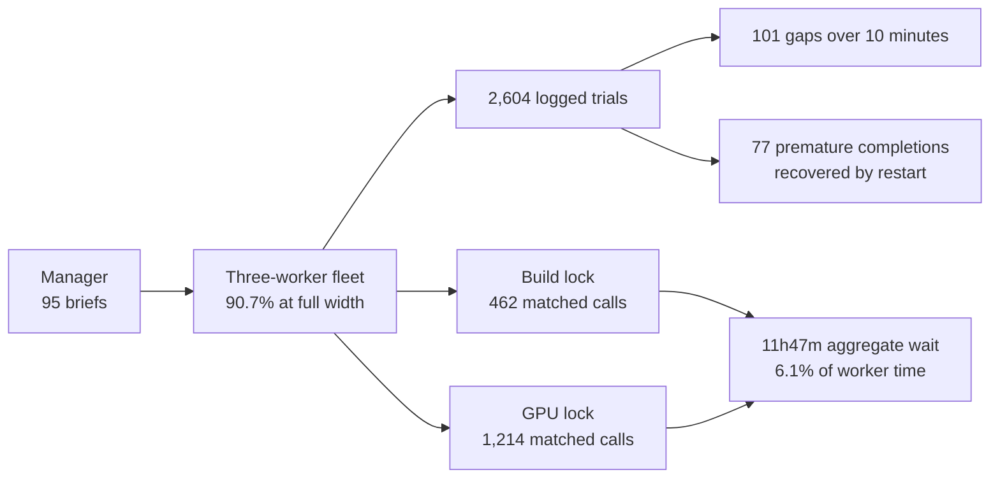

# Behavior Report: 2026-07-03-13-39-25

## Executive Summary

This single optimize-tree experiment was productive but operationally uneven: the CSV records 2,601 trials over 191.63 aggregate worker-hours, with an arithmetic mean of 14.94 and a pooled rate of 13.57 trials/hour. Reliability was mixed: 40 branches contain 101 trial transitions over ten minutes, and 39 branches made 77 completion attempts that the manager reversed with another cycle; one experiment cannot establish cross-run stability.

**Key takeaways**

- The fleet held the requested three active briefs for 62h21m26s of the 68h42m46s run (90.7%); the longest under-strength stretch was 1h17m02s before brief 89 resumed.
- Matched lock records show 11h47m03s of conservative aggregate wait, 6.1% of CSV worker-time. Brief 30 paid the most at 1h01m01s, and brief 7 had the worst single wait at 440.0s.
- The harness contains 172 completion outputs. Seventy-seven were premature because the same branch was later restarted; there were no "should I keep going?" questions.
- The longest true orchestration stall was brief 4's 71m22s stop/restart gap. Brief 89's 2h35m07s longest gap instead contained continuous worker activity.
- The report CSV understates the log by three trials because one-trial briefs 20, 21, and 94 are emitted as zero-duration rows; five trial rows also contain invalid manually expanded commit SHAs.

**Run:** 95 branches, 2,601 CSV-counted trials (2,604 trial log rows), 191h37m59s aggregate CSV worker walltime; arithmetic mean 14.94 trials/hour, pooled rate 13.57, and worst reported rate 0.00 on three single-trial artifacts (6.24 worst meaningful rate on brief 89). Overall reliability: productive and actively managed, but weakened by repeated stop/resume cycles, one long slot-replacement stall, and log bookkeeping defects.

### Run Flow

## Fleet Behavior

### Concurrency Over Time

Pairing 173 `brief_start`/`brief_stop` intervals gives an exact peak of three concurrent briefs. Five-minute midpoint buckets were at width three in 749 of 825 windows; exact integration gives 224,485.7s at width three and 22,880.3s below it. The longest continuous under-strength interval was 4,621.5s, from 2026-07-06 02:37:04 to 03:54:06 UTC: brief 89 stopped, briefs 88 and 90 subsequently turned over, and the third slot was not restored until brief 89 resumed. The requested three workers were therefore not in flight at all times.

### Brief-Cycle Timing

Under the report contract's manager-to-first-trial definition, median handoff latency was 344.1s (5m44s) and nearest-rank p95 was 663.5s (11m03s). Sixty-nine briefs exceeded five minutes: `2` 5.2m, `4` 6.9m, `5` 6.4m, `6` 6.3m, `8` 5.5m, `11` 6.7m, `12` 5.8m, `13` 5.1m, `15` 6.1m, `16` 6.1m, `18` 9.2m, `19` 7.6m, `21` 5.3m, `22` 5.4m, `23` 5.6m, `24` 5.0m, `25` 5.0m, `27` 5.1m, `29` 7.6m, `30` 5.0m, `31` 7.6m, `35` 7.7m, `36` 8.7m, `38` 5.4m, `39` 5.9m, `41` 6.4m, `42` 6.4m, `44` 5.1m, `45` 5.6m, `46` 5.8m, `47` 5.3m, `49` 6.5m, `50` 5.9m, `51` 9.9m, `52` 7.5m, `53` 6.8m, `54` 5.6m, `55` 5.7m, `56` 8.5m, `57` 10.9m, `58` 7.6m, `59` 8.1m, `60` 6.8m, `61` 5.3m, `62` 7.6m, `63` 7.5m, `64` 5.7m, `67` 5.9m, `70` 9.1m, `73` 6.7m, `74` 6.0m, `75` 5.5m, `76` 10.1m, `77` 12.5m, `78` 7.4m, `79` 8.4m, `80` 10.7m, `82` 8.2m, `83` 5.1m, `84` 9.5m, `86` 5.2m, `87` 7.6m, `88` 11.1m, `89` 7.8m, `90` 7.3m, `91` 5.7m, `92` 14.6m, `93` 11.9m, and `94` 18.7m. This metric includes setup, editing, build, validation, and benchmark work before trial 0 is logged, so it is not pure dispatch latency.

### Lock Contention

The 83 current-run worker JSONLs yielded 462 matched shared-build calls and 1,214 matched exclusive GPU calls. Shared `build` locks accumulated 4,624.7s of wait and 19,452.8s of execution; `gpu-0` locks accumulated 37,798.1s of wait and 23,989.8s of execution. Total matched wait was 42,422.8s (11h47m03s), 6.1% of aggregate CSV worker-time. Brief 30 paid the largest per-brief wait at 3,661.2s; brief 7 paid the worst single wait, 440.0s on `gpu-0`. Another 250 acquire/release markers could not be paired because asynchronous outputs exposed only one side, so these totals are conservative lower bounds. The wait fraction is material, but repeated completion cycles and long experiment work dominate fleet walltime more than lock contention.

### Per-Brief Reliability

The median branch rate is 13.69 trials/hour. Rates more than 2x from that median are briefs 43 (63.53), 39 (41.27), 59 (40.19), and 52 (37.31) on the high side, and briefs 93 (6.64), 48 (6.53), 89 (6.24), 20 (0.00), 21 (0.00), and 94 (0.00) on the low side. The high rates and brief 48 are short-run artifacts of two or three trials; briefs 20, 21, and 94 each logged one trial but have no inter-trial duration; and brief 93's caching trials were invalidated post-run. Brief 89 is the meaningful slow outlier: 47 trials over 7h22m22s with seven long transitions.

## Throughput

Tree brief logs do not carry `pct_change`, so Improvement is `+0.00%` by construction. This is single-experiment mode, so no cross-run mean/stddev row is included.

| Branch | Trials | Duration | Trials/hour | Improvement % |
|---|---:|---:|---:|---:|
| `brief-43` | 3 | 0:01:53 | 63.53 | +0.00 |
| `brief-39` | 3 | 0:02:54 | 41.27 | +0.00 |
| `brief-59` | 2 | 0:01:30 | 40.19 | +0.00 |
| `brief-52` | 2 | 0:01:36 | 37.31 | +0.00 |
| `brief-6` | 25 | 1:02:50 | 22.92 | +0.00 |
| `brief-38` | 7 | 0:15:46 | 22.83 | +0.00 |
| `brief-47` | 21 | 0:55:17 | 21.71 | +0.00 |
| `brief-70` | 30 | 1:24:05 | 20.69 | +0.00 |
| `brief-5` | 59 | 2:52:56 | 20.12 | +0.00 |
| `brief-87` | 16 | 0:45:42 | 19.69 | +0.00 |
| `brief-66` | 8 | 0:21:24 | 19.62 | +0.00 |
| `brief-44` | 7 | 0:18:27 | 19.52 | +0.00 |
| `brief-28` | 3 | 0:06:20 | 18.95 | +0.00 |
| `brief-65` | 6 | 0:16:15 | 18.45 | +0.00 |
| `brief-77` | 8 | 0:23:35 | 17.80 | +0.00 |
| `brief-84` | 10 | 0:31:12 | 17.30 | +0.00 |
| `brief-17` | 17 | 0:55:41 | 17.24 | +0.00 |
| `brief-31` | 24 | 1:20:14 | 17.20 | +0.00 |
| `brief-19` | 24 | 1:20:16 | 17.19 | +0.00 |
| `brief-27` | 11 | 0:35:05 | 17.10 | +0.00 |
| `brief-36` | 16 | 0:53:03 | 16.97 | +0.00 |
| `brief-46` | 8 | 0:24:46 | 16.96 | +0.00 |
| `brief-56` | 17 | 0:56:48 | 16.90 | +0.00 |
| `brief-8` | 48 | 2:48:52 | 16.70 | +0.00 |
| `brief-10` | 32 | 1:53:05 | 16.45 | +0.00 |
| `brief-23` | 24 | 1:23:56 | 16.44 | +0.00 |
| `brief-53` | 52 | 3:08:08 | 16.26 | +0.00 |
| `brief-51` | 23 | 1:21:46 | 16.14 | +0.00 |
| `brief-29` | 26 | 1:34:10 | 15.93 | +0.00 |
| `brief-88` | 26 | 1:34:45 | 15.83 | +0.00 |
| `brief-50` | 20 | 1:12:17 | 15.77 | +0.00 |
| `brief-86` | 11 | 0:38:09 | 15.73 | +0.00 |
| `brief-85` | 11 | 0:38:53 | 15.43 | +0.00 |
| `brief-41` | 11 | 0:38:56 | 15.41 | +0.00 |
| `brief-33` | 39 | 2:31:48 | 15.02 | +0.00 |
| `brief-90` | 37 | 2:25:12 | 14.88 | +0.00 |
| `brief-69` | 36 | 2:24:12 | 14.56 | +0.00 |
| `brief-12` | 15 | 0:58:20 | 14.40 | +0.00 |
| `brief-13` | 49 | 3:21:13 | 14.31 | +0.00 |
| `brief-83` | 18 | 1:11:25 | 14.28 | +0.00 |
| `brief-49` | 51 | 3:30:16 | 14.27 | +0.00 |
| `brief-15` | 8 | 0:29:30 | 14.24 | +0.00 |
| `brief-75` | 11 | 0:42:12 | 14.22 | +0.00 |
| `brief-25` | 46 | 3:10:46 | 14.15 | +0.00 |
| `brief-2` | 79 | 5:31:42 | 14.11 | +0.00 |
| `brief-68` | 51 | 3:37:05 | 13.82 | +0.00 |
| `brief-55` | 69 | 4:57:02 | 13.74 | +0.00 |
| `brief-40` | 28 | 1:58:18 | 13.69 | +0.00 |
| `brief-73` | 34 | 2:24:57 | 13.66 | +0.00 |
| `brief-11` | 41 | 2:56:05 | 13.63 | +0.00 |
| `brief-78` | 41 | 2:59:59 | 13.33 | +0.00 |
| `brief-42` | 12 | 0:49:36 | 13.30 | +0.00 |
| `brief-35` | 16 | 1:07:51 | 13.26 | +0.00 |
| `brief-81` | 33 | 2:25:03 | 13.24 | +0.00 |
| `brief-63` | 73 | 5:30:30 | 13.07 | +0.00 |
| `brief-30` | 48 | 3:36:07 | 13.05 | +0.00 |
| `brief-82` | 43 | 3:13:12 | 13.04 | +0.00 |
| `brief-9` | 9 | 0:37:02 | 12.96 | +0.00 |
| `brief-7` | 53 | 4:00:57 | 12.95 | +0.00 |
| `brief-64` | 54 | 4:05:42 | 12.94 | +0.00 |
| `brief-57` | 67 | 5:07:41 | 12.87 | +0.00 |
| `brief-37` | 4 | 0:14:01 | 12.84 | +0.00 |
| `brief-3` | 33 | 2:31:51 | 12.64 | +0.00 |
| `brief-67` | 67 | 5:13:53 | 12.62 | +0.00 |
| `brief-1` | 47 | 3:43:37 | 12.34 | +0.00 |
| `brief-16` | 9 | 0:38:59 | 12.31 | +0.00 |
| `brief-80` | 39 | 3:05:10 | 12.31 | +0.00 |
| `brief-72` | 37 | 2:56:42 | 12.22 | +0.00 |
| `brief-74` | 9 | 0:39:34 | 12.13 | +0.00 |
| `brief-71` | 31 | 2:29:26 | 12.05 | +0.00 |
| `brief-79` | 40 | 3:18:29 | 11.79 | +0.00 |
| `brief-76` | 24 | 1:57:22 | 11.76 | +0.00 |
| `brief-34` | 13 | 1:02:03 | 11.60 | +0.00 |
| `brief-32` | 27 | 2:15:13 | 11.54 | +0.00 |
| `brief-54` | 12 | 0:57:23 | 11.50 | +0.00 |
| `brief-0` | 40 | 3:26:30 | 11.33 | +0.00 |
| `brief-61` | 82 | 7:17:17 | 11.11 | +0.00 |
| `brief-4` | 58 | 5:08:42 | 11.08 | +0.00 |
| `brief-14` | 16 | 1:21:42 | 11.02 | +0.00 |
| `brief-60` | 24 | 2:05:52 | 10.96 | +0.00 |
| `brief-58` | 12 | 1:00:45 | 10.86 | +0.00 |
| `brief-62` | 46 | 4:10:39 | 10.77 | +0.00 |
| `brief-91` | 83 | 7:37:20 | 10.76 | +0.00 |
| `brief-92` | 56 | 5:19:47 | 10.32 | +0.00 |
| `brief-45` | 49 | 4:47:42 | 10.01 | +0.00 |
| `brief-26` | 2 | 0:06:21 | 9.45 | +0.00 |
| `brief-24` | 4 | 0:20:24 | 8.82 | +0.00 |
| `brief-22` | 2 | 0:07:59 | 7.52 | +0.00 |
| `brief-18` | 2 | 0:08:00 | 7.50 | +0.00 |
| `brief-93` | 12 | 1:39:27 | 6.64 | +0.00 |
| `brief-48` | 2 | 0:09:12 | 6.53 | +0.00 |
| `brief-89` | 47 | 7:22:22 | 6.24 | +0.00 |
| `brief-20` | 0* | 0:00:00* | 0.00* | +0.00 |
| `brief-21` | 0* | 0:00:00* | 0.00* | +0.00 |
| `brief-94` | 0* | 0:00:00* | 0.00* | +0.00 |

`*` Each marked branch contains one trial row. The data builder reports zero because it requires two timestamps to derive an inter-trial duration.

## Gaps And Stalls

**Brief 0:** Three gaps, longest 786s between trials 37 and 38. The harness remained active with no silence over 14s, so this was an edit/build/measurement cycle rather than an agent stall.

**Brief 1:** Four gaps, longest 961s between trials 17 and 18. It crosses a `brief_stop`/`brief_start` boundary and one compaction; the manager recovered the first completion and restarted the worker.

**Brief 2:** Three gaps, longest 657s between trials 45 and 46. Harness activity continued at intervals under 18s while the worker implemented and measured the next variant.

**Brief 3:** One 794s gap between trials 19 and 20. It crosses a stop/restart and compaction, with a 259s replacement pause before work resumed.

**Brief 4:** One 4,282s gap between trials 34 and 35. This is the clearest orchestration stall: a stop/restart boundary contains 3,916s with no worker record before the continuation was issued.

**Brief 5:** One 737s gap between runtime-error trial 26 and successful trial 27. Dense harness activity shows debugging, rebuild, and revalidation rather than silence.

**Brief 6:** One 720s gap between trials 18 and 19. The worker remained active throughout the compile/validation cycle; no paired lock call explains it.

**Brief 7:** Two gaps, longest 922s between trials 9 and 10. A 440s exclusive GPU wait explains nearly half of the longest transition.

**Brief 8:** One 670s gap between trials 42 and 43. Matched lock records account for 78s waiting and 80s running; the remainder is active edit and validation work.

**Brief 11:** One 691s gap between trials 35 and 36. Harness activity continued at least every 38s through implementation and measurement.

**Brief 14:** Two gaps, longest 731s between trials 3 and 4. Two matched calls account for 216s of queue wait and 50s of execution.

**Brief 25:** One 644s gap between trials 19 and 20. It crosses a completion and immediate manager continuation, adding setup and revalidation overhead.

**Brief 30:** One 614s gap between trials 14 and 15. It includes a compaction and a 119s lock wait, then continued measurement.

**Brief 32:** One 1,208s gap between trials 6 and 7. It crosses a stop/restart; harness silence peaks at 328s before the continuation becomes active.

**Brief 35:** One 627s gap between trials 0 and 1. The harness was active at intervals under 35s while building and validating the second variant.

**Brief 45:** Seven gaps, longest 1,577s between trials 15 and 16. The trace remains active at intervals under 60s, indicating long implementation, build, and benchmark work rather than an idle worker.

**Brief 49:** Two gaps, longest 1,302s between trials 34 and 35. It includes a compaction plus 144s of matched wait and 42s of resource execution.

**Brief 54:** One 608s gap between trials 4 and 5. The worker remained active, with no harness silence longer than 84s.

**Brief 55:** Two gaps, longest 803s between validation-error trials 66 and 67. Dense records show continued diagnosis and validation work.

**Brief 57:** Four gaps, longest 879s between trials 50 and 51. It crosses a stop/restart, and matched calls add 150s of wait and 125s of execution.

**Brief 58:** Two gaps, longest 716s between trials 2 and 3. The gap crosses a completion and manager continuation; the harness restarted promptly.

**Brief 60:** One 1,423s gap between trials 3 and 4. It crosses a stop/restart and includes a 510s replacement pause before active continuation work.

**Brief 61:** Seven gaps, longest 1,120s between trials 74 and 75. Four matched calls contribute 218s of wait and 247s of execution, with active work filling the remainder.

**Brief 62:** Three gaps, longest 954s between trials 14 and 15. It crosses a stop/restart and compaction; matched calls add 41s of wait and 88s of execution.

**Brief 63:** Three gaps, longest 1,036s between trials 50 and 51. It crosses a completion, restart, and compaction, but the worker becomes active again within 54s.

**Brief 64:** One 981s gap between trials 6 and 7. It crosses a stop/restart and contains a 465s replacement pause.

**Brief 67:** Two gaps, longest 764s between trials 49 and 50. It crosses a stop/restart; the matched GPU call waited 58s.

**Brief 71:** Three gaps, longest 1,081s between trials 21 and 22. One compaction occurred, but harness activity continued at intervals under 35s through the experiment cycle.

**Brief 72:** One 699s gap between trials 11 and 12. Dense harness activity shows sustained implementation and measurement rather than unexplained silence.

**Brief 73:** One 751s gap between successful trial 7 and runtime-error trial 8. The worker stayed active while executing the failing variant.

**Brief 74:** One 803s gap between trials 6 and 7. Nine matched calls account for 454s waiting and 190s running, explaining most of the transition.

**Brief 76:** One 941s gap between trials 18 and 19. Harness records remain dense, with no silence over 13s, so this was active tool and benchmark time.

**Brief 79:** One 643s gap between trials 32 and 33. The worker remained active at intervals under 33s throughout the cycle.

**Brief 81:** Three gaps, longest 804s between trials 13 and 14. Dense harness activity indicates continued implementation and validation.

**Brief 82:** One 1,017s gap between trials 36 and 37. The harness stayed active at intervals under 43s while working through the native-kernel experiment.

**Brief 89:** Seven gaps, longest 9,307s between trials 34 and 35. It crosses a stop/restart, but the resumed worker then remained continuously active at intervals under 65s for the long two-stage implementation and measurement cycle.

**Brief 90:** Two gaps, longest 755s between trials 19 and 20. The harness remained active at intervals under 75s while diagnosing the validation error.

**Brief 91:** Eleven gaps, longest 1,813s between trials 58 and 59. It crosses a stop/restart; four matched calls account for 258s waiting and 701s running.

**Brief 92:** Seven gaps, longest 1,426s between trials 22 and 23. The worker remained active at intervals under 51s through a long algorithm, build, and benchmark cycle.

**Brief 93:** Three gaps, longest 749s between validation-error trials 1 and 2. Harness activity continued at intervals under 35s; these cached-output trials were later invalidated for reward hacking.

## Early-Termination Attempts

The harness contains 172 completion outputs. Final completion for each of 95 branches is expected; the 77 pre-final outputs below are counted because the same branch was subsequently restarted. No worker asked whether it should keep going.

| Branch | Attempts | Trial numbers |
|---|---:|---|
| `brief-0` | 2 | 20, 35 |
| `brief-1` | 2 | 17, 26 |
| `brief-2` | 2 | 22, 50 |
| `brief-3` | 1 | 19 |
| `brief-4` | 1 | 34 |
| `brief-5` | 1 | 28 |
| `brief-7` | 1 | 29 |
| `brief-13` | 1 | 39 |
| `brief-25` | 1 | 19 |
| `brief-30` | 1 | 21 |
| `brief-32` | 3 | 6, 13, 20 |
| `brief-33` | 1 | 7 |
| `brief-34` | 1 | 5 |
| `brief-45` | 3 | 14, 30, 39 |
| `brief-49` | 4 | 16, 24, 37, 44 |
| `brief-53` | 2 | 13, 24 |
| `brief-55` | 2 | 39, 59 |
| `brief-57` | 4 | 13, 26, 50, 61 |
| `brief-58` | 2 | 2, 6 |
| `brief-60` | 2 | 3, 9 |
| `brief-61` | 3 | 27, 45, 67 |
| `brief-62` | 2 | 14, 31 |
| `brief-63` | 3 | 19, 50, 60 |
| `brief-64` | 4 | 6, 16, 34, 49 |
| `brief-67` | 4 | 17, 27, 34, 49 |
| `brief-68` | 3 | 7, 19, 28 |
| `brief-69` | 4 | 6, 11, 18, 26 |
| `brief-70` | 1 | 12 |
| `brief-71` | 2 | 10, 22 |
| `brief-72` | 1 | 14 |
| `brief-73` | 1 | 26 |
| `brief-76` | 1 | 13 |
| `brief-79` | 1 | 27 |
| `brief-81` | 2 | 8, 21 |
| `brief-89` | 2 | 21, 34 |
| `brief-90` | 1 | 18 |
| `brief-91` | 3 | 8, 36, 58 |
| `brief-92` | 1 | 21 |
| `brief-93` | 1 | 5 |

## Other Aberrant Behavior

- Briefs 20, 21, and 94 each contain one trial, but the behavior CSV reports zero trials and zero duration because the data builder requires at least two trial timestamps. The logs contain 2,604 trial rows versus the CSV's 2,601.
- Five trial rows contain non-existent manually expanded full SHAs: brief 24 trial 0, brief 31 trial 16, brief 49 trial 46, brief 59 trial 0, and brief 78 trial 0. Four are explicitly corrected in a later row or stop record; brief 31's logged prefix `e2882498a` resolves to actual commit `e2882498af9eb8a580bd1e771d5e422fc51bb724`, not the recorded full string.
- Briefs 9 and 49 each contain one unmatched extra `brief_stop` lifecycle row. Trial numbering is otherwise contiguous and timestamps are monotonic.
- Briefs 82, 85, and 86 were interrupted together at about 00:56 UTC. All three turns resumed within 36s and no trial row was skipped.
- The current `autocuda schema check log --skill optimize-tree-brief` expects `linalg/qr_v2` from the present data-directory schema and therefore rejects all run logs' consistent `linalg/eigh_py` header. The behavior CSV itself passes its required schema check.
- Briefs 93 and 94 are post-run invalidated for cached-output reward hacking. Their rows remain relevant to worker cadence but not to performance claims.
- The lock totals exclude 250 unmatched acquire/release markers and are conservative; no wait or run duration was invented to fill missing sides.

## Analysis

The fleet manager kept all three slots occupied for 90.7% of elapsed time, but replacement behavior was uneven. Most short deficits were normal turnover; the 77-minute deficit before brief 89 resumed and brief 4's 65-minute silent portion are orchestration failures. The manager recovered every premature completion, but 77 recoveries across 39 branches created avoidable setup, handoff, and repeated-finalization work.

Long trial gaps usually do not mean idle agents. Harness records remain dense in 39 of the 40 longest branch gaps, and lock calls explain material portions of briefs 7, 14, 30, 49, 61, 74, and 91. Brief 89's 155-minute transition is the strongest example: it is long because the resumed implementation and benchmark cycle was long, not because the worker disappeared. Brief 4 is the exception, with a genuine 3,916s silent replacement interval.

Single-GPU contention is measurable but not the main bottleneck. The conservative matched wait total is 11.78 hours, 6.1% of CSV worker-time, while experimental work and continuation churn consume much more. Cross-branch rate spread is also a weak stability proxy: the apparent 0.00-63.53 range is dominated by one- to three-trial branches, and one run provides no cross-run variance estimate.

**Recommendations:** require an explicit open-directions check before `task_complete`, and have the manager replenish a stopped slot within a fixed two-minute service target. Preserve three workers, but schedule long profiling calls so exclusive GPU work is staggered. Fix the behavior builder's one-trial case and make log schema selection tag-local; also have the logger resolve commit SHAs itself instead of accepting manual full-hash expansion.
