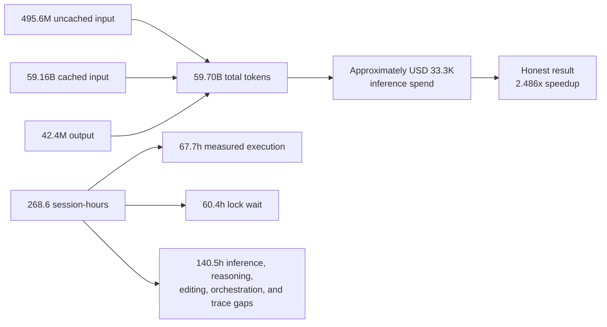

# Cost Report: 2026-07-03-13-39-25

## Executive Summary

This single optimize-tree experiment was expensive: 268.6 aggregate session-hours over 76.5 elapsed hours through the reporting cutoff, with approximately $33.3K of inference spend at public list rates. Inference drove dollars through 59.16B cached-input tokens, while walltime included 60.4 hours of matched GPU-lock wait and 67.7 hours of measured build/GPU execution; this is one run, so there is no cross-experiment cost comparison.

**Key takeaways**

- The covered sessions processed 59.70B tokens; 99.10% were cached input, but those reads still contributed about $29.6K, or 88.7% of estimated spend.
- The run compacted 794 times. Late worker and audit sessions inherited very large histories: 32 of 80 worker-session anchors cost more than 2x the $160 fleet median, and brief 91 reached about $869 with 20 compactions.
- Paired lock records show 35.2 hours of builds, 32.6 hours of exclusive GPU execution, and 60.4 hours of lock wait. The remaining 140.5 aggregate hours cover inference, reasoning, editing, orchestration, and trace gaps.
- The honest result was a 2.486x speedup, from 56.277 ms to 22.648 ms, at roughly $558 per percentage point of runtime reduction. Cost from the invalidated output-replay work is retained because it was still incurred.
- Eighty long-lived worker traces cover all 95 briefs. Fifteen continuation briefs have blank inference fields to avoid billing the same cumulative thread twice; their usage remains in the session's first-brief anchor.

**Run:** 268.6 aggregate session-hours, approximately $33.3K inference spend, 495.6M uncached input tokens, 59.16B cached input tokens, 42.4M output tokens, and 794 compactions. Average paired build and exclusive-GPU calls were 46.9s and 20.1s; the 85.6s longest build and 571.5s longest exclusive call fit `environment.md`'s custom-build and profiler budgets, so the run cost came from volume, context growth, and queueing rather than systematically undersized timeouts.

### Cost Flow

## Token Totals

**59.70B tokens**

| Token type | Tokens | Share |
|---|---:|---:|
| Input | 495.6M | 0.83% |
| Cached input | 59.16B | 99.10% |
| Output | 42.4M | 0.07% |
| **Total** | **59.70B** | **100.00%** |

Codex reports cumulative input inclusive of cache reads; the data builder subtracts cached input to make the Input and Cached input rows disjoint. The total includes the manager, pre-run research, three interrupted worker attempts, and seven post-run experiment audit/cleanup sessions. Codex exposed no cache-creation counter, so cache writes are absent from both tokens and cost.

## Walltime Breakdown

`Bench calls` means observed exclusive `gpu-0` acquisitions and therefore includes validation, benchmark, and profile calls. Counts below are reconstructed from raw Codex traces because the stock cost builder does not parse Codex custom tool calls; 2,696 build and 5,823 exclusive records had matched releases, totaling 126,535.9s and 117,319.6s of execution, with 217,418.4s of paired lock wait.

Durations for briefs are numeric-trial spans from the CSV, so `0s` means the log had only one numeric trial. The `n/a` rows are continuation briefs 42-46, 50, 52-57, and 66-68; their calls and tokens are already included in the earlier long-lived worker-session anchors that executed them. An anchor's call count can therefore span later briefs and should not be divided by its displayed first-brief duration. This is single-experiment mode, so there is no totals row.

| Branch | Duration | Build calls | Bench calls | Other tool calls |
|---|---:|---:|---:|---:|
| brief-0 | 3h26m30s | 40 | 84 | 947 |
| brief-1 | 3h43m37s | 40 | 80 | 1013 |
| brief-2 | 5h31m42s | 78 | 152 | 1313 |
| brief-3 | 2h31m51s | 33 | 69 | 672 |
| brief-4 | 5h08m42s | 58 | 114 | 1084 |
| brief-5 | 2h52m56s | 48 | 80 | 725 |
| brief-6 | 1h02m50s | 25 | 41 | 323 |
| brief-7 | 4h00m57s | 54 | 125 | 1057 |
| brief-8 | 2h48m52s | 48 | 95 | 894 |
| brief-9 | 37m02s | 8 | 24 | 182 |
| brief-10 | 1h53m05s | 32 | 61 | 467 |
| brief-11 | 2h56m05s | 18 | 113 | 665 |
| brief-12 | 58m20s | 14 | 41 | 255 |
| brief-13 | 3h21m13s | 49 | 110 | 990 |
| brief-14 | 1h21m42s | 16 | 45 | 424 |
| brief-15 | 29m30s | 8 | 33 | 156 |
| brief-16 | 38m59s | 9 | 27 | 170 |
| brief-17 | 55m41s | 17 | 35 | 257 |
| brief-18 | 8m00s | 2 | 10 | 103 |
| brief-19 | 1h20m16s | 25 | 54 | 396 |
| brief-20 | 0s | 1 | 5 | 58 |
| brief-21 | 0s | 1 | 10 | 68 |
| brief-22 | 7m59s | 2 | 6 | 117 |
| brief-23 | 1h23m56s | 26 | 58 | 402 |
| brief-24 | 20m24s | 4 | 16 | 194 |
| brief-25 | 3h10m46s | 46 | 95 | 1117 |
| brief-26 | 6m21s | 2 | 7 | 71 |
| brief-27 | 35m05s | 11 | 29 | 191 |
| brief-28 | 6m20s | 3 | 15 | 59 |
| brief-29 | 1h34m10s | 26 | 55 | 558 |
| brief-30 | 3h36m07s | 48 | 157 | 856 |
| brief-31 | 1h20m14s | 24 | 51 | 368 |
| brief-32 | 2h15m13s | 27 | 55 | 545 |
| brief-33 | 2h31m48s | 39 | 88 | 665 |
| brief-34 | 1h02m03s | 13 | 28 | 288 |
| brief-35 | 1h07m51s | 17 | 43 | 309 |
| brief-36 | 53m03s | 16 | 29 | 260 |
| brief-37 | 14m01s | 4 | 9 | 70 |
| brief-38 | 15m46s | 7 | 15 | 116 |
| brief-39 | 2m54s | 158 | 342 | 2746 |
| brief-40 | 1h58m18s | 28 | 56 | 554 |
| brief-41 | 38m56s | 27 | 58 | 626 |
| brief-42 | 49m36s | n/a | n/a | n/a |
| brief-43 | 1m53s | n/a | n/a | n/a |
| brief-44 | 18m27s | n/a | n/a | n/a |
| brief-45 | 4h47m42s | n/a | n/a | n/a |
| brief-46 | 24m46s | n/a | n/a | n/a |
| brief-47 | 55m17s | 41 | 86 | 608 |
| brief-48 | 9m12s | 2 | 6 | 98 |
| brief-49 | 3h30m16s | 150 | 327 | 3012 |
| brief-50 | 1h12m17s | n/a | n/a | n/a |
| brief-51 | 1h21m46s | 73 | 152 | 1307 |
| brief-52 | 1m36s | n/a | n/a | n/a |
| brief-53 | 3h08m08s | n/a | n/a | n/a |
| brief-54 | 57m23s | n/a | n/a | n/a |
| brief-55 | 4h57m02s | n/a | n/a | n/a |
| brief-56 | 56m48s | n/a | n/a | n/a |
| brief-57 | 5h07m41s | n/a | n/a | n/a |
| brief-58 | 1h00m45s | 13 | 42 | 355 |
| brief-59 | 1m30s | 1 | 4 | 66 |
| brief-60 | 2h05m52s | 25 | 52 | 618 |
| brief-61 | 7h17m17s | 82 | 170 | 1784 |
| brief-62 | 4h10m39s | 47 | 104 | 1038 |
| brief-63 | 5h30m30s | 167 | 304 | 2821 |
| brief-64 | 4h05m42s | 53 | 114 | 1018 |
| brief-65 | 16m15s | 65 | 153 | 1267 |
| brief-66 | 21m24s | n/a | n/a | n/a |
| brief-67 | 5h13m53s | n/a | n/a | n/a |
| brief-68 | 3h37m05s | n/a | n/a | n/a |
| brief-69 | 2h24m12s | 37 | 75 | 644 |
| brief-70 | 1h24m05s | 30 | 55 | 466 |
| brief-71 | 2h29m26s | 29 | 81 | 635 |
| brief-72 | 2h56m42s | 36 | 78 | 749 |
| brief-73 | 2h24m57s | 32 | 73 | 652 |
| brief-74 | 39m34s | 9 | 27 | 192 |
| brief-75 | 42m12s | 10 | 24 | 215 |
| brief-76 | 1h57m22s | 24 | 51 | 648 |
| brief-77 | 23m35s | 8 | 21 | 164 |
| brief-78 | 2h59m59s | 41 | 93 | 885 |
| brief-79 | 3h18m29s | 39 | 88 | 860 |
| brief-80 | 3h05m10s | 40 | 86 | 845 |
| brief-81 | 2h25m03s | 32 | 50 | 582 |
| brief-82 | 3h13m12s | 45 | 89 | 887 |
| brief-83 | 1h11m25s | 18 | 43 | 319 |
| brief-84 | 31m12s | 10 | 25 | 172 |
| brief-85 | 38m53s | 12 | 23 | 193 |
| brief-86 | 38m09s | 11 | 20 | 185 |
| brief-87 | 45m42s | 16 | 28 | 204 |
| brief-88 | 1h34m45s | 26 | 57 | 435 |
| brief-89 | 7h22m22s | 91 | 150 | 1624 |
| brief-90 | 2h25m12s | 37 | 74 | 632 |
| brief-91 | 7h37m20s | 83 | 133 | 1894 |
| brief-92 | 5h19m47s | 55 | 125 | 1195 |
| brief-93 | 1h39m27s | 12 | 26 | 408 |
| brief-94 | 0s | 1 | 4 | 73 |
| steered/audit_brief93 | 2m16s | 0 | 0 | 11 |
| steered/audit_brief94_submit | 3m23s | 0 | 1 | 18 |
| steered/audit_log_edits | 1m43s | 0 | 0 | 15 |
| steered/audit_runwide_cache | 5m06s | 0 | 0 | 30 |
| steered/b200_eigh_research | 4m41s | 0 | 0 | 31 |
| steered/best_clean_local | 1m18s | 0 | 0 | 10 |
| steered/best_clean_submission | 1m04s | 0 | 0 | 11 |
| steered/brief-87-interrupted | 3m40s | 1 | 0 | 21 |
| steered/brief-88-interrupted | 3m38s | 0 | 0 | 17 |
| steered/brief-89-interrupted | 3m21s | 1 | 0 | 17 |
| steered/launch-attempt | 9s | 0 | 0 | 0 |
| steered/manager | 76h27m50s | 60 | 116 | 7444 |
| steered/popcorn_delete_help | 1m54s | 0 | 0 | 17 |

## Tool Call Distribution

The stock CSV's Codex tool breakdown is blank, so this table is reconstructed directly from the same 93 selected session JSONLs. The traces contain 48,949 `exec`, 15,067 `wait`, and 3,773 `wait_agent` calls; no web tool calls were recorded. Long-lived worker continuations remain attributed to the first brief in each session.

| Branch | Tool | Count |
|---|---|---:|
| brief-0 | exec | 607 |
| brief-0 | wait | 459 |
| brief-0 | send_message | 4 |
| brief-0 | list_agents | 1 |
| brief-1 | exec | 923 |
| brief-1 | wait | 203 |
| brief-1 | send_message | 6 |
| brief-1 | list_agents | 1 |
| brief-2 | exec | 1110 |
| brief-2 | wait | 424 |
| brief-2 | send_message | 8 |
| brief-2 | list_agents | 1 |
| brief-3 | exec | 652 |
| brief-3 | wait | 120 |
| brief-3 | send_message | 2 |
| brief-4 | exec | 794 |
| brief-4 | wait | 458 |
| brief-4 | send_message | 4 |
| brief-5 | exec | 615 |
| brief-5 | wait | 237 |
| brief-5 | wait_agent | 1 |
| brief-6 | exec | 305 |
| brief-6 | wait | 82 |
| brief-6 | send_message | 2 |
| brief-7 | exec | 1053 |
| brief-7 | wait | 174 |
| brief-7 | send_message | 9 |
| brief-8 | exec | 696 |
| brief-8 | wait | 340 |
| brief-8 | send_message | 1 |
| brief-9 | exec | 160 |
| brief-9 | wait | 54 |
| brief-10 | exec | 393 |
| brief-10 | wait | 166 |
| brief-10 | send_message | 1 |
| brief-11 | exec | 548 |
| brief-11 | wait | 247 |
| brief-11 | send_message | 1 |
| brief-12 | exec | 238 |
| brief-12 | wait | 72 |
| brief-13 | exec | 1008 |
| brief-13 | wait | 141 |
| brief-14 | exec | 485 |
| brief-15 | exec | 148 |
| brief-15 | wait | 49 |
| brief-16 | exec | 159 |
| brief-16 | wait | 47 |
| brief-17 | exec | 231 |
| brief-17 | wait | 78 |
| brief-18 | exec | 98 |
| brief-18 | wait | 17 |
| brief-19 | exec | 357 |
| brief-19 | wait | 118 |
| brief-20 | exec | 50 |
| brief-20 | wait | 14 |
| brief-21 | exec | 79 |
| brief-22 | exec | 94 |
| brief-22 | wait | 31 |
| brief-23 | exec | 385 |
| brief-23 | wait | 100 |
| brief-23 | list_agents | 1 |
| brief-24 | exec | 214 |
| brief-25 | exec | 1257 |
| brief-25 | send_message | 1 |
| brief-26 | exec | 56 |
| brief-26 | wait | 24 |
| brief-27 | exec | 185 |
| brief-27 | wait | 46 |
| brief-28 | exec | 59 |
| brief-28 | wait | 17 |
| brief-28 | send_message | 1 |
| brief-29 | exec | 602 |
| brief-29 | wait | 37 |
| brief-30 | exec | 773 |
| brief-30 | wait | 280 |
| brief-30 | send_message | 8 |
| brief-31 | exec | 330 |
| brief-31 | wait | 111 |
| brief-31 | send_message | 2 |
| brief-32 | exec | 470 |
| brief-32 | wait | 157 |
| brief-33 | exec | 577 |
| brief-33 | wait | 213 |
| brief-33 | send_message | 2 |
| brief-34 | exec | 245 |
| brief-34 | wait | 84 |
| brief-35 | exec | 274 |
| brief-35 | wait | 95 |
| brief-36 | exec | 224 |
| brief-36 | wait | 81 |
| brief-37 | exec | 55 |
| brief-37 | wait | 28 |
| brief-38 | exec | 111 |
| brief-38 | wait | 27 |
| brief-39 | exec | 2462 |
| brief-39 | wait | 778 |
| brief-39 | send_message | 4 |
| brief-39 | list_agents | 1 |
| brief-39 | spawn_agent | 1 |
| brief-40 | exec | 419 |
| brief-40 | wait | 219 |
| brief-41 | exec | 533 |
| brief-41 | wait | 178 |
| brief-47 | exec | 548 |
| brief-47 | wait | 187 |
| brief-48 | exec | 76 |
| brief-48 | wait | 30 |
| brief-49 | exec | 2797 |
| brief-49 | wait | 674 |
| brief-49 | send_message | 11 |
| brief-49 | list_agents | 4 |
| brief-49 | spawn_agent | 3 |
| brief-51 | exec | 1250 |
| brief-51 | wait | 277 |
| brief-51 | send_message | 4 |
| brief-51 | list_agents | 1 |
| brief-58 | exec | 293 |
| brief-58 | wait | 115 |
| brief-58 | list_agents | 1 |
| brief-58 | spawn_agent | 1 |
| brief-59 | exec | 61 |
| brief-59 | wait | 10 |
| brief-60 | exec | 586 |
| brief-60 | wait | 108 |
| brief-60 | spawn_agent | 1 |
| brief-61 | exec | 1504 |
| brief-61 | wait | 521 |
| brief-61 | send_message | 6 |
| brief-61 | list_agents | 4 |
| brief-61 | spawn_agent | 1 |
| brief-62 | exec | 855 |
| brief-62 | wait | 326 |
| brief-62 | send_message | 6 |
| brief-62 | list_agents | 2 |
| brief-63 | exec | 2522 |
| brief-63 | wait | 760 |
| brief-63 | send_message | 9 |
| brief-63 | spawn_agent | 1 |
| brief-64 | exec | 882 |
| brief-64 | wait | 297 |
| brief-64 | send_message | 6 |
| brief-65 | exec | 1163 |
| brief-65 | wait | 321 |
| brief-65 | send_message | 1 |
| brief-69 | exec | 486 |
| brief-69 | wait | 270 |
| brief-70 | exec | 479 |
| brief-70 | wait | 72 |
| brief-71 | exec | 573 |
| brief-71 | wait | 170 |
| brief-71 | list_agents | 2 |
| brief-72 | exec | 616 |
| brief-72 | wait | 245 |
| brief-72 | send_message | 2 |
| brief-73 | exec | 703 |
| brief-73 | wait | 53 |
| brief-73 | send_message | 1 |
| brief-74 | exec | 161 |
| brief-74 | wait | 65 |
| brief-74 | send_message | 2 |
| brief-75 | exec | 179 |
| brief-75 | wait | 68 |
| brief-75 | send_message | 2 |
| brief-76 | exec | 650 |
| brief-76 | wait | 69 |
| brief-76 | send_message | 4 |
| brief-77 | exec | 141 |
| brief-77 | wait | 51 |
| brief-77 | send_message | 1 |
| brief-78 | exec | 866 |
| brief-78 | wait | 150 |
| brief-78 | send_message | 2 |
| brief-78 | list_agents | 1 |
| brief-79 | exec | 734 |
| brief-79 | wait | 247 |
| brief-79 | send_message | 5 |
| brief-79 | list_agents | 1 |
| brief-80 | exec | 721 |
| brief-80 | wait | 246 |
| brief-80 | send_message | 4 |
| brief-81 | exec | 461 |
| brief-81 | wait | 200 |
| brief-81 | send_message | 3 |
| brief-82 | exec | 819 |
| brief-82 | wait | 201 |
| brief-82 | send_message | 1 |
| brief-83 | exec | 284 |
| brief-83 | wait | 96 |
| brief-84 | exec | 157 |
| brief-84 | wait | 50 |
| brief-85 | exec | 177 |
| brief-85 | wait | 51 |
| brief-86 | exec | 173 |
| brief-86 | wait | 43 |
| brief-87 | exec | 201 |
| brief-87 | wait | 43 |
| brief-87 | send_message | 3 |
| brief-87 | list_agents | 1 |
| brief-88 | exec | 409 |
| brief-88 | wait | 101 |
| brief-88 | send_message | 7 |
| brief-88 | list_agents | 1 |
| brief-89 | exec | 1351 |
| brief-89 | wait | 503 |
| brief-89 | send_message | 9 |
| brief-89 | list_agents | 2 |
| brief-90 | exec | 550 |
| brief-90 | wait | 190 |
| brief-90 | send_message | 3 |
| brief-91 | exec | 1534 |
| brief-91 | wait | 572 |
| brief-91 | send_message | 3 |
| brief-91 | list_agents | 1 |
| brief-92 | exec | 912 |
| brief-92 | wait | 463 |
| brief-93 | exec | 281 |
| brief-93 | wait | 163 |
| brief-93 | send_message | 2 |
| brief-94 | exec | 51 |
| brief-94 | wait | 26 |
| brief-94 | send_message | 1 |
| steered/audit_brief93 | exec | 11 |
| steered/audit_brief94_submit | exec | 16 |
| steered/audit_brief94_submit | send_message | 2 |
| steered/audit_brief94_submit | wait | 1 |
| steered/audit_log_edits | exec | 13 |
| steered/audit_log_edits | send_message | 2 |
| steered/audit_runwide_cache | exec | 24 |
| steered/audit_runwide_cache | wait | 4 |
| steered/audit_runwide_cache | send_message | 2 |
| steered/b200_eigh_research | exec | 30 |
| steered/b200_eigh_research | wait | 1 |
| steered/best_clean_local | exec | 9 |
| steered/best_clean_local | send_message | 1 |
| steered/best_clean_submission | exec | 10 |
| steered/best_clean_submission | send_message | 1 |
| steered/brief-87-interrupted | exec | 21 |
| steered/brief-87-interrupted | wait | 1 |
| steered/brief-88-interrupted | exec | 17 |
| steered/brief-89-interrupted | exec | 17 |
| steered/brief-89-interrupted | wait | 1 |
| steered/manager | wait_agent | 3772 |
| steered/manager | exec | 2525 |
| steered/manager | wait | 1019 |
| steered/manager | followup_task | 95 |
| steered/manager | spawn_agent | 91 |
| steered/manager | list_agents | 78 |
| steered/manager | send_message | 37 |
| steered/manager | interrupt_agent | 3 |
| steered/popcorn_delete_help | exec | 16 |
| steered/popcorn_delete_help | send_message | 1 |

## Inference Breakdown

Cache hit is `cached / (uncached + cache creation + cached)`. The aggregate hit rate was 99.17%, but discounted reads still dominated spend because the reused contexts were enormous. Fifteen `n/a` continuation rows are covered by their session anchors; all 93 selected traces are counted exactly once, 92 report nonzero usage, and there is no totals row in this single-experiment report.

| Branch | Input tokens | Output tokens | Cached input tokens | Cache creation tokens | Cache hit % | Compactions | Estimated USD |
|---|---:|---:|---:|---:|---:|---:|---:|
| brief-0 | 1,498,778 | 155,389 | 194,334,720 | 0 | 99.23% | 2 | $109.32 |
| brief-1 | 1,569,654 | 197,393 | 176,207,104 | 0 | 99.12% | 2 | $101.87 |
| brief-2 | 2,757,735 | 272,533 | 274,601,472 | 0 | 99.01% | 3 | $159.27 |
| brief-3 | 1,417,528 | 152,880 | 150,558,208 | 0 | 99.07% | 1 | $86.95 |
| brief-4 | 1,933,214 | 224,908 | 238,418,176 | 0 | 99.20% | 2 | $135.62 |
| brief-5 | 1,592,776 | 202,667 | 181,147,904 | 0 | 99.13% | 2 | $104.62 |
| brief-6 | 1,302,171 | 116,759 | 109,996,288 | 0 | 98.83% | 2 | $65.01 |
| brief-7 | 2,203,913 | 269,199 | 253,763,328 | 0 | 99.14% | 3 | $145.98 |
| brief-8 | 2,021,842 | 224,488 | 244,975,104 | 0 | 99.18% | 2 | $139.33 |
| brief-9 | 1,097,101 | 125,590 | 97,758,208 | 0 | 98.89% | 1 | $58.13 |
| brief-10 | 1,612,144 | 173,565 | 163,888,384 | 0 | 99.03% | 2 | $95.21 |
| brief-11 | 2,223,915 | 222,040 | 229,644,032 | 0 | 99.04% | 2 | $132.60 |
| brief-12 | 1,446,629 | 148,921 | 160,058,112 | 0 | 99.10% | 1 | $91.73 |
| brief-13 | 2,356,333 | 265,346 | 302,554,880 | 0 | 99.23% | 3 | $171.02 |
| brief-14 | 1,812,205 | 163,946 | 197,955,072 | 0 | 99.09% | 2 | $112.96 |
| brief-15 | 1,410,588 | 127,706 | 135,171,584 | 0 | 98.97% | 2 | $78.47 |
| brief-16 | 1,419,588 | 145,303 | 137,044,480 | 0 | 98.97% | 2 | $79.98 |
| brief-17 | 1,556,067 | 150,110 | 166,800,896 | 0 | 99.08% | 2 | $95.68 |
| brief-18 | 1,431,349 | 135,543 | 126,965,248 | 0 | 98.89% | 2 | $74.71 |
| brief-19 | 1,992,087 | 179,464 | 193,476,096 | 0 | 98.98% | 3 | $112.08 |
| brief-20 | 1,380,982 | 122,669 | 121,083,648 | 0 | 98.87% | 2 | $71.13 |
| brief-21 | 1,404,860 | 124,406 | 123,420,672 | 0 | 98.87% | 2 | $72.47 |
| brief-22 | 1,462,290 | 128,721 | 129,908,224 | 0 | 98.89% | 2 | $76.13 |
| brief-23 | 2,076,771 | 205,310 | 207,592,704 | 0 | 99.01% | 3 | $120.34 |
| brief-24 | 1,576,995 | 143,555 | 144,991,488 | 0 | 98.92% | 2 | $84.69 |
| brief-25 | 3,028,884 | 325,038 | 346,229,248 | 0 | 99.13% | 4 | $198.01 |
| brief-26 | 1,530,643 | 135,652 | 136,717,568 | 0 | 98.89% | 2 | $80.08 |
| brief-27 | 1,756,251 | 167,726 | 165,125,632 | 0 | 98.95% | 2 | $96.38 |
| brief-28 | 1,624,998 | 142,980 | 143,313,920 | 0 | 98.88% | 3 | $84.07 |
| brief-29 | 2,378,671 | 218,962 | 244,466,432 | 0 | 99.04% | 4 | $140.70 |
| brief-30 | 3,180,508 | 368,750 | 345,915,136 | 0 | 99.09% | 6 | $199.92 |
| brief-31 | 2,295,290 | 208,450 | 222,654,720 | 0 | 98.98% | 4 | $129.06 |
| brief-32 | 2,673,257 | 285,528 | 272,176,640 | 0 | 99.03% | 4 | $158.02 |
| brief-33 | 3,096,007 | 313,308 | 337,286,144 | 0 | 99.09% | 5 | $193.52 |
| brief-34 | 2,725,453 | 251,077 | 258,954,240 | 0 | 98.96% | 5 | $150.64 |
| brief-35 | 2,714,133 | 228,010 | 282,365,952 | 0 | 99.05% | 5 | $161.59 |
| brief-36 | 2,661,535 | 233,031 | 271,821,312 | 0 | 99.03% | 4 | $156.21 |
| brief-37 | 2,460,639 | 194,222 | 239,453,184 | 0 | 98.98% | 4 | $137.86 |
| brief-38 | 2,594,504 | 207,257 | 254,119,936 | 0 | 98.99% | 4 | $146.25 |
| brief-39 | 7,775,235 | 922,055 | 845,443,072 | 0 | 99.09% | 13 | $489.26 |
| brief-40 | 3,215,868 | 288,175 | 346,252,032 | 0 | 99.08% | 5 | $197.85 |
| brief-41 | 3,438,986 | 307,301 | 362,900,992 | 0 | 99.06% | 5 | $207.86 |
| brief-42 | n/a | n/a | n/a | n/a | n/a | n/a | n/a |
| brief-43 | n/a | n/a | n/a | n/a | n/a | n/a | n/a |
| brief-44 | n/a | n/a | n/a | n/a | n/a | n/a | n/a |
| brief-45 | n/a | n/a | n/a | n/a | n/a | n/a | n/a |
| brief-46 | n/a | n/a | n/a | n/a | n/a | n/a | n/a |
| brief-47 | 1,157,868 | 138,256 | 142,948,096 | 0 | 99.20% | 2 | $81.41 |
| brief-48 | 187,044 | 20,715 | 10,713,344 | 0 | 98.28% | 0 | $6.91 |
| brief-49 | 5,958,424 | 778,659 | 615,956,992 | 0 | 99.04% | 10 | $361.13 |
| brief-50 | n/a | n/a | n/a | n/a | n/a | n/a | n/a |
| brief-51 | 5,869,230 | 569,633 | 646,922,752 | 0 | 99.10% | 10 | $369.90 |
| brief-52 | n/a | n/a | n/a | n/a | n/a | n/a | n/a |
| brief-53 | n/a | n/a | n/a | n/a | n/a | n/a | n/a |
| brief-54 | n/a | n/a | n/a | n/a | n/a | n/a | n/a |
| brief-55 | n/a | n/a | n/a | n/a | n/a | n/a | n/a |
| brief-56 | n/a | n/a | n/a | n/a | n/a | n/a | n/a |
| brief-57 | n/a | n/a | n/a | n/a | n/a | n/a | n/a |
| brief-58 | 749,540 | 93,111 | 73,753,344 | 0 | 98.99% | 1 | $43.42 |
| brief-59 | 164,569 | 16,563 | 6,787,072 | 0 | 97.63% | 0 | $4.71 |
| brief-60 | 1,394,523 | 174,871 | 117,050,880 | 0 | 98.82% | 2 | $70.74 |
| brief-61 | 3,062,108 | 411,937 | 355,765,248 | 0 | 99.15% | 5 | $205.55 |
| brief-62 | 2,075,345 | 242,858 | 227,890,176 | 0 | 99.10% | 3 | $131.61 |
| brief-63 | 10,551,306 | 1,014,672 | 1,183,504,128 | 0 | 99.12% | 18 | $674.95 |
| brief-64 | 8,192,842 | 693,859 | 941,737,216 | 0 | 99.14% | 14 | $532.65 |
| brief-65 | 8,898,985 | 745,865 | 1,061,213,952 | 0 | 99.17% | 16 | $597.48 |
| brief-66 | n/a | n/a | n/a | n/a | n/a | n/a | n/a |
| brief-67 | n/a | n/a | n/a | n/a | n/a | n/a | n/a |
| brief-68 | n/a | n/a | n/a | n/a | n/a | n/a | n/a |
| brief-69 | 8,060,226 | 616,766 | 951,194,368 | 0 | 99.16% | 13 | $534.40 |
| brief-70 | 7,996,187 | 647,123 | 947,840,768 | 0 | 99.16% | 14 | $533.32 |
| brief-71 | 8,248,020 | 648,734 | 1,009,637,120 | 0 | 99.19% | 14 | $565.52 |
| brief-72 | 8,444,746 | 682,736 | 1,034,476,288 | 0 | 99.19% | 14 | $579.94 |
| brief-73 | 8,457,268 | 706,214 | 1,034,350,848 | 0 | 99.19% | 14 | $580.65 |
| brief-74 | 7,876,825 | 589,643 | 952,620,288 | 0 | 99.18% | 13 | $533.38 |
| brief-75 | 8,008,748 | 602,186 | 981,630,720 | 0 | 99.19% | 13 | $548.92 |
| brief-76 | 8,768,038 | 703,651 | 1,092,367,104 | 0 | 99.20% | 15 | $611.13 |
| brief-77 | 8,009,870 | 601,333 | 976,586,752 | 0 | 99.19% | 14 | $546.38 |
| brief-78 | 9,422,245 | 789,157 | 1,146,285,056 | 0 | 99.18% | 17 | $643.93 |
| brief-79 | 9,351,678 | 787,933 | 1,148,253,696 | 0 | 99.19% | 16 | $644.52 |
| brief-80 | 9,598,986 | 820,887 | 1,168,030,976 | 0 | 99.18% | 16 | $656.64 |
| brief-81 | 9,016,377 | 745,993 | 1,178,914,560 | 0 | 99.24% | 15 | $656.92 |
| brief-82 | 10,427,150 | 834,660 | 1,260,914,432 | 0 | 99.18% | 18 | $707.63 |
| brief-83 | 8,992,219 | 716,694 | 1,166,339,840 | 0 | 99.23% | 16 | $649.63 |
| brief-84 | 8,917,333 | 709,552 | 1,125,177,344 | 0 | 99.21% | 15 | $628.46 |
| brief-85 | 9,029,039 | 732,104 | 1,143,042,816 | 0 | 99.22% | 15 | $638.63 |
| brief-86 | 8,981,466 | 717,805 | 1,139,120,384 | 0 | 99.22% | 15 | $636.00 |
| brief-87 | 9,490,897 | 754,872 | 1,174,412,544 | 0 | 99.20% | 15 | $657.31 |
| brief-88 | 9,971,941 | 817,026 | 1,221,313,024 | 0 | 99.19% | 16 | $685.03 |
| brief-89 | 12,353,280 | 1,087,536 | 1,444,571,136 | 0 | 99.15% | 19 | $816.68 |
| brief-90 | 10,763,579 | 872,389 | 1,285,892,608 | 0 | 99.17% | 17 | $722.94 |
| brief-91 | 12,257,443 | 1,084,405 | 1,549,641,728 | 0 | 99.22% | 20 | $868.64 |
| brief-92 | 11,493,698 | 937,722 | 1,449,754,112 | 0 | 99.21% | 18 | $810.48 |
| brief-93 | 10,392,044 | 822,245 | 1,330,778,368 | 0 | 99.23% | 16 | $742.02 |
| brief-94 | 10,145,544 | 796,985 | 1,315,412,224 | 0 | 99.23% | 16 | $732.34 |
| steered/audit_brief93 | 10,408,849 | 792,265 | 1,324,467,456 | 0 | 99.22% | 16 | $738.05 |
| steered/audit_brief94_submit | 10,467,535 | 797,269 | 1,325,853,696 | 0 | 99.22% | 16 | $739.18 |
| steered/audit_log_edits | 10,603,325 | 809,210 | 1,330,179,840 | 0 | 99.21% | 17 | $742.38 |
| steered/audit_runwide_cache | 10,542,879 | 796,752 | 1,327,553,536 | 0 | 99.21% | 16 | $740.39 |
| steered/b200_eigh_research | 256,762 | 11,063 | 4,431,872 | 0 | 94.52% | 0 | $3.83 |
| steered/best_clean_local | 10,498,795 | 805,968 | 1,329,074,432 | 0 | 99.22% | 17 | $741.21 |
| steered/best_clean_submission | 10,512,375 | 804,736 | 1,329,239,808 | 0 | 99.22% | 17 | $741.32 |
| steered/brief-87-interrupted | 8,902,882 | 698,678 | 1,124,783,872 | 0 | 99.21% | 15 | $627.87 |
| steered/brief-88-interrupted | 8,899,481 | 698,899 | 1,124,593,152 | 0 | 99.21% | 15 | $627.76 |
| steered/brief-89-interrupted | 8,895,350 | 699,628 | 1,124,921,600 | 0 | 99.22% | 15 | $627.93 |
| steered/launch-attempt | 0 | 0 | 0 | 0 | 0.00% | 0 | $0.00 |
| steered/manager | 10,587,398 | 817,722 | 1,331,836,672 | 0 | 99.21% | 17 | $743.39 |
| steered/popcorn_delete_help | 10,603,845 | 808,450 | 1,330,211,840 | 0 | 99.21% | 17 | $742.38 |

## Cost-Optimization Opportunities

- Rotate worker threads after one or two compactions instead of carrying them to 15-20. The run accumulated 794 compactions, and reported per-session cost rose with inherited context; brief 91 alone cost about $869.
- Launch narrow-context audit workers. Each post-run cache/submission/log audit inherited about 1.3B cached tokens and cost roughly $738-$742 despite lasting only 1-5 minutes; the three interrupted brief 87-89 attempts each cost about $628 before restart.
- Schedule full benchmarks and profiles around the single B200. Matched queue wait was 60.4 hours, nearly twice the 32.6 hours of exclusive GPU execution, and the longest wait was 646.8s.
- Fix `autocuda report data cost` to parse Codex `custom_tool_call` records and to represent several briefs in one persistent worker session. The current CSV gets tokens right but leaves tool columns blank and cannot attribute continuation-brief cost without double counting.
- Keep output concise, but prioritize context control: output was only 0.07% of tokens and about $1.27K, whereas cached input cost about $29.58K.

## Analysis

The run bought a material honest result: the optimization report reconstructs a 2.486x speedup, from 56,277.006 us to a reconfirmed 22,648.370 us. Against 2,604 logged attempts, the cost averages about $12.80 and 22.9M reported tokens per attempt, or approximately $558 per percentage point of runtime reduction. The output-replay trials in briefs 93-94 do not count toward the speedup, but their inference and GPU costs correctly remain here.

Inference cost grew with session age rather than trial productivity. Cache hit stayed above 97.6% for every covered worker anchor and reached 99.17% in aggregate, yet late sessions repeatedly read billion-token cumulative histories. That shape explains why a high cache-hit rate coexists with $33.3K spend: the discount reduced the unit price, but not the volume.

Cost was not predictive of success. Brief 91 was the most expensive worker anchor at $868.64 and explored a Jacobi line that remained slower than production, while brief 75 reconfirmed the honest production best at $548.92. Thirty-two anchors exceeded twice the $160.43 fleet median, mostly later in the run, so this is broad context inflation rather than one isolated runaway.

**Recommendations:** cap thread lifetime by compaction count, spawn post-run audits with only the target logs/commits instead of the full manager transcript, and batch GPU-heavy validation/profile work to reduce queue contention. Preserve the three-worker search width, but reset context between objectives and record per-continuation usage so cost can be tied to the brief that incurred it.

[^pricing]: Approximate list-rate estimate, not an invoice. All 92 sessions with reported usage used `gpt-5.6-sol`; the zero-usage launch attempt reported `gpt-5.5`. The CLI was supplied $5/M uncached input, $30/M output, and $0.50/M cache reads from [OpenAI's GPT-5.6 Sol pricing](https://openai.com/index/previewing-gpt-5-6-sol/). OpenAI also lists cache writes at 1.25x input, but Codex did not expose cache-write tokens here, so they are unpriced. Actual Codex plan credits, negotiated terms, and regional adjustments may differ.
