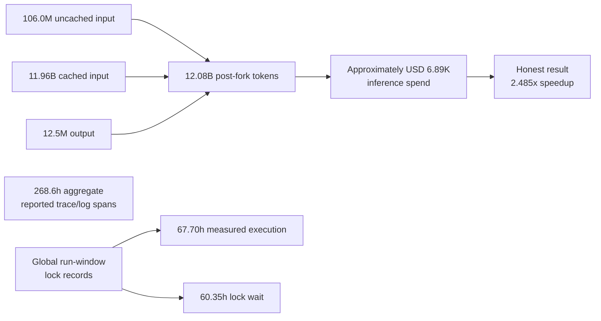

# Cost Report: 2026-07-03-13-39-25

## Executive Summary

This single optimize-tree experiment was expensive: 268.6 aggregate reported trace/log hours over 76.5 elapsed hours through the reporting cutoff, with approximately $6.89K of inference spend at public list rates.[^pricing] The corrected ledger contains 11.96B post-fork cached-input tokens. A separate global run-window lock audit found 60.35 hours of matched wait and 67.70 hours of measured build/GPU execution; those lock totals are not a partition of the mixed-duration trace/log sum.

**Key takeaways**

- The covered traces processed 12.08B post-fork tokens; 99.02% were cached input. Those reads contributed about $5.98K, or 86.9% of estimated spend.
- The run compacted 134 times after the selected fork boundaries. Fifteen of 80 worker-session anchors cost more than 2x the $59.46 fleet median; brief 49 was the highest worker anchor at $361.13 and 10 compactions.
- Global paired lock records show 35.15 hours of builds, 32.55 hours of exclusive GPU execution, and 60.35 hours of lock wait. Because 112 pairs cross trace labels, the raw data does not support exact per-brief lock attribution or a residual walltime category.
- The honest result was a 2.485x speedup, from 56.277 ms to 22.648 ms, at roughly $115 per percentage point of runtime reduction. Cost from the invalidated output-replay work is retained because it was still incurred.
- Eighty long-lived worker traces cover all 95 briefs. Fifteen continuation briefs have blank inference fields to avoid billing the same cumulative thread twice; their usage remains in the session's first-brief anchor.

**Run:** 268.6 aggregate reported trace/log hours, approximately $6.89K inference spend, 106.0M uncached input tokens, 11.96B cached input tokens, 12.5M output tokens, and 134 post-fork compactions. Average paired build and exclusive-GPU calls were 46.9s and 20.2s. The 571.5s longest exclusive call was a benchmark that exceeded the documented 480s budget because the standard wrapper did not enforce it; measured cost came from volume, context growth, queueing, and several unbounded long-running commands.

### Cost Flow

## Token Totals

**12.08B post-fork tokens**

| Token type | Tokens | Share |
|---|---:|---:|
| Input | 106.0M | 0.88% |
| Cached input | 11.96B | 99.02% |
| Output | 12.5M | 0.10% |
| **Total** | **12.08B** | **100.00%** |

Codex reports cumulative input inclusive of cache reads. The stock builder took each forked rollout's final cumulative snapshot, which re-billed inherited parent history. This audit instead subtracts the last cumulative snapshot before each child-specific fork boundary, then subtracts cached input from inclusive input so the rows above are disjoint. The corrected total includes the manager, research, three interrupted worker attempts, and post-run experiment audit/cleanup sessions without charging their inherited history again. Codex exposed no cache-creation counter; cache-write tokens therefore cannot be separated from uncached input, and the 25% write premium is unpriced.

## Walltime Breakdown

The global run-window audit matched 2,696 build and 5,802 exclusive `gpu-0` acquisitions to releases, totaling 126,535.9s and 117,166.7s of execution, with 217,258.6s of wait. It pairs lock records globally because 106 build pairs and six GPU pairs cross trace labels. That produces reliable run-wide totals but not reliable per-label build/bench counts, so those schema-required columns are `n/a` below. Behavior's smaller lock totals use a stricter 83-worker, target-boundary, source-local scope and are not directly comparable.

Durations for briefs are numeric-trial spans from the CSV, so `0s` means the log had only one numeric trial; steered rows use actual session spans. The `n/a` duration rows are continuation briefs 42-46, 50, 52-57, and 66-68, whose activity is included in earlier long-lived worker-session anchors. `Other tool calls` is the enforced schema label, but here it contains every post-fork tool call because exact lock subtraction by label is unavailable. These mixed spans sum to 268.6 hours and must not be treated as additive active worker walltime. This is single-experiment mode, so there is no totals row.

| Branch | Duration | Build calls | Bench calls | Other tool calls |
|---|---:|---:|---:|---:|
| brief-0 | 3h26m30s | n/a | n/a | 1071 |
| brief-1 | 3h43m37s | n/a | n/a | 1133 |
| brief-2 | 5h31m42s | n/a | n/a | 1543 |
| brief-3 | 2h31m51s | n/a | n/a | 774 |
| brief-4 | 5h08m42s | n/a | n/a | 1256 |
| brief-5 | 2h52m56s | n/a | n/a | 853 |
| brief-6 | 1h02m50s | n/a | n/a | 389 |
| brief-7 | 4h00m57s | n/a | n/a | 1236 |
| brief-8 | 2h48m52s | n/a | n/a | 1037 |
| brief-9 | 37m02s | n/a | n/a | 214 |
| brief-10 | 1h53m05s | n/a | n/a | 560 |
| brief-11 | 2h56m05s | n/a | n/a | 796 |
| brief-12 | 58m20s | n/a | n/a | 310 |
| brief-13 | 3h21m13s | n/a | n/a | 1149 |
| brief-14 | 1h21m42s | n/a | n/a | 485 |
| brief-15 | 29m30s | n/a | n/a | 197 |
| brief-16 | 38m59s | n/a | n/a | 206 |
| brief-17 | 55m41s | n/a | n/a | 309 |
| brief-18 | 8m00s | n/a | n/a | 115 |
| brief-19 | 1h20m16s | n/a | n/a | 475 |
| brief-20 | 0s | n/a | n/a | 64 |
| brief-21 | 0s | n/a | n/a | 79 |
| brief-22 | 7m59s | n/a | n/a | 125 |
| brief-23 | 1h23m56s | n/a | n/a | 486 |
| brief-24 | 20m24s | n/a | n/a | 214 |
| brief-25 | 3h10m46s | n/a | n/a | 1258 |
| brief-26 | 6m21s | n/a | n/a | 80 |
| brief-27 | 35m05s | n/a | n/a | 231 |
| brief-28 | 6m20s | n/a | n/a | 77 |
| brief-29 | 1h34m10s | n/a | n/a | 639 |
| brief-30 | 3h36m07s | n/a | n/a | 1061 |
| brief-31 | 1h20m14s | n/a | n/a | 443 |
| brief-32 | 2h15m13s | n/a | n/a | 627 |
| brief-33 | 2h31m48s | n/a | n/a | 792 |
| brief-34 | 1h02m03s | n/a | n/a | 329 |
| brief-35 | 1h07m51s | n/a | n/a | 369 |
| brief-36 | 53m03s | n/a | n/a | 305 |
| brief-37 | 14m01s | n/a | n/a | 83 |
| brief-38 | 15m46s | n/a | n/a | 138 |
| brief-39 | 2m54s | n/a | n/a | 3246 |
| brief-40 | 1h58m18s | n/a | n/a | 638 |
| brief-41 | 38m56s | n/a | n/a | 711 |
| brief-42 | 49m36s | n/a | n/a | n/a |
| brief-43 | 1m53s | n/a | n/a | n/a |
| brief-44 | 18m27s | n/a | n/a | n/a |
| brief-45 | 4h47m42s | n/a | n/a | n/a |
| brief-46 | 24m46s | n/a | n/a | n/a |
| brief-47 | 55m17s | n/a | n/a | 735 |
| brief-48 | 9m12s | n/a | n/a | 106 |
| brief-49 | 3h30m16s | n/a | n/a | 3489 |
| brief-50 | 1h12m17s | n/a | n/a | n/a |
| brief-51 | 1h21m46s | n/a | n/a | 1532 |
| brief-52 | 1m36s | n/a | n/a | n/a |
| brief-53 | 3h08m08s | n/a | n/a | n/a |
| brief-54 | 57m23s | n/a | n/a | n/a |
| brief-55 | 4h57m02s | n/a | n/a | n/a |
| brief-56 | 56m48s | n/a | n/a | n/a |
| brief-57 | 5h07m41s | n/a | n/a | n/a |
| brief-58 | 1h00m45s | n/a | n/a | 410 |
| brief-59 | 1m30s | n/a | n/a | 71 |
| brief-60 | 2h05m52s | n/a | n/a | 695 |
| brief-61 | 7h17m17s | n/a | n/a | 2036 |
| brief-62 | 4h10m39s | n/a | n/a | 1189 |
| brief-63 | 5h30m30s | n/a | n/a | 3292 |
| brief-64 | 4h05m42s | n/a | n/a | 1185 |
| brief-65 | 16m15s | n/a | n/a | 1485 |
| brief-66 | 21m24s | n/a | n/a | n/a |
| brief-67 | 5h13m53s | n/a | n/a | n/a |
| brief-68 | 3h37m05s | n/a | n/a | n/a |
| brief-69 | 2h24m12s | n/a | n/a | 756 |
| brief-70 | 1h24m05s | n/a | n/a | 551 |
| brief-71 | 2h29m26s | n/a | n/a | 745 |
| brief-72 | 2h56m42s | n/a | n/a | 863 |
| brief-73 | 2h24m57s | n/a | n/a | 757 |
| brief-74 | 39m34s | n/a | n/a | 228 |
| brief-75 | 42m12s | n/a | n/a | 249 |
| brief-76 | 1h57m22s | n/a | n/a | 723 |
| brief-77 | 23m35s | n/a | n/a | 193 |
| brief-78 | 2h59m59s | n/a | n/a | 1019 |
| brief-79 | 3h18m29s | n/a | n/a | 987 |
| brief-80 | 3h05m10s | n/a | n/a | 971 |
| brief-81 | 2h25m03s | n/a | n/a | 664 |
| brief-82 | 3h13m12s | n/a | n/a | 1021 |
| brief-83 | 1h11m25s | n/a | n/a | 380 |
| brief-84 | 31m12s | n/a | n/a | 207 |
| brief-85 | 38m53s | n/a | n/a | 228 |
| brief-86 | 38m09s | n/a | n/a | 216 |
| brief-87 | 45m42s | n/a | n/a | 248 |
| brief-88 | 1h34m45s | n/a | n/a | 518 |
| brief-89 | 7h22m22s | n/a | n/a | 1865 |
| brief-90 | 2h25m12s | n/a | n/a | 743 |
| brief-91 | 7h37m20s | n/a | n/a | 2110 |
| brief-92 | 5h19m47s | n/a | n/a | 1375 |
| brief-93 | 1h39m27s | n/a | n/a | 446 |
| brief-94 | 0s | n/a | n/a | 78 |
| steered/manager | 76h27m50s | n/a | n/a | 7620 |
| steered/launch-attempt | 9s | n/a | n/a | n/a |
| steered/brief-87-interrupted | 3m40s | n/a | n/a | 22 |
| steered/brief-88-interrupted | 3m38s | n/a | n/a | 17 |
| steered/brief-89-interrupted | 3m21s | n/a | n/a | 18 |
| steered/audit_brief93 | 2m16s | n/a | n/a | 11 |
| steered/audit_brief94_submit | 3m23s | n/a | n/a | 19 |
| steered/audit_log_edits | 1m43s | n/a | n/a | 15 |
| steered/audit_runwide_cache | 5m06s | n/a | n/a | 30 |
| steered/b200_eigh_research | 4m41s | n/a | n/a | 31 |
| steered/best_clean_local | 1m18s | n/a | n/a | 10 |
| steered/best_clean_submission | 1m04s | n/a | n/a | 11 |
| steered/popcorn_delete_help | 1m54s | n/a | n/a | 17 |
## Tool Call Distribution

The stock CSV's Codex tool breakdown is blank, so this table is reconstructed directly from the same 93 selected session JSONLs after their fork boundaries. The traces contain 48,949 top-level `exec`, 15,067 `wait`, and 3,773 `wait_agent` calls. No top-level web records were present; 25 nested `web__run` calls in the research trace are classified under `exec`. Long-lived worker continuations remain attributed to the first brief in each session.

| Branch | Tool | Count |
|---|---|---:|
| brief-0 | exec | 607 |
| brief-0 | wait | 459 |
| brief-0 | send_message | 4 |
| brief-0 | list_agents | 1 |
| brief-1 | exec | 923 |
| brief-1 | wait | 203 |
| brief-1 | send_message | 6 |
| brief-1 | list_agents | 1 |
| brief-2 | exec | 1110 |
| brief-2 | wait | 424 |
| brief-2 | send_message | 8 |
| brief-2 | list_agents | 1 |
| brief-3 | exec | 652 |
| brief-3 | wait | 120 |
| brief-3 | send_message | 2 |
| brief-4 | exec | 794 |
| brief-4 | wait | 458 |
| brief-4 | send_message | 4 |
| brief-5 | exec | 615 |
| brief-5 | wait | 237 |
| brief-5 | wait_agent | 1 |
| brief-6 | exec | 305 |
| brief-6 | wait | 82 |
| brief-6 | send_message | 2 |
| brief-7 | exec | 1053 |
| brief-7 | wait | 174 |
| brief-7 | send_message | 9 |
| brief-8 | exec | 696 |
| brief-8 | wait | 340 |
| brief-8 | send_message | 1 |
| brief-9 | exec | 160 |
| brief-9 | wait | 54 |
| brief-10 | exec | 393 |
| brief-10 | wait | 166 |
| brief-10 | send_message | 1 |
| brief-11 | exec | 548 |
| brief-11 | wait | 247 |
| brief-11 | send_message | 1 |
| brief-12 | exec | 238 |
| brief-12 | wait | 72 |
| brief-13 | exec | 1008 |
| brief-13 | wait | 141 |
| brief-14 | exec | 485 |
| brief-15 | exec | 148 |
| brief-15 | wait | 49 |
| brief-16 | exec | 159 |
| brief-16 | wait | 47 |
| brief-17 | exec | 231 |
| brief-17 | wait | 78 |
| brief-18 | exec | 98 |
| brief-18 | wait | 17 |
| brief-19 | exec | 357 |
| brief-19 | wait | 118 |
| brief-20 | exec | 50 |
| brief-20 | wait | 14 |
| brief-21 | exec | 79 |
| brief-22 | exec | 94 |
| brief-22 | wait | 31 |
| brief-23 | exec | 385 |
| brief-23 | wait | 100 |
| brief-23 | list_agents | 1 |
| brief-24 | exec | 214 |
| brief-25 | exec | 1257 |
| brief-25 | send_message | 1 |
| brief-26 | exec | 56 |
| brief-26 | wait | 24 |
| brief-27 | exec | 185 |
| brief-27 | wait | 46 |
| brief-28 | exec | 59 |
| brief-28 | wait | 17 |
| brief-28 | send_message | 1 |
| brief-29 | exec | 602 |
| brief-29 | wait | 37 |
| brief-30 | exec | 773 |
| brief-30 | wait | 280 |
| brief-30 | send_message | 8 |
| brief-31 | exec | 330 |
| brief-31 | wait | 111 |
| brief-31 | send_message | 2 |
| brief-32 | exec | 470 |
| brief-32 | wait | 157 |
| brief-33 | exec | 577 |
| brief-33 | wait | 213 |
| brief-33 | send_message | 2 |
| brief-34 | exec | 245 |
| brief-34 | wait | 84 |
| brief-35 | exec | 274 |
| brief-35 | wait | 95 |
| brief-36 | exec | 224 |
| brief-36 | wait | 81 |
| brief-37 | exec | 55 |
| brief-37 | wait | 28 |
| brief-38 | exec | 111 |
| brief-38 | wait | 27 |
| brief-39 | exec | 2462 |
| brief-39 | wait | 778 |
| brief-39 | send_message | 4 |
| brief-39 | list_agents | 1 |
| brief-39 | spawn_agent | 1 |
| brief-40 | exec | 419 |
| brief-40 | wait | 219 |
| brief-41 | exec | 533 |
| brief-41 | wait | 178 |
| brief-47 | exec | 548 |
| brief-47 | wait | 187 |
| brief-48 | exec | 76 |
| brief-48 | wait | 30 |
| brief-49 | exec | 2797 |
| brief-49 | wait | 674 |
| brief-49 | send_message | 11 |
| brief-49 | list_agents | 4 |
| brief-49 | spawn_agent | 3 |
| brief-51 | exec | 1250 |
| brief-51 | wait | 277 |
| brief-51 | send_message | 4 |
| brief-51 | list_agents | 1 |
| brief-58 | exec | 293 |
| brief-58 | wait | 115 |
| brief-58 | list_agents | 1 |
| brief-58 | spawn_agent | 1 |
| brief-59 | exec | 61 |
| brief-59 | wait | 10 |
| brief-60 | exec | 586 |
| brief-60 | wait | 108 |
| brief-60 | spawn_agent | 1 |
| brief-61 | exec | 1504 |
| brief-61 | wait | 521 |
| brief-61 | send_message | 6 |
| brief-61 | list_agents | 4 |
| brief-61 | spawn_agent | 1 |
| brief-62 | exec | 855 |
| brief-62 | wait | 326 |
| brief-62 | send_message | 6 |
| brief-62 | list_agents | 2 |
| brief-63 | exec | 2522 |
| brief-63 | wait | 760 |
| brief-63 | send_message | 9 |
| brief-63 | spawn_agent | 1 |
| brief-64 | exec | 882 |
| brief-64 | wait | 297 |
| brief-64 | send_message | 6 |
| brief-65 | exec | 1163 |
| brief-65 | wait | 321 |
| brief-65 | send_message | 1 |
| brief-69 | exec | 486 |
| brief-69 | wait | 270 |
| brief-70 | exec | 479 |
| brief-70 | wait | 72 |
| brief-71 | exec | 573 |
| brief-71 | wait | 170 |
| brief-71 | list_agents | 2 |
| brief-72 | exec | 616 |
| brief-72 | wait | 245 |
| brief-72 | send_message | 2 |
| brief-73 | exec | 703 |
| brief-73 | wait | 53 |
| brief-73 | send_message | 1 |
| brief-74 | exec | 161 |
| brief-74 | wait | 65 |
| brief-74 | send_message | 2 |
| brief-75 | exec | 179 |
| brief-75 | wait | 68 |
| brief-75 | send_message | 2 |
| brief-76 | exec | 650 |
| brief-76 | wait | 69 |
| brief-76 | send_message | 4 |
| brief-77 | exec | 141 |
| brief-77 | wait | 51 |
| brief-77 | send_message | 1 |
| brief-78 | exec | 866 |
| brief-78 | wait | 150 |
| brief-78 | send_message | 2 |
| brief-78 | list_agents | 1 |
| brief-79 | exec | 734 |
| brief-79 | wait | 247 |
| brief-79 | send_message | 5 |
| brief-79 | list_agents | 1 |
| brief-80 | exec | 721 |
| brief-80 | wait | 246 |
| brief-80 | send_message | 4 |
| brief-81 | exec | 461 |
| brief-81 | wait | 200 |
| brief-81 | send_message | 3 |
| brief-82 | exec | 819 |
| brief-82 | wait | 201 |
| brief-82 | send_message | 1 |
| brief-83 | exec | 284 |
| brief-83 | wait | 96 |
| brief-84 | exec | 157 |
| brief-84 | wait | 50 |
| brief-85 | exec | 177 |
| brief-85 | wait | 51 |
| brief-86 | exec | 173 |
| brief-86 | wait | 43 |
| brief-87 | exec | 201 |
| brief-87 | wait | 43 |
| brief-87 | send_message | 3 |
| brief-87 | list_agents | 1 |
| brief-88 | exec | 409 |
| brief-88 | wait | 101 |
| brief-88 | send_message | 7 |
| brief-88 | list_agents | 1 |
| brief-89 | exec | 1351 |
| brief-89 | wait | 503 |
| brief-89 | send_message | 9 |
| brief-89 | list_agents | 2 |
| brief-90 | exec | 550 |
| brief-90 | wait | 190 |
| brief-90 | send_message | 3 |
| brief-91 | exec | 1534 |
| brief-91 | wait | 572 |
| brief-91 | send_message | 3 |
| brief-91 | list_agents | 1 |
| brief-92 | exec | 912 |
| brief-92 | wait | 463 |
| brief-93 | exec | 281 |
| brief-93 | wait | 163 |
| brief-93 | send_message | 2 |
| brief-94 | exec | 51 |
| brief-94 | wait | 26 |
| brief-94 | send_message | 1 |
| steered/audit_brief93 | exec | 11 |
| steered/audit_brief94_submit | exec | 16 |
| steered/audit_brief94_submit | send_message | 2 |
| steered/audit_brief94_submit | wait | 1 |
| steered/audit_log_edits | exec | 13 |
| steered/audit_log_edits | send_message | 2 |
| steered/audit_runwide_cache | exec | 24 |
| steered/audit_runwide_cache | wait | 4 |
| steered/audit_runwide_cache | send_message | 2 |
| steered/b200_eigh_research | exec | 30 |
| steered/b200_eigh_research | wait | 1 |
| steered/best_clean_local | exec | 9 |
| steered/best_clean_local | send_message | 1 |
| steered/best_clean_submission | exec | 10 |
| steered/best_clean_submission | send_message | 1 |
| steered/brief-87-interrupted | exec | 21 |
| steered/brief-87-interrupted | wait | 1 |
| steered/brief-88-interrupted | exec | 17 |
| steered/brief-89-interrupted | exec | 17 |
| steered/brief-89-interrupted | wait | 1 |
| steered/manager | wait_agent | 3772 |
| steered/manager | exec | 2525 |
| steered/manager | wait | 1019 |
| steered/manager | followup_task | 95 |
| steered/manager | spawn_agent | 91 |
| steered/manager | list_agents | 78 |
| steered/manager | send_message | 37 |
| steered/manager | interrupt_agent | 3 |
| steered/popcorn_delete_help | exec | 16 |
| steered/popcorn_delete_help | send_message | 1 |

## Inference Breakdown

Cache hit is `cached / (uncached + cache creation + cached)`. The corrected aggregate hit rate was 99.12%, and discounted reads still dominated spend. Fifteen `n/a` continuation rows are covered by their session anchors; all 93 selected traces are counted exactly once, 92 report nonzero usage, and there is no totals row in this single-experiment report.

| Branch | Input tokens | Output tokens | Cached input tokens | Cache creation tokens | Cache hit % | Compactions | Estimated USD |
|---|---:|---:|---:|---:|---:|---:|---:|
| brief-0 | 1,342,053 | 141,571 | 188,294,656 | 0 | 99.29% | 2 | $105.10 |
| brief-1 | 1,411,933 | 183,311 | 170,029,056 | 0 | 99.18% | 2 | $97.57 |
| brief-2 | 2,598,732 | 258,278 | 268,285,440 | 0 | 99.04% | 3 | $154.88 |
| brief-3 | 1,074,741 | 122,299 | 121,641,984 | 0 | 99.12% | 1 | $69.86 |
| brief-4 | 1,562,170 | 192,118 | 207,687,168 | 0 | 99.25% | 2 | $117.42 |
| brief-5 | 1,159,133 | 163,517 | 138,916,096 | 0 | 99.17% | 1 | $80.16 |
| brief-6 | 806,589 | 72,277 | 66,681,344 | 0 | 98.80% | 1 | $39.54 |
| brief-7 | 1,681,104 | 221,717 | 209,825,280 | 0 | 99.21% | 2 | $119.97 |
| brief-8 | 1,273,709 | 155,107 | 179,279,360 | 0 | 99.29% | 1 | $100.66 |
| brief-9 | 329,956 | 54,708 | 31,045,888 | 0 | 98.95% | 0 | $18.81 |
| brief-10 | 795,431 | 99,309 | 89,875,200 | 0 | 99.12% | 1 | $51.89 |
| brief-11 | 1,340,122 | 142,615 | 142,869,248 | 0 | 99.07% | 1 | $82.41 |
| brief-12 | 511,022 | 65,977 | 60,209,408 | 0 | 99.16% | 0 | $34.64 |
| brief-13 | 1,406,407 | 181,079 | 201,487,616 | 0 | 99.31% | 2 | $113.21 |
| brief-14 | 786,113 | 74,704 | 95,088,128 | 0 | 99.18% | 0 | $53.72 |
| brief-15 | 351,372 | 35,875 | 31,048,192 | 0 | 98.88% | 0 | $18.36 |
| brief-16 | 340,358 | 51,739 | 32,334,080 | 0 | 98.96% | 0 | $19.42 |
| brief-17 | 475,629 | 56,398 | 61,994,496 | 0 | 99.24% | 0 | $35.07 |
| brief-18 | 254,100 | 34,820 | 16,505,856 | 0 | 98.48% | 0 | $10.57 |
| brief-19 | 798,197 | 77,503 | 82,353,152 | 0 | 99.04% | 1 | $47.49 |
| brief-20 | 155,415 | 18,301 | 6,675,200 | 0 | 97.72% | 0 | $4.66 |
| brief-21 | 165,029 | 19,088 | 8,209,408 | 0 | 98.03% | 0 | $5.50 |
| brief-22 | 208,479 | 22,375 | 13,848,064 | 0 | 98.52% | 0 | $8.64 |
| brief-23 | 808,892 | 97,558 | 90,637,568 | 0 | 99.12% | 1 | $52.29 |
| brief-24 | 293,515 | 34,680 | 27,096,320 | 0 | 98.93% | 0 | $16.06 |
| brief-25 | 1,693,636 | 211,501 | 219,630,592 | 0 | 99.23% | 2 | $124.63 |
| brief-26 | 179,921 | 21,086 | 9,002,752 | 0 | 98.04% | 0 | $6.03 |
| brief-27 | 389,205 | 52,160 | 36,245,504 | 0 | 98.94% | 0 | $21.63 |
| brief-28 | 227,569 | 25,379 | 9,528,832 | 0 | 97.67% | 0 | $6.66 |
| brief-29 | 947,970 | 98,562 | 110,238,720 | 0 | 99.15% | 1 | $62.82 |
| brief-30 | 1,655,038 | 241,828 | 207,528,192 | 0 | 99.21% | 3 | $119.29 |
| brief-31 | 685,682 | 76,519 | 77,068,288 | 0 | 99.12% | 1 | $44.26 |
| brief-32 | 951,404 | 146,992 | 114,126,080 | 0 | 99.17% | 1 | $66.23 |
| brief-33 | 1,234,606 | 165,938 | 152,744,448 | 0 | 99.20% | 2 | $87.52 |
| brief-34 | 626,649 | 88,821 | 52,088,064 | 0 | 98.81% | 1 | $31.84 |
| brief-35 | 584,227 | 63,025 | 73,367,040 | 0 | 99.21% | 1 | $41.50 |
| brief-36 | 455,318 | 62,710 | 54,672,896 | 0 | 99.17% | 0 | $31.49 |
| brief-37 | 148,708 | 16,883 | 7,319,552 | 0 | 98.01% | 0 | $4.91 |
| brief-38 | 281,476 | 29,743 | 21,732,608 | 0 | 98.72% | 0 | $13.17 |
| brief-39 | 5,380,721 | 738,333 | 597,240,064 | 0 | 99.11% | 9 | $347.67 |
| brief-40 | 820,166 | 104,289 | 97,752,320 | 0 | 99.17% | 1 | $56.11 |
| brief-41 | 1,042,934 | 123,266 | 114,103,552 | 0 | 99.09% | 1 | $65.96 |
| brief-42 | n/a | n/a | n/a | n/a | n/a | n/a | n/a |
| brief-43 | n/a | n/a | n/a | n/a | n/a | n/a | n/a |
| brief-44 | n/a | n/a | n/a | n/a | n/a | n/a | n/a |
| brief-45 | n/a | n/a | n/a | n/a | n/a | n/a | n/a |
| brief-46 | n/a | n/a | n/a | n/a | n/a | n/a | n/a |
| brief-47 | 1,157,868 | 138,256 | 142,948,096 | 0 | 99.20% | 2 | $81.41 |
| brief-48 | 187,044 | 20,715 | 10,713,344 | 0 | 98.28% | 0 | $6.91 |
| brief-49 | 5,958,424 | 778,659 | 615,956,992 | 0 | 99.04% | 10 | $361.13 |
| brief-50 | n/a | n/a | n/a | n/a | n/a | n/a | n/a |
| brief-51 | 2,573,668 | 318,758 | 298,909,696 | 0 | 99.15% | 4 | $171.89 |
| brief-52 | n/a | n/a | n/a | n/a | n/a | n/a | n/a |
| brief-53 | n/a | n/a | n/a | n/a | n/a | n/a | n/a |
| brief-54 | n/a | n/a | n/a | n/a | n/a | n/a | n/a |
| brief-55 | n/a | n/a | n/a | n/a | n/a | n/a | n/a |
| brief-56 | n/a | n/a | n/a | n/a | n/a | n/a | n/a |
| brief-57 | n/a | n/a | n/a | n/a | n/a | n/a | n/a |
| brief-58 | 749,540 | 93,111 | 73,753,344 | 0 | 98.99% | 1 | $43.42 |
| brief-59 | 164,569 | 16,563 | 6,787,072 | 0 | 97.63% | 0 | $4.71 |
| brief-60 | 1,394,523 | 174,871 | 117,050,880 | 0 | 98.82% | 2 | $70.74 |
| brief-61 | 3,062,108 | 411,937 | 355,765,248 | 0 | 99.15% | 5 | $205.55 |
| brief-62 | 2,075,345 | 242,858 | 227,890,176 | 0 | 99.10% | 3 | $131.61 |
| brief-63 | 5,222,891 | 613,062 | 567,726,848 | 0 | 99.09% | 8 | $328.37 |
| brief-64 | 2,070,416 | 239,455 | 219,575,808 | 0 | 99.07% | 3 | $127.32 |
| brief-65 | 2,349,482 | 260,060 | 275,184,896 | 0 | 99.15% | 4 | $157.14 |
| brief-66 | n/a | n/a | n/a | n/a | n/a | n/a | n/a |
| brief-67 | n/a | n/a | n/a | n/a | n/a | n/a | n/a |
| brief-68 | n/a | n/a | n/a | n/a | n/a | n/a | n/a |
| brief-69 | 1,151,320 | 106,302 | 132,560,640 | 0 | 99.14% | 1 | $75.23 |
| brief-70 | 774,822 | 115,066 | 81,821,440 | 0 | 99.06% | 1 | $48.24 |
| brief-71 | 958,073 | 111,411 | 135,786,496 | 0 | 99.30% | 1 | $76.03 |
| brief-72 | 1,063,189 | 138,221 | 148,249,344 | 0 | 99.29% | 1 | $83.59 |
| brief-73 | 1,031,497 | 157,839 | 143,356,160 | 0 | 99.29% | 1 | $81.57 |
| brief-74 | 327,830 | 31,665 | 32,243,456 | 0 | 98.99% | 0 | $18.71 |
| brief-75 | 361,414 | 35,931 | 34,765,312 | 0 | 98.97% | 0 | $20.27 |
| brief-76 | 1,062,707 | 133,251 | 141,679,360 | 0 | 99.26% | 1 | $80.15 |
| brief-77 | 276,160 | 26,958 | 24,078,848 | 0 | 98.87% | 0 | $14.23 |
| brief-78 | 1,602,668 | 204,227 | 185,655,296 | 0 | 99.14% | 3 | $106.97 |
| brief-79 | 1,489,633 | 197,265 | 182,448,896 | 0 | 99.19% | 2 | $104.59 |
| brief-80 | 1,567,867 | 211,309 | 166,328,320 | 0 | 99.07% | 2 | $97.34 |
| brief-81 | 809,926 | 118,351 | 128,005,376 | 0 | 99.37% | 1 | $71.60 |
| brief-82 | 2,133,400 | 198,307 | 190,609,920 | 0 | 98.89% | 3 | $111.92 |
| brief-83 | 533,846 | 64,376 | 85,056,256 | 0 | 99.38% | 1 | $47.13 |
| brief-84 | 346,692 | 45,799 | 32,591,872 | 0 | 98.95% | 0 | $19.40 |
| brief-85 | 393,588 | 61,811 | 39,159,552 | 0 | 99.00% | 0 | $23.40 |
| brief-86 | 319,642 | 44,218 | 31,627,008 | 0 | 99.00% | 0 | $18.74 |
| brief-87 | 436,626 | 64,243 | 47,790,848 | 0 | 99.09% | 0 | $28.01 |
| brief-88 | 913,972 | 126,044 | 94,435,584 | 0 | 99.04% | 1 | $55.57 |
| brief-89 | 3,294,310 | 396,342 | 317,434,880 | 0 | 98.97% | 4 | $187.08 |
| brief-90 | 1,627,320 | 171,740 | 135,150,336 | 0 | 98.81% | 2 | $80.86 |
| brief-91 | 3,001,659 | 373,321 | 370,483,712 | 0 | 99.20% | 4 | $211.45 |
| brief-92 | 2,057,757 | 209,875 | 255,879,936 | 0 | 99.20% | 2 | $144.53 |
| brief-93 | 538,641 | 59,095 | 66,485,248 | 0 | 99.20% | 0 | $37.71 |
| brief-94 | 114,346 | 17,727 | 5,609,728 | 0 | 98.00% | 0 | $3.91 |
| steered/manager | 10,587,398 | 817,722 | 1,331,836,672 | 0 | 99.21% | 17 | $743.39 |
| steered/launch-attempt | 0 | 0 | 0 | 0 | 0.00% | 0 | $0.00 |
| steered/brief-87-interrupted | 113,034 | 10,780 | 1,453,824 | 0 | 92.79% | 0 | $1.62 |
| steered/brief-88-interrupted | 105,363 | 10,585 | 1,015,552 | 0 | 90.60% | 0 | $1.35 |
| steered/brief-89-interrupted | 100,620 | 10,990 | 1,092,352 | 0 | 91.57% | 0 | $1.38 |
| steered/audit_brief93 | 45,219 | 7,425 | 453,632 | 0 | 90.94% | 0 | $0.68 |
| steered/audit_brief94_submit | 101,754 | 11,641 | 1,561,600 | 0 | 93.88% | 0 | $1.64 |
| steered/audit_log_edits | 43,906 | 5,012 | 667,648 | 0 | 93.83% | 0 | $0.70 |
| steered/audit_runwide_cache | 175,160 | 10,995 | 2,982,144 | 0 | 94.45% | 0 | $2.70 |
| steered/b200_eigh_research | 256,762 | 11,063 | 4,431,872 | 0 | 94.52% | 0 | $3.83 |
| steered/best_clean_local | 35,411 | 3,964 | 332,032 | 0 | 90.36% | 0 | $0.46 |
| steered/best_clean_submission | 46,552 | 2,560 | 409,600 | 0 | 89.79% | 0 | $0.51 |
| steered/popcorn_delete_help | 43,588 | 3,783 | 598,528 | 0 | 93.21% | 0 | $0.63 |
## Cost-Optimization Opportunities

- Cap worker thread lifetime by measured post-fork compactions. The run accumulated 134; the manager had 17, and the highest-cost worker anchor, brief 49, had 10 and cost $361.13.
- Keep post-run audits narrowly scoped, but do not charge them inherited parent history. Their corrected deltas cost less than $3 each; the three interrupted brief 87-89 attempts cost $1.62, $1.35, and $1.38.
- Schedule full benchmarks and profiles around the single B200. Matched queue wait was 60.35 hours versus 32.55 hours of exclusive GPU execution, and the longest wait was 646.8s.
- Fix `autocuda report data cost` to subtract each forked Codex rollout's pre-fork cumulative baseline, count compactions and tools only after that boundary, and represent several briefs in one persistent worker session. The stock builder over-billed inherited usage and leaves Codex tool columns blank.
- Keep output concise, but prioritize input-context control: output was 0.10% of tokens and about $374, whereas cached input cost about $5,982.

## Analysis

The run bought a material honest result: the optimization report reconstructs a 2.485x speedup, from 56,277.006 us to a reconfirmed 22,648.370 us. Against 2,604 logged attempts, the corrected cost averages about $2.64 and 4.640M post-fork tokens per attempt, or approximately $115.25 per percentage point of runtime reduction. The output-replay trials in briefs 93-94 do not count toward the speedup, but their inference and GPU costs correctly remain here.

Even after inherited fork history is removed, cache reads dominate the measured ledger: a 99.12% aggregate input cache-hit rate still produced $5,982 of the $6,887 estimate. The cache discount reduced the unit price, but the 11.96B post-fork read volume remained the primary cost driver.

Cost was not predictive of success. Brief 49 was the most expensive worker anchor at $361.13, while brief 75 reconfirmed the honest production best for $20.27. Fifteen of 80 worker anchors exceeded twice the $59.46 fleet median; the manager itself cost $743.39 because it spans the full run.

**Recommendations:** cap thread lifetime by compaction count, spawn post-run audits with only the target logs/commits instead of the full manager transcript, and batch GPU-heavy validation/profile work to reduce queue contention. Preserve the three-worker search width, but reset context between objectives and record per-continuation usage so cost can be tied to the brief that incurred it.

[^pricing]: Approximate list-rate estimate, not an invoice. All 92 sessions with reported usage used `gpt-5.6-sol`; the zero-usage launch attempt reported `gpt-5.5`. The CLI was supplied $5/M uncached input, $30/M output, and $0.50/M cache reads from [OpenAI's GPT-5.6 Sol pricing](https://openai.com/index/previewing-gpt-5-6-sol/). OpenAI lists cache writes at 1.25x input, but Codex did not expose a separate write counter. The omitted premium is therefore unknown and bounded above by $132.56 if every uncached input token were a write. Actual Codex plan credits, negotiated terms, and regional adjustments may differ.
