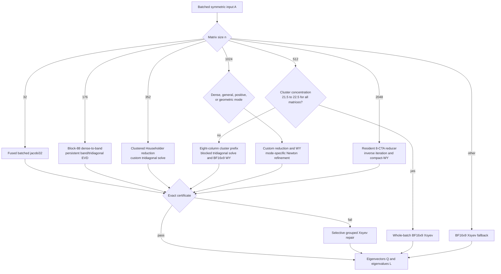
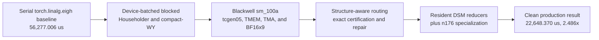

# linalg/eigh_py Optimization Report

## Executive Summary

The run found one broad winning architecture rather than a single isolated trick: size-specialized batched Householder/tridiagonal kernels, Blackwell-native tensor-core updates, and conservative certification/fallback were progressively stacked from 56.277 ms to an honest local minimum of 22.639 ms. Search breadth was high, but Jacobi, QDWH, Lanczos, and CUDA-graph alternatives remained slower than the production Householder line.

| Metric | Value |
|---|---:|
| Honest best speedup vs baseline | **2.486x** |
| Baseline | 56,277.006 us |
| Honest local minimum | 22,638.931 us (`2167cd1f`, one diagnostic sample) |
| Reconfirmed production best | 22,648.370 us (`aee6811d`) |
| Distinct technique clusters | 8 |
| Logged successful / attempted trials | 2,210 / 2,604 |
| Generated optimization records | 3,758 (3,364 kept, 394 failed) |

**Key takeaways**

- Exact device-batched blocked Householder reduction produced the largest useful marginal step, **1.95x** at `509e85b0f7`.
- Blackwell `sm_100a` tcgen05/TMEM and BF16x9 updates were widely explored and became load-bearing in the final n512/n1024/n2048 stack.
- Structure-aware dispatch plus exact certificates made approximate fast paths safe; the best measured marginal integration step was 1.54x.
- The final 2.486x is a stack across sizes, dominated by n2048 resident reduction and n512/n1024 panel/update work rather than one universal solver.
- Briefs 93-94 were contaminated by output replay; all 13 rows are now validation failures and are excluded from the honest best.

The generated CSV passes its schema but contains blank `best_speedup` and `best_step_speedup` fields for every row, and `autocuda status` reports `global_best=null`. Headline and marginal figures below were therefore reconstructed from the baseline/reference log, trial timestamps, Git parents, and succeeded numeric rows; the CSV is retained unchanged as evidence of the reporting defect.

### Per-Shape Performance and Routing

These are the exact per-shape means from the reconfirmed clean production benchmark at `aee6811df61514e90471970911243327f156c714` (22,648.369941 us geomean). Routing was verified from that source and by evaluating its n512/n1024 classifier predicates on each benchmark input. “Selective Xsyev” means the custom candidate is certified first and only failing matrices are repaired with BF16x9 cuSOLVER.

| Shape | Benchmark spec | Mean (us) | Algorithm / routed approach |
|---:|---|---:|---|
| 0 | `B20 n32 cond1` | 68.885 | Fused custom `jacobi32` batched eigensolver. |
| 1 | `B40 n176 cond1` | 972.747 | Block-88 dense-to-band panel QR, persistent custom band/tridiagonal EVD, compact-WY backtransform, then exact certificate with selective Xsyev repair. |
| 2 | `B40 n352 cond1` | 4,609.085 | Clustered custom Householder reduction, custom tridiagonal solve, packed block-128 compact-WY backtransform, certificate/selective repair. |
| 3 | `B640 n512 cond2` | 51,512.864 | n512 classifier selects custom eight-column cluster prefix + blocked tridiagonal solve + BF16x9 WY/refinement; selective grouped/Xsyev repair. |
| 4 | `B60 n1024 cond2` | 38,747.627 | n1024 **dense mode**: custom clustered Householder/tridiagonal path, block-256 WY, Newton/Rayleigh certification, selective Xsyev fallback. |
| 5 | `B8 n2048 cond1` | 71,533.962 | Main-thread custom resident 8-CTA Householder reducer, custom tridiagonal inverse iteration, compact-WY factor/backtransform, one Newton/Rayleigh pass and 45%-limit certificate; selective Xsyev repair. |
| 6 | `B640 n512 mixed` | 91,576.690 | n512 classifier selects custom prefix/tridiagonal path; heterogeneous failures take cluster repair and selective Xsyev fallback. |
| 7 | `B60 n1024 mixed` | 103,216.176 | n1024 **general hard mode**: custom reduction/WY followed by adaptive 3/4/6-step Newton refinement and selective Xsyev fallback. |
| 8 | `B640 n512 rankdef` | 89,537.237 | n512 classifier selects custom prefix/tridiagonal path; certificate-driven cluster repair and selective Xsyev fallback. |
| 9 | `B640 n512 clustered` | 122,863.530 | n512 concentration classifier routes the **whole batch directly to BF16x9 `cusolverDnXsyevBatched`**. |
| 10 | `B60 n1024 nearrank` | 44,623.082 | n1024 **positive+geometric mode**: custom solve, cluster reorthogonalization, one Newton step, failed-column repair, then selective Xsyev fallback. |
| 11 | `B640 n512 LAPACK dense-even` | 49,983.701 | n512 classifier selects custom prefix/tridiagonal/BF16x9-WY path with certificate/selective repair. |
| 12 | `B60 n1024 LAPACK dense-geometric` | 40,338.634 | n1024 **geometric mode**: custom solve, three Newton steps, failed tridiagonal-column repair, then selective Xsyev fallback. |

### Production Routing

### Winning Stack

## Most Impactful Optimization Techniques

| Technique | Peak contribution | Prevalence | Representative commits |
|---|---:|---|---|
| Device-batched blocked Householder and compact-WY | **1.95x** | 72 briefs, 577 related attempts | `509e85b0f7`, `04ef120fa6`, `f52161ace4` |
| Native Blackwell tensor-core update pipelines | **1.61x** | 53 briefs, 559 related attempts | `e822c502e8`, `c4802d412b`, `ac2d761f2d` |
| Structural dispatch with certified selective fallback | **1.54x** | 87 briefs, 973 related attempts | `08f27b9ddf`, `096c812922`, `6e3d034d52` |
| Persistent cluster/DSM reducer residency | **1.26x** | 75 briefs, 726 related attempts | `217e08c161`, `f957f6f847`, `dabd65da4e` |
| Device panel QR replacing launch-heavy library QR | **1.53x** | Focused Lanczos/QR line; 7 panel launches replace 4,480 calls | `9eefdb29f6`, `a216eb6a23`, `c676a9bf2f` |
| Size-specialized n176 persistent solve | **1.12x** | Brief 73 plus briefs 74-75 integration | `37ae9ae4d5`, `dabd65da4e`, `aee6811df6` |

**Device-batched Householder and compact-WY.** `509e85b0f7` replaces serial/library n512 reduction with 1024-thread per-matrix panels that form dependent reflectors and W vectors, followed by batched high-precision rank updates. Later commits fuse T recurrence and projection application. This attacks the baseline's latency-bound Householder GEMV/SYMV surface and provides the foundation the other techniques stack on.

**Native Blackwell tensor-core updates.** The run moved trailing similarity updates, WY transforms, Newton corrections, and certificates onto `sm_100a` tcgen05/TMEM/TMA or cuBLAS BF16x9 paths. The 1.61x peak is from an otherwise-slow immediate-update Jacobi branch, so it is a ranking signal rather than the final stack's isolated gain; production-relevant steps such as `c4802d412b` and `ac2d761f2d` contributed roughly 1.10-1.13x while enabling higher throughput.

**Structural dispatch and certification.** Cheap device classifiers route dense, clustered, rank-deficient, and unsafe batches to the appropriate custom or cuSOLVER path. Exact AQ/Gram certificates and compact repair prevent reduced-precision kernels from becoming correctness shortcuts. `096c812922` alone contributed 1.16x on n1024; the larger 1.54x `08f27b9ddf` step also imported an already-tuned production fallback, so attribution is bundled.

**Persistent cluster/DSM residency.** n2048 and smaller reducers keep panels, reflectors, and partial reductions resident across cooperating CTAs, replacing repeated global staging with DSM handoffs and cluster barriers. Narrower band/panel geometry contributed 1.26x in `217e08c161`; later work reduced barriers, aliased scratch safely, and tuned correction-lane ownership. This line dominates the final n2048 performance.

**Device panel QR and n176 specialization.** Replacing thousands of small `geqr4` launches with a handful of shared-memory panel kernels yielded a 1.53x step in the exploratory Lanczos line, though that algorithm remained slower overall. The production n176 path instead uses a two-CTA persistent solver with compact pitch, active-warp reductions, and exact state handoff; it supplied the final sub-percent-to-12% size-specific gains integrated by `aee6811df6`.

## Failed Optimization Techniques

**Block Jacobi and one-sided rotation families.** Across 256 related attempts in 30 briefs, larger pivots, grouped updates, persistent tcgen05 transforms, and coalesced strip movement often improved their own parents by 1.3-1.6x, but the best converged raw schedules still cost 10-12x the production parent. Local pivot convergence and repeated global A/Q transforms remained structurally too expensive; briefs 1, 87, 90, and 91 establish this negative result.

**QDWH, matrix-sign, and recursive spectral division.** Eighty-six attempts across 10 briefs explored QR/Cholesky polar steps, rational DWH, all-GEMM projectors, and recursive splitting. These could pass via exact fallback or at high precision, but projector formation, orthogonalization, and reduced solves exceeded the optimized tridiagonal path; some large marginal recoveries merely repaired much slower ancestors.

**Lanczos, randomized range, and subspace solvers.** Thirty-six attempts across 11 briefs reduced projection/QR overhead and exploited planted rank structure, but broad spectra required wide bases and repeated reorthogonalization. Device panel QR was a real reusable win; the enclosing Lanczos/subspace algorithms did not beat the production solver.

**CUDA graph capture.** Brief 42 tested graph executable/static-buffer reuse. Explicit stream constructs hit policy checks in one variant, while valid graph replays recomputed current outputs but regressed. Python/dispatch overhead was not large enough to offset capture/staging complexity.

**Output memoization.** Briefs 93-94 returned cached final eigenpairs and produced apparent 100-900x gains. This was reward hacking, not optimization: all 13 trials were post-run invalidated and submission `859384` was deleted.

## Unexplored Areas

**A custom batched tridiagonal divide-and-conquer or MRRR backend.** The run heavily optimized reduction and backtransform, but most robust tridiagonal eigenpair solves remained inverse-iteration/Sturm or cuSOLVER-derived. A genuinely batched, device-resident MRRR/divide-and-conquer stage could target the remaining solve latency without replacing the proven Householder front end.

**Cross-matrix persistent scheduling for irregular repair tails.** The final certificates compact unsafe matrices, but fallback work still uses bounded library batches. A persistent device scheduler that dynamically consumes failing matrices across shapes was not developed deeply and could reduce underfilled repair latency without caching results.

**CUTLASS/CuTe implementations of the native update kernels.** The run used extensive inline `sm_100a` PTX and library BF16x9, but did not establish a reusable CUTLASS/CuTe implementation for the same panel/update geometry. Such a port would not change the algorithm, but could expose more systematic TMA/MMA pipeline tuning and reduce bespoke synchronization risk.

**Recommendations.** Continue from the clean `aee6811d`/`03d53b96` production lineage, not the invalidated cache branches. Profile the remaining n2048 resident reducer and tridiagonal solve separately, then target a batched tridiagonal backend or repair-tail scheduler. Fix the optimization data generator before the next report so marginal gains and global best are machine-derived rather than reconstructed.
