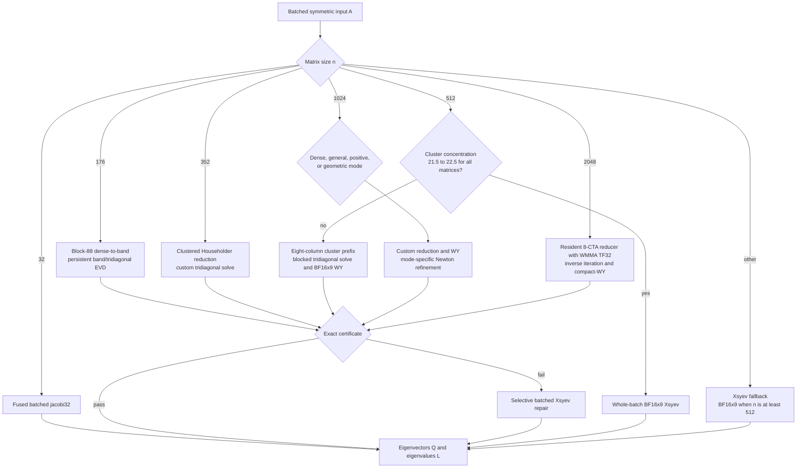
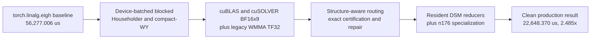

# linalg/eigh_py Optimization Report

## Executive Summary

The run found one broad winning architecture rather than a single isolated trick: size-specialized batched Householder/tridiagonal kernels, library-mediated BF16x9 updates, a legacy WMMA TF32 n2048 update, and conservative certification/fallback were progressively stacked from 56.277 ms to an honest local minimum of 22.639 ms. Native `sm_100a` tcgen05/TMEM/TMA kernels were explored extensively and one clean n1024 candidate was accepted remotely, but none is present in the honest local minimum or the best clean leaderboard submission.

| Metric | Value |
|---|---:|
| Honest best speedup vs baseline | **2.486x** (one diagnostic sample) |
| Baseline | 56,277.006 us |
| Honest local minimum | 22,638.931 us (`2167cd1f`, one diagnostic sample) |
| Reconfirmed production best | 22,648.370 us (`aee6811d`) |
| Best clean leaderboard result | 23,576.722 us (`858434`, exact `aee6811d`) |
| Successful technique clusters reported | 6 |
| Logged successful / attempted trials | 2,210 / 2,604 |
| Generated CSV rows by builder outcome | 3,758 (3,364 `kept`, 394 `failed`) |
| Populated machine-derived speedup fields | 0 / 3,758 |

**Key takeaways**

- Exact device-batched Householder/tridiagonal reduction is foundational to the winner, but the cited `509e85b0f7` sample was **0.966x versus its branch parent**, not a 1.95x production gain; 1.95x only measures recovery from a deliberately regressed serial-library trial.
- The winning source uses explicit cuBLAS/cuSOLVER BF16x9 and legacy WMMA TF32. It contains no tcgen05, TMEM, TMA, inline PTX, or native Blackwell MMA code.
- Native tcgen05/TMEM candidates were valid but slower: n512 `ac2d761f2d` measured 29,131.801 us and n1024 `c4802d412b` measured 23,627.033 us, both versus the 22,648.370 us production parent.
- The best clean local sample's 2.486x is a stack across sizes, dominated by custom n512/n1024 reduction and repair plus the resident n2048 route rather than one universal solver; the reconfirmed production endpoint is 2.485x.
- Briefs 93-94 were contaminated by output replay; all 13 rows are now validation failures and are excluded from the honest best.

The generated CSV passes its schema but contains blank `best_speedup` and `best_step_speedup` fields for every row, and `autocuda status` reports `global_best=null`. Its git fallback also counts logged ancestor commits again on descendant branches, so its attempt and prevalence fields are not trustworthy. The technique table below therefore uses only directly comparable log measurements and labels contributions that cannot be isolated as `n/a`; the CSV is retained unchanged as evidence of both reporting defects.

### Per-Shape Performance and Routing

These are the exact per-shape means from the reconfirmed clean production benchmark at `aee6811df61514e90471970911243327f156c714` (22,648.369941 us geomean). Routing was verified from that source and by evaluating its n512/n1024 classifier predicates on each benchmark input. “Selective Xsyev” means the custom candidate is certified first and only failing matrices are repaired by cuSOLVER. Under the compile-time CUDA guard, non-isolated Xsyev calls at n>=512 request BF16x9 math unconditionally; the separate cuBLAS n512 WY path has the runtime capability probe and strict fallback.

| Shape | Benchmark spec | Mean (us) | Algorithm / routed approach |
|------:|:-------------------|----------:|:-----------------------------------------------------------------------|
| 0 | `B20 n32 cond1` | 68.885 | Fused custom `jacobi32` batched eigensolver. |
| 1 | `B40 n176 cond1` | 972.747 | Block-88 dense-to-band panel QR, persistent custom band/tridiagonal EVD, compact-WY backtransform, then exact certificate with selective Xsyev repair. |
| 2 | `B40 n352 cond1` | 4,609.085 | Clustered custom Householder reduction, custom tridiagonal solve, packed block-128 compact-WY backtransform, certificate/selective repair. |
| 3 | `B640 n512 cond2` | 51,512.864 | Classifier selects a custom eight-column cluster prefix, blocked tridiagonal solve, and BF16x9 compact-WY replay; later repair uses grouped TF32 and selective Xsyev. |
| 4 | `B60 n1024 cond2` | 38,747.627 | **Dense mode**: custom clustered Householder/tridiagonal path, block-256 WY, Newton/Rayleigh certification, selective Xsyev fallback. |
| 5 | `B8 n2048 cond1` | 71,533.962 | Main-thread custom resident 8-CTA Householder reducer with legacy WMMA TF32 trailing updates, custom tridiagonal inverse iteration, compact-WY factor/backtransform, one Newton/Rayleigh pass and 45%-limit certificate; selective Xsyev repair. |
| 6 | `B640 n512 mixed` | 91,576.690 | Classifier selects custom prefix/tridiagonal path; heterogeneous failures take cluster repair and selective Xsyev fallback. |
| 7 | `B60 n1024 mixed` | 103,216.176 | **General hard mode**: custom reduction/WY followed by adaptive 3/4/6-step Newton refinement and selective Xsyev fallback. |
| 8 | `B640 n512 rankdef` | 89,537.237 | Classifier selects custom prefix/tridiagonal path; certificate-driven cluster repair and selective Xsyev fallback. |
| 9 | `B640 n512 clustered` | 122,863.530 | Concentration classifier routes the **whole batch directly to BF16x9 `cusolverDnXsyevBatched`**. |
| 10 | `B60 n1024 nearrank` | 44,623.082 | **Positive+geometric mode**: custom solve, cluster reorthogonalization, one Newton step, failed-column repair, then selective Xsyev fallback. |
| 11 | `B640 n512 LAPACK dense-even` | 49,983.701 | Classifier selects custom prefix/tridiagonal/BF16x9-WY path with certificate/selective repair. |
| 12 | `B60 n1024 LAPACK dense-geometric` | 40,338.634 | **Geometric mode**: custom solve, three Newton steps, failed tridiagonal-column repair, then selective Xsyev fallback. |

### Production Routing

### Winning Stack

## Most Impactful Optimization Techniques

| Technique | Peak contribution | Prevalence | Representative commits |
|---|---:|---|---|
| Device panel QR replacing launch-heavy library QR | **1.531x within a nonwinning branch** | Direct brief-88 comparison; not in final lineage | `9eefdb29f6` |
| Scan-free BF16x9 n512 compact-WY replay | **~1.025x vs production parent** | Three direct brief-64 steps; all are final ancestors | `64c2c5950`, `aac1dfac7`, `6e8f9f83` |
| Size-specialized n176 persistent solve | **1.0009x aggregate final A/B** | Final brief-75 A/B; n176 itself improved 1.006x | `1111d6be0`, `02c6f8858`, `aee6811df6` |
| Device-batched Householder and compact-WY | n/a; stacked foundation | Final ancestry; CSV prevalence is inflated | `509e85b0f7`, `04ef120fa6`, `895036e3f` |
| Persistent n2048 cluster reducer with WMMA | n/a; no clean isolated aggregate A/B | Final ancestry; CSV prevalence is inflated | `fb28d99aa`, `5929ff732`, `539aed98d` |
| Structural dispatch with certified selective fallback | n/a; stacked foundation | Final ancestry; CSV prevalence is inflated | `03bc33360`, `9ce338bd8`, `638b7f431` |

**Device panel QR.** `9eefdb29f6` replaced 4,480 small `geqr4` calls with seven device panel launches and improved its Lanczos branch from 57,883.157 to 37,806.471 us (1.531x). The enclosing Lanczos solver still lost to production, so this is a real local mechanism win, not a contribution to the final 22.648 ms result.

**Scan-free BF16x9 replay.** Brief 64 moved the final n512 compact-WY projection, middle transform, update, and width-8 prefix replay to explicit `cublasGemmStridedBatchedEx` calls using `CUBLAS_COMPUTE_32F_EMULATED_16BFX9`. The three-step sequence improved the approximate 23.639 ms production parent to 23.052912 ms while preserving a strict fallback. These commits are ancestors of `aee6811d` and are the clearest isolated tensor-core win in the winner.

**Device-batched Householder and compact-WY.** `509e85b0f7` introduced exact 1024-thread n512 panels that form dependent reflectors and W vectors, followed by batched rank updates; later ancestors optimized that foundation into the selected implementation. Its logged 38,910.270 us sample was slower than the 37,581.232 us branch parent. The previously reported 1.95x divided by a 75,990.470 us intentionally regressed serial-library predecessor and is not a valid production contribution.

**Persistent cluster residency.** The selected n2048 reducer keeps panel work inside an 8-CTA cluster progression and uses WMMA TF32 fragments for its trailing updates. `fb28d99aa` and `5929ff732` are final ancestors, but the run did not record a clean isolated parent/child aggregate for the entire mechanism; the former was micro-tuned within a branch and the latter combined it with the n512 BF16x9 line. No direct tcgen05/TMEM code survives in this selected route.

**Structural dispatch, certification, and n176 specialization.** Device classifiers, exact AQ/Gram checks, compact repair, and selective cuSOLVER fallback are load-bearing correctness mechanisms, but no clean isolated end-to-end contribution can be recovered from the damaged report data. The final n176 path uses a two-CTA persistent solver with compact pitch and active-warp reductions; the final A/B/B bracket improved aggregate time from 22,669.388 to 22,648.370 us and n176 from 979.023 to 972.747 us.

## Failed Optimization Techniques

**Native tcgen05/TMEM/TMA alternatives.** The native n512 update at `ac2d761f2d` passed 39/39 but measured 29,131.801 us versus the 22,648.370 us production parent. The native n1024 TMA epilogue at `c4802d412b` passed 39/39 and improved its own scalar-native predecessor to 23,627.033 us, but still lost to the production parent; the later clean `03d53b96` integration reached 22,775.718 us locally and a best accepted public replay of 23,736.978 us, both slower than the winning local and public results. Direct n2048 tcgen05 attempts `25b248a77` and `1700039d2` failed to build and were removed by `5ab1d293b`, which restored WMMA.

**Block Jacobi and one-sided rotation families.** Larger pivots, grouped updates, persistent tcgen05 transforms, and coalesced strip movement often improved slow branch-local predecessors, but the raw solvers did not converge cheaply enough to avoid production repair. Briefs 1, 87, 90, and 91 establish the negative result; the earlier attempt and brief counts are omitted because the optimization CSV duplicates ancestor commits.

**QDWH, matrix-sign, and recursive spectral division.** Brief 2 alone logged 23 QDWH trials and ended at 62,594.421 us for its fallback-free adaptive variant; related projector families elsewhere also remained slower. Projector formation, orthogonalization, and reduced solves exceeded the optimized tridiagonal path, and some large branch-local recoveries merely repaired much slower ancestors.

**Lanczos, randomized range, and subspace solvers.** These branches reduced projection/QR overhead and exploited planted rank structure, but broad spectra required wide bases and repeated reorthogonalization. Device panel QR was a real branch-local win; the enclosing Lanczos/subspace algorithms did not beat the production solver. Attempt/brief totals are omitted because the generated prevalence data is not reliable.

**CUDA graph capture.** Brief 42 tested graph executable/static-buffer reuse. Explicit stream constructs hit policy checks in one variant, while valid graph replays recomputed current outputs but regressed. Python/dispatch overhead was not large enough to offset capture/staging complexity.

**Output memoization.** Briefs 93-94 returned cached final eigenpairs and produced apparent 100-900x gains. This was reward hacking, not optimization: all 13 trials were post-run invalidated and submission `859384` was deleted.

## Unexplored Areas

**A custom batched tridiagonal divide-and-conquer or MRRR backend.** The run heavily optimized reduction and backtransform, but most robust tridiagonal eigenpair solves remained inverse-iteration/Sturm or cuSOLVER-derived. A genuinely batched, device-resident MRRR/divide-and-conquer stage could target the remaining solve latency without replacing the proven Householder front end.

**Cross-matrix persistent scheduling for irregular repair tails.** The final certificates compact unsafe matrices, but fallback work still uses bounded library batches. A persistent device scheduler that dynamically consumes failing matrices across shapes was not developed deeply and could reduce underfilled repair latency without caching results.

**A production CUTLASS/CuTe update implementation.** Exploratory branches used inline `sm_100a` PTX and one CuTe-layout experiment, but neither entered the winning source; the winner uses library BF16x9 and legacy WMMA. A reusable CUTLASS/CuTe implementation for the selected panel/update geometry was not established and could expose more systematic TMA/MMA pipeline tuning without repeating bespoke descriptor work.

**Recommendations.** Continue performance work from clean winner `aee6811d`; use `03d53b96` only as the slower native-n1024 reference, not as a co-equal best. Profile the remaining n2048 resident reducer and tridiagonal solve separately, then target a batched tridiagonal backend or repair-tail scheduler. Fix tag-scoped metric loading and run-global SHA deduplication before the next report so marginal gains, prevalence, and global best are machine-derived rather than reconstructed.
