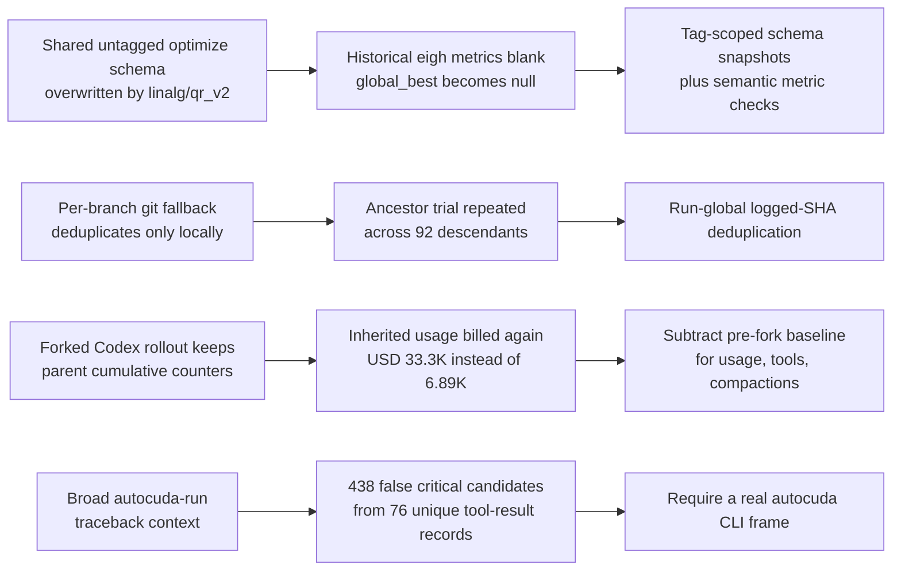

# Autocuda Skill Audit: 2026-07-03-13-39-25

## Executive Summary

Four autocuda skill/CLI contract issues were confirmed: two in `report-optimization` and its shared `optimize-tree` data contract, one in `report-cost`, and one in `report-skill` candidate detection. Harness coverage is complete for all 95 brief branches plus the manager/report session, so the audit is trustworthy; the main qualification is that reused worker conversations can cover several brief IDs.

- A later run overwrote the untagged optimize schema, leaving all 3,758 generated rows with blank speedup fields, including every metric-bearing logged trial, while schema validation still passed.
- The optimization report's git fallback re-counts logged ancestor commits on descendant branches, inflating attempts and prevalence and duplicating techniques.
- The cost builder charged forked Codex rollouts for inherited cumulative parent usage, inflating this run from the corrected $6.89K and 12.08B post-fork tokens to $33.3K and 59.70B.
- The skill candidate extractor reported 438 critical autocuda exceptions from 76 unique ordinary kernel, build, or probe tool-result records.
- No confirmation gates, stale CLI syntax, unreadable records, or missing branch records were found.

### Root-Cause Map

## Skill Issue Candidates

| Branch | Skill | Severity | Category | Evidence | Recommendation |
|---|---|---|---|---|---|
| `autocuda/optimize/2026-07-03-13-39-25/manager` | `report-optimization`, `optimize-tree` | high | schema contract | At 2026-07-06T18:08:17Z the manager recorded 3,758 rows with both speedup columns blank and `global_best=null`; the active schema is now `linalg/qr_v2`, while this run logs `linalg/eigh_py`. | Persist and load optimize schemas per tag; reject a report whose selected run metrics do not match the loaded schema. |
| `autocuda/optimize/2026-07-03-13-39-25/brief-0` | `report-optimization` | high | ancestry duplication | Commit `d05f2986` is logged once on brief 0, but git-history fallback emits it on 92 descendants as 92 attempts and also emits the logged observation separately. | Suppress any globally logged SHA from git fallback on every selected branch and add linear/diamond ancestry tests. |
| `autocuda/optimize/2026-07-03-13-39-25/manager` | `report-cost` | high | cumulative fork accounting | `_summarize_harness_jsonl` takes each rollout's final cumulative token snapshot and counts all compactions, even when a forked rollout embeds its parent's prior counters. | Detect each child-specific fork boundary and subtract the preceding cumulative baseline; count tools and compactions only after that boundary. |
| `autocuda/optimize/2026-07-03-13-39-25/brief-83` | `report-skill` | medium | false autocuda exception | Candidates `bug_0408` and `bug_0409` call a failed residual stress probe a critical autocuda exception only because it ran under `autocuda run`. | Require an autocuda CLI traceback frame or explicit CLI failure; ignore child build, validation, benchmark, and probe tracebacks. |

The schema-contract failure is recorded in `/home/shadeform/.codex/sessions/2026/07/03/rollout-2026-07-03T13-37-30-019f2832-e134-7e31-9969-1d56b2f65234.jsonl:39172` at `2026-07-06T18:08:17.281Z`. Direct artifact review confirms `autocuda/log-schema-optimize.json` currently names `linalg/qr_v2`, whereas `2026-07-03-13-39-25-optimize-tree-reference-log.csv` and all selected brief logs carry `linalg/eigh_py`. There are 2,206 succeeded rows with numeric `linalg/eigh_py` metrics, yet `2026-07-03-13-39-25-report-optimization.csv` has zero populated `best_speedup` or `best_step_speedup` cells and `autocuda status` returns an empty `top_best`.

The ancestry defect is grounded in `/home/shadeform/.codex/sessions/2026/07/03/rollout-2026-07-03T13-47-52-019f283c-5cc8-70d3-ad2e-869469f03ceb.jsonl:4047` through line 4051 at `2026-07-03T17:17:53.775Z` through `17:17:57.716Z`: brief 0 commits and logs `d05f2986` once. The optimization CSV nevertheless contains one git-subject row with 92 attempts across 92 branches and a separate one-attempt row for the logged description; `git branch --contains` confirms those are inherited descendants, not 92 independent trials.

The cost defect is explicit in `lib/_report.py::_summarize_harness_jsonl`: lines 1430-1436 define Codex token counts as cumulative, lines 1531-1546 retain only the final snapshot, and lines 1507-1508 count every compaction in the file. Forked rollout files contain the parent's earlier transcript and counters. Subtracting the last snapshot before each child-specific fork boundary reduces the run from 59.70B tokens, 794 compactions, and about $33.3K to 12.08B post-fork tokens, 134 compactions, and $6,886.96. For example, brief 75 costs $20.27 after subtracting its line-8395 baseline from its line-9386 final snapshot, not $548.92.

The extractor defect is visible in `/home/shadeform/.codex/sessions/2026/07/05/rollout-2026-07-05T22-46-31-019f3476-39d6-7ee1-8ae1-8ae7ff060479.jsonl:10598` at `2026-07-05T23:18:46.740Z`. The traceback is an expected `A @ Q - Q @ diag(L)` residual failure from a worker stress probe. Across the CSV, 438 critical candidates collapse to 76 unique source-line/tool-result records: 69 kernel/harness failures, three ad hoc probe failures, and four other child failures; none contains an autocuda CLI implementation frame. The two remaining automated candidates describe a kernel's Blackwell descriptor defect, not a skill defect.

## Root Causes

**Untagged mutable schema.** `skills/optimize-tree/SKILL.md` tells every run to call `autocuda schema define optimize`, which writes the shared `autocuda/log-schema-optimize.json`. `skills/report-optimization/SKILL.md` later trusts `autocuda report data optimization`, while `lib/_report.py::_primary_benchmark` and `lib/_manager.py::_compute_top_best` load that current global schema rather than a schema associated with the requested tag. `report-optimization-csv` permits blank numeric cells, so the semantic loss is reported as schema-valid.

**Branch-local rather than run-global deduplication.** `lib/_report.py::cmd_report_build_optimization` compares each branch's git history only with `log_shas` from that same brief log. An ancestor commit logged by an earlier brief is therefore treated as an unlogged commit on every descendant, despite `_metric_by_sha` already indexing logged SHAs across the full selected run.

**Final cumulative snapshot without fork subtraction.** `lib/_report.py::_summarize_harness_jsonl` correctly recognizes that Codex token snapshots are cumulative within a file, but assumes the file begins at zero usage. Forked agent rollouts embed a parent prefix and its cumulative counters, so taking the final snapshot independently for each selected child bills the inherited prefix repeatedly. Compactions and tool calls have the same boundary problem.

**Over-broad traceback context.** `lib/_report.py::_has_autocuda_context` treats `[autocuda run]` and any `/autocuda/` worktree path as proof that a traceback came from autocuda itself. This contradicts the normal-failure rule in `skills/report-skill/SKILL.md` and turns expected compiler, validation, and kernel failures into critical audit candidates.

## Fix Plan

1. Make optimize schemas tag-scoped or snapshot the active schema when a manager baseline is written. Update `optimize-tree/SKILL.md`, `report-optimization/SKILL.md`, `schema define`, `status`, and report-data loading together; fail with a metric/schema mismatch instead of emitting an all-blank valid report. Validate with a regression that creates run A, overwrites the active schema for run B, then runs `autocuda status --tag A` and `autocuda report data optimization --tag A` with non-empty speedups.

2. Build a run-global set of logged commit SHAs before the per-branch git fallback and skip those SHAs on every branch. Keep fallback only for genuinely unlogged or newly cherry-picked commits. Validate with a linear ancestry and a diamond/merge fixture, asserting one attempt for one logged trial and no duplicate normalized technique row.

3. Teach `report data cost` about Codex fork boundaries. For every selected rollout, identify the child-specific boundary, subtract the immediately preceding cumulative token snapshot, and count compactions and tools only after the boundary; retain one anchor for reused multi-brief worker conversations. Validate with a parent plus two forked children whose known deltas sum without any inherited usage.

4. Narrow `autocuda_exception` detection to tracebacks containing `bin/autocuda`, `lib/autocuda_cli.py`, or another known CLI frame, and classify wrapper child failures separately or ignore them. Validate with a fixture whose `autocuda run` child raises a residual error and assert that `report data skill` emits no autocuda exception, while a real CLI traceback still emits one.

5. Add a semantic report check: when selected logs contain numeric kept trials, reject an optimization CSV with no populated speedup fields. Validate with `autocuda schema check report-optimization-csv --output <fixture>` plus a new run-aware semantic check or integrate that invariant into data generation tests.

## Verification

- Rebuilt `autocuda/2026-07-03-13-39-25-report-skill.csv` from 98 brief-to-session mappings plus the manager session. Briefs 87-89 each have two session segments; reused long-lived sessions account for the other multi-brief mappings.
- `autocuda schema check report-skill-csv --output 2026-07-03-13-39-25` passed.
- Reviewed all 440 generated candidate rows against their source JSONLs and collapsed 438 exception rows to 76 unique source records before triage.
- Searched assistant messages and tool results directly for `/autocuda:`, `autocuda:`, `SKILL.md`, CLI rejections, schema failures, contradictions, instruction defects, and confirmation gates.
- Reproduced the optimization failures: 0 of 3,758 rows have either speedup field, `autocuda status` returns `global_best=null`, and a once-logged commit is counted as 92 inherited attempts.
- Recomputed all 93 selected cost anchors from post-fork deltas: 12,083,223,851 disjoint tokens, 134 compactions, and $6,886.96, versus the stock cumulative-fork totals of 59.70B, 794, and about $33.3K.
- Harness coverage is 95 of 95 brief branches plus the manager/report session. No JSONL was missing or unreadable, so there are no coverage-gap rows.
- `autocuda schema check report-skill-markdown --output 2026-07-03-13-39-25` passed; the schema-valid Markdown was then converted to HTML.
