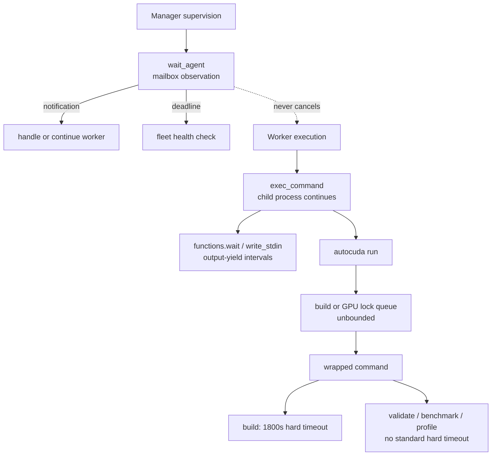
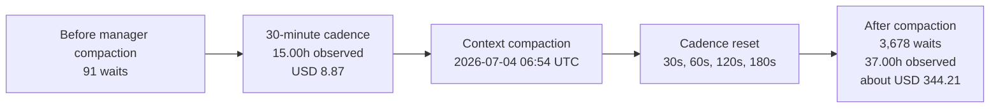

# Waiting and Timeout Report: 2026-07-03-13-39-25

## Executive Summary

This optimize-tree run used several mechanisms that all look like "waiting" in a trace but have different consequences. Manager `wait_agent` calls waited for mailbox activity and never stopped workers. Worker `functions.wait` and PTY polls yielded tool output while child commands continued. File-lock waits, by contrast, delayed admission to a shared build or the single B200. Process deadlines were a fourth and mostly missing mechanism: only the build wrapper enforced one.

**Key findings**

- The manager made 3,769 `wait_agent` calls and spent 52.00 of the 68.72 run hours inside them. This was the correct idle state while workers ran, but a post-compaction reset changed the intended 30-minute health cadence into mostly 30-second calls. Those wait-call turns cost an estimated $353.08, 48.0% of manager inference spend, without improving notification latency.
- Workers made 14,040 outer `functions.wait` continuations, occupying 43.53 aggregate worker-hours. In 94.7% of calls the cell completed rather than yielding again. These were observation/yield intervals, not command deadlines; the underlying build, validation, benchmark, or profile continued.
- A conservative worker-only parse matched 2,636 shared-build and 5,737 exclusive-GPU lifecycles. They accumulated 59h16m42s of lock queue time, equal to 29.8% of paired worker lifecycle-active time. GPU admission alone accounted for 50h10m32s, 1.56 times the measured execution time behind those GPU locks.
- `autocuda run` had neither a lock deadline nor a child-command deadline. `harness/build.sh` enforced 1,800 seconds plus a 30-second kill grace; validation, benchmark, profiling, and submission wrappers did not enforce the documented budgets.
- At least four commands exceeded their documented step budgets. Brief 91's benchmark ran for 571.460 seconds despite a 480-second stated limit and was logged as succeeded. Several hung kernels required manual interruption.

**Run:** first manager wait at 2026-07-03 13:48:04 UTC through graceful fleet stop at 2026-07-06 10:31:31 UTC, approximately 68h43m. Worker totals cover 83 post-fork session segments mapped to 95 briefs; concurrent worker-hours must not be added directly to elapsed run time.

### Waiting Layers

## Scope and Method

The manager analysis uses the preserved manager rollout through the last worker notification. Tool-call arguments were paired with their result timestamps; a rejected one-second request is counted as a call but contributes no wait duration. Inference estimates subtract cumulative pre-fork usage, separate cached from uncached input, and apply the same public list rates as the cost report.[^pricing]

Worker tool waiting uses 80 long-lived worker rollouts plus three interrupted segments after their child-specific fork boundaries. Outer `functions.exec` calls were paired with yielded `functions.wait` cells; inner `exec_command` and `write_stdin` calls describe the child-process layer. A long-lived session's label is its first brief anchor and can include later continuation briefs.

Lock records were normalized from both scalar and list-shaped Codex tool outputs, deduplicated by exact marker, and paired FIFO within each source segment. This worker-local method matched 8,373 lifecycles and left 50 acquisitions and 166 releases unmatched, so its totals are conservative. The separate global run-window audit pairs across trace labels and is used only as a cross-check.

The report keeps three denominators distinct:

| Quantity | Meaning | May overlap? |
|---|---|---|
| 68.72 elapsed hours | Wall-clock optimization window | No |
| 198h50m59.8s paired lifecycle-active time | Sum across concurrently active worker segments | Yes |
| Aggregate wait hours | Sum of time inside a mechanism across manager or workers | Yes |

## Mechanism Inventory

| Layer | Intended role | Actual behavior in this run | Deadline effect |
|---|---|---|---|
| Manager `wait_agent` | Sleep until worker/user activity, with a 30-minute health-check ceiling | Returned early on activity; timed out only as an observation deadline | Does not cancel a worker |
| Outer `functions.exec` / `functions.wait` | Yield and resume a long tool cell | The outer cell remained live and was resumed | Does not cancel the child |
| Inner `exec_command(yield_time_ms)` | Return output or a PTY session | Returned a session ID when the process outlived the yield interval | Does not cancel the process |
| `write_stdin(yield_time_ms)` | Continue observing a PTY session | Waited for more output or process exit | Does not cancel the process |
| Shared build lock | Exclude builds from GPU measurements | Blocking `flock`, no acquisition deadline | Can queue forever |
| Exclusive GPU lock | Serialize validation, benchmark, and profile on one B200 | Blocking scheduler lock plus a 250ms rescan loop, no acquisition deadline | Can queue forever |
| Build wrapper | Bound CUDA-extension import/build | Coreutils `timeout`: 1,800s, TERM, then 30s kill grace | Enforced |
| Validate/benchmark/profile/submit | Bound experiment execution | Documented budgets were not passed into standard local wrappers | Not enforced |

The manager contract explicitly says completion notification is the only actionable worker signal and permits one brief-count health check every 30 minutes ([optimize-tree waiting contract](/home/shadeform/.codex/plugins/cache/brycelelbach-autocuda/autocuda/0.4.0/skills/optimize-tree/SKILL.md)). The worker contract requires synchronous `autocuda run` and forbids polling shells ([explore-brief concurrency contract](/home/shadeform/.codex/plugins/cache/brycelelbach-autocuda/autocuda/0.4.0/skills/explore-brief/SKILL.md)). The worker agent definition contradicts that rule by requesting a shell `until ... sleep 5` loop for long background calls ([worker definition](/home/shadeform/.codex/plugins/cache/brycelelbach-autocuda/autocuda/0.4.0/agents/optimize-tree-worker.md)). Actual workers usually used the native PTY continuation tools instead.

## Manager Waiting

### Cadence and outcomes

| Manager wait outcome | Calls | Share |
|---|---:|---:|
| Timed out with no update | 3,540 | 93.9% |
| Returned on worker/mailbox activity | 222 | 5.9% |
| Interrupted by new user input | 6 | 0.2% |
| Rejected invalid one-second request | 1 | 0.0% |
| **Total** | **3,769** | **100.0%** |

The manager spent 52.00 hours inside these calls, 75.7% of the run window. That fraction is not evidence that workers were idle: waiting is the manager's intended state while three workers execute. The defect is call frequency and the inference turn around each call, not the blocked wall time itself.

Every completed wait was followed by its inter-agent record within a median 21ms, p95 43ms, and maximum 74ms. This directly confirms that the long observation ceiling did not delay notifications. Conversely, 3,323 consecutive timeout-to-wait transitions added 3h48m20s of model/status overhead between calls, with a 3.269-second median and 8.681-second p95.

Requested observation ceilings were dominated by 3,136 calls at 30 seconds. There were also 433 at 60 seconds, 95 at 180 seconds, 48 at 30 minutes, 12 at 20 minutes, and 45 at other durations. Of the 30-second calls, 3,031 ended by timeout rather than activity.

### Compaction changed the policy

Before the compaction boundary, 91 waits covered 15.00 hours: 67 returned on activity, 23 timed out, and one returned on user input. Immediately after compaction, the manager resumed with short deadlines and eventually made 3,678 more calls. Since a 30-minute `wait_agent` already returns as soon as activity arrives, reducing the ceiling to 30 seconds did not improve notification responsiveness.

The 3,769 wait-call turns processed approximately 664.7M cached-input, 2.76M uncached-input, and 227,750 output tokens, an estimated $353.08. Total manager inference through optimization completion was about $736.02, making wait-call turns 48.0% of manager spend. A counterfactual that retained early-return notifications and used 30-minute health ceilings would have needed roughly 233 post-compaction calls rather than 3,678; applying the observed average cost per short-cadence call suggests about $322 avoidable spend. This is an estimate, not a replayed measurement.

The permitted 30-minute health check was also not executed literally. Seventy-seven `list_agents` checks had a median interval of 42.1 minutes, p95 of 161.7 minutes, and maximum gap of 3h41m43s; 58 of 76 adjacent intervals exceeded 30 minutes. Short mailbox polling therefore increased turn count without preserving the intended health-check cadence.

### Dispatch after notification

Direct notification/dispatch records are more reliable than `brief_start`/`brief_stop` rows for judging manager waiting:

| Dispatch phase | Samples | Median | p95 | Maximum |
|---|---:|---:|---:|---:|
| Manager brief row to `spawn_agent` | 80 | 6.202s | 20.448s | 52.421s |
| `spawn_agent` to worker `brief_start` row | 80 | 23.712s | 46.988s | 86.020s |
| Manager brief row to worker `brief_start` row | 80 | 32.525s | 56.666s | 94.690s |
| Final notification to `followup_task` | 92 | 31.948s | 325.819s | 3,915.915s |

The maximum follow-up delay was brief 4, but it did not leave a fleet slot empty: the manager spawned brief 7 into that slot 43.958 seconds after brief 4's notification and resumed brief 4 when a later slot freed. Brief 89 exposes the opposite logging artifact. Its stop/start rows imply a 77-minute deficit, yet its worker trace contains 1,471 records, 257 exec calls, and 78 waits throughout that interval; the manager sent continuation 20.909 seconds after notification, and the worker performed validation before writing its delayed `brief_start` row.

Fifteen continuation briefs reused an existing long-lived task agent rather than receiving a dedicated spawn. As a result, mailbox identity, current brief ID, and CSV lifecycle rows are not interchangeable. The behavior report's earlier occupancy/stall interpretation from CSV rows alone was invalid and has been corrected.

### Manager shell-cell waiting

Separate from worker notifications, the manager made 1,018 outer `functions.wait` calls for long shell cells. They occupied 3.766 hours, with a 16.269-second median, 18.416-second p95, and 18.831-second maximum. Of these, 948 completed their cell and 70 yielded while it was still running. These were output-yield waits, not process timeouts.

## Worker Waiting

### Tool continuation

| Worker tool observation | Count or duration |
|---|---:|
| Outer `functions.exec` calls | 46,240 |
| Nested `exec_command` starts | 23,306 |
| Nested `write_stdin` polls | 20,683 |
| Outer exec cells that yielded | 13,186 |
| Paired outer `functions.wait` continuations | 14,040 |
| Aggregate time inside outer waits | 43.525h |
| Median / p95 / maximum observed wait | 13.401s / 18.307s / 48.315s |
| Completed cell / still running | 13,297 / 743 |

Requested outer wait ceilings were 30 seconds for 10,162 calls, 10 seconds for 2,128, and 20 seconds for 1,521; the remaining 229 used other values. Because 94.7% of continuations returned a completed cell, most tool-call turns existed only to collect a result that was already near completion. Longer supported yield intervals would reduce continuation turns without delaying results because these waits return early on completion.

When a continuation still reported a running cell, the delay before the next wait call totaled 16.34 aggregate worker-hours with a 3.19-second median. The child process continued during that control/model delay, so it is not all lost runtime; it is primarily orchestration overhead and delayed result collection.

Wait-call turns processed approximately 2.501B cached-input, 11.87M uncached-input, and 459,566 output tokens, an estimated $1,323.48. Corrected worker inference was about $6,132.42, so these turns represent 21.6% of worker spend. Exact savings from a different yield cadence cannot be reconstructed because completion times within each requested interval are unknown.

The top long-lived session anchors by outer wait time were brief 39 (2.472h), brief 63 (2.271h), brief 49 (2.047h), brief 91 (1.893h), brief 92 (1.728h), and brief 89 (1.675h). These labels identify the session's first mapped brief, not necessarily every later continuation whose work occurred in it.

### What workers were observing

Origin classification is available only after an initial outer cell yielded, so it is not a complete command-time breakdown.

| Continuation origin | Wait calls | Aggregate observed time |
|---|---:|---:|
| Generic process / unclassified | 11,523 | 35.790h |
| Build | 719 | 2.328h |
| Benchmark | 703 | 2.241h |
| Validate | 621 | 1.728h |
| Nsight Systems | 341 | 1.042h |
| Other GPU work | 86 | 0.237h |
| Nsight Compute | 45 | 0.152h |
| Combined build and validate | 2 | 0.007h |

Only one worker-side `wait_agent` call was found, in brief 5. It was an atypical 30-second sleep/poll while the worker inspected and interrupted an overlapping lock wait; it was not part of the normal worker protocol.

### Polling and result collection failures

Workers issued 20,683 nested `write_stdin` polls; 6,056 requested one-second yields. For the 17,866 polls that reported wall time, observed blocking sums to 77.575 aggregate hours. This overlaps outer wait time, lock queueing, and useful command execution and therefore must not be added to any of them.

Of 13,186 yielded outer execution cells, 13,176 were eventually collected and ten were not. One uncollected brief 63 benchmark result led the worker to poll a stale session and rerun the benchmark about 61 seconds later; the other nine were interrupted-worker poll cells. Eleven stale polls failed with `Unknown process id`.

Fifty-two worker commands used shell sleep/poll inspection despite the worker contract's prohibition, totaling 16m52s of outer lifecycle time. Forty-seven occurred in the long-lived session while it handled the later brief 57 continuation; brief 63 used one `while pgrep ...; sleep 2` loop. The normal pattern was native session continuation, but the contradictory worker definition still produced avoidable shell polling.

## Resource-Lock Waiting

### Worker-local conservative totals

| Lock | Matched calls | Aggregate queue wait | Aggregate execution | Median wait | p95 wait | Maximum wait |
|---|---:|---:|---:|---:|---:|---:|
| Shared build | 2,636 | 9h06m11s | 34h11m04s | 0.000s | 54.915s | 559.744s |
| Exclusive GPU | 5,737 | 50h10m32s | 32h15m53s | 16.062s | 107.435s | 646.809s |
| **Total** | **8,373** | **59h16m42s** | **66h26m57s** |  |  |  |

The 59.28 aggregate wait hours equal 29.8% of the 198h50m59.8s paired worker lifecycle-active total. The GPU queue was the dominant source: its wait time was 5.51 times build queue time and 1.56 times the execution time behind exclusive GPU locks. On a one-GPU host with three active briefs, serialization is expected; the magnitude shows that admission latency was a major part of worker activity, not that the solver itself required concurrent callers.

Brief 92's long-lived session anchor accumulated the most worker-local lock wait at 3h31m22s. The global longest individual wait was brief 71: 646.809 seconds queued for a validation that then executed for 7.564 seconds. That trial correctly distinguished queue time from its explicit 240-second command envelope.

The global run-window cross-check matched 2,696 build and 5,802 GPU lifecycles, with 60.35 aggregate hours waiting and 67.70 hours executing. It is slightly larger because it includes manager and boundary-adjacent records and can pair 112 lifecycles whose acquisition and release appear under different trace labels. It is the right run-wide total; the 59.28-hour figure is the conservative worker-only total used for per-worker analysis.

Implementation evidence confirms that `autocuda run` is unbounded: `_run_logged` calls bare `subprocess.run`, the build path uses blocking `flock`, and exclusive selection holds a blocking scheduler lock while rescanning GPUs forever ([lock implementation](/home/shadeform/.codex/plugins/cache/brycelelbach-autocuda/autocuda/0.4.0/lib/_run.py)).

## Timeout Enforcement

| Step | Documented budget | Enforced by standard local path? | Actual stop mechanism |
|---|---:|---|---|
| Build/import | 1,800s wrapper default | Yes | TERM at deadline, KILL after 30s |
| Validation | 240s | No | Process exit or manual interruption |
| Benchmark | 480s | No | Process exit or manual interruption |
| Ranked evaluation | 900s | Not in local wrapper | Remote service behavior |
| Nsys | approximately 15-20s measured | No common hard deadline | Process exit or ad hoc shell timeout |
| Ncu | at least 600s advised | No common hard deadline | Process exit or ad hoc shell timeout |
| Leaderboard submission | at least 600s, retry up to 3 times advised | No standard enforced retry/deadline | CLI/service behavior |
| Build/GPU lock acquisition | None documented | No | Lock eventually acquired or caller interrupted |

The budgets appear in [`task.yml`](../problems/linalg/eigh_py/task.yml) and [`environment.md`](../autocuda/environment.md), but [`validate.sh`](../harness/validate.sh) and [`benchmark.sh`](../harness/benchmark.sh) invoke `eval.py` directly. Of worker exec records that referenced these wrappers, only 40 of 2,554 validation records and 19 of 2,335 benchmark records contained an explicit coreutils `timeout`; these counts are trace records, not unique process invocations.

The evaluator's 120-second per-shape break is soft. It is checked only after `custom_kernel` and `torch.cuda.synchronize()` return, and `multiprocessing.Pool.apply` blocks without a process timeout ([evaluator](../problems/linalg/eigh_py/eval.py)). It therefore cannot terminate a hung GPU kernel or evaluator child.

Workers issued 68 explicit shell `timeout` commands: 48 correctly placed the timeout around the payload inside `autocuda run`, 19 incorrectly wrapped `autocuda run` itself, and one bounded a probe. Sixty-one exited zero, four exited one, and three reached exit 124. Two exit-124 cases correctly stopped genuine validation hangs after 90 and 120 seconds. The third, in brief 61, used `timeout 180s autocuda run exclusive ...` and expired without an acquired-lock marker: GPU queue time consumed its entire budget before the payload started.

This distinction is load-bearing. Until `autocuda run` supports separate native limits, `autocuda run exclusive -- timeout 240s <validate>` bounds command execution after acquisition; `timeout 240s autocuda run exclusive -- <validate>` conflates queue and execution. Twenty-one Ctrl-C writes manually targeted 20 unique sessions during the run, showing that manual cancellation frequently substituted for a standard process deadline.

### Observed overruns and hangs

| Brief / trial | Operation | Stated budget | Observed behavior | Outcome |
|---|---|---:|---:|---|
| 49 | Validation | 240s | 285.791s execution | Completed after budget |
| 73 / 8 | Validation | 240s | 516.649s on GPU | Manually interrupted |
| 91 / 59 | Validation | 240s | 318.836s execution | Logged succeeded |
| 91 / 59 | Benchmark | 480s | 571.460s execution after 49.876s queue | Logged succeeded |
| 55 / 67 | Validation | 240s | Three deadlocks stopped at 185s, 90s, and 120s | Ad hoc interruption |
| 45 / 22 | Direct kernel run | None | Deadlocked for 254s | Manually terminated |
| 63 / 38 | Validation | 240s | Hung for 220s | Manually terminated |

Brief 91 is the clearest contract failure. The worker described its benchmark as running under the 480-second limit, but the ordinary wrapper had no timeout. It made 18 PTY `write_stdin` polls and 18 outer `functions.wait` continuations while the command ran for 571.460 seconds, then recorded a successful metric ([brief 91 log](2026-07-03-13-39-25-optimize-tree-brief-91-log.csv)). Brief 55's three manually bounded deadlocks likewise show why the wrapper needs a real deadline ([brief 55 log](2026-07-03-13-39-25-optimize-tree-brief-55-log.csv)).

## Benchmark Concurrency

Nothing in the benchmark or leaderboard path establishes a requirement for simultaneous production calls into the solver. `eval.py` creates a one-process pool and invokes each test or benchmark through blocking `pool.apply`; cases are evaluated serially. The three-way concurrency in this run came from optimization workers competing for one B200, not from the target API contract. Worker effort spent making the solver safe for unrelated concurrent callers was therefore outside the demonstrated local and leaderboard requirements.

## Recommendations

1. Preserve `wait_agent(timeout_ms=1800000)` as manager state across compaction. On timeout, perform one fleet-health and hourly-submission check; on notification, return immediately and handle that worker.
2. Remove the shell-polling instruction from `optimize-tree-worker`. Specify output-yield intervals separately from hard process deadlines and use native session continuation only.
3. Add `--lock-timeout` and `--command-timeout` to `autocuda run`. Start the command budget after lock acquisition so queue contention cannot consume validation or benchmark execution time.
4. Enforce the 240-second validation and 480-second benchmark limits in their wrappers, plus explicit profile and submission deadlines. Implement the documented three-attempt submission retry.
5. Emit a structured invocation ID with brief ID, command kind, queue duration, execution duration, configured deadline, exit reason, and timeout status. This would eliminate cross-trace pairing ambiguity.
6. Report elapsed run time, aggregate worker-active time, output-yield time, and lock queue time as separate measures. Never add concurrent worker-hours directly to wall-clock duration.
7. Keep solver validation aligned with the actual evaluator: serial calls and official local/leaderboard tests. Add concurrent-call work only if a test or explicit API requirement demonstrates it.

## Verification

- Parsed 3,769 manager `wait_agent` calls and 1,018 manager shell-cell waits through graceful fleet stop.
- Parsed 46,240 worker outer exec calls, 23,306 nested command starts, 20,683 PTY polls, and 14,040 paired outer continuations after worker fork boundaries.
- Re-ran lock extraction with normalized scalar/list tool outputs and source-local exact-marker deduplication; retained 8,373 conservative worker pairs and compared them with 8,498 global run-window pairs.
- Confirmed the timeout paths in `harness/build.sh`, `harness/validate.sh`, `harness/benchmark.sh`, `eval.py`, `task.yml`, and `autocuda run` source.
- Cross-checked documented overruns and deadlocks against brief logs and their underlying trace lock records.

[^pricing]: Approximate list-rate estimate, not an invoice. The calculation uses $5/M uncached input, $30/M output, and $0.50/M cache reads from [OpenAI's GPT-5.6 Sol pricing](https://openai.com/index/previewing-gpt-5-6-sol/), matching the corrected cost report. Actual plan credits and terms may differ.
