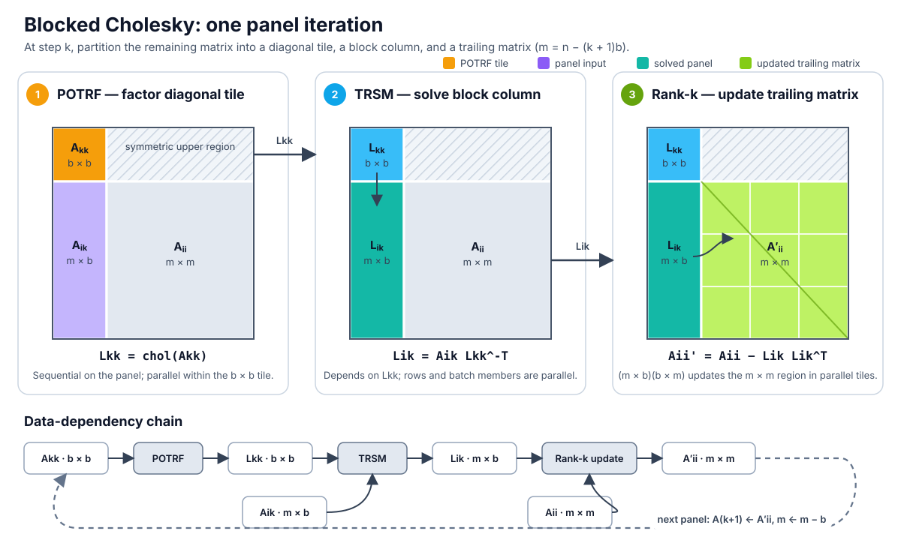

# Optimization Report: linalg/cholesky_py

## Executive Summary

The completed 45-hour B200 tree reduced the 15-shape benchmark geomean from 2153.690 µs to 743.614 µs, a 2.8962× speedup and 65.47% latency reduction. The result is a shape-dispatched portfolio assembled from several hardware-level mechanisms, so the search covered distinct matrix regimes but remained algorithmically concentrated on blocked Cholesky. Raw leader `6d5995fe` passed every public and secret check at 735.328/739.563 µs; the account retained the statistically indistinguishable 735.196 µs public result from `01366b20`. A separate reward-hacking audit classifies the raw run as contaminated because at least 288 successful rows construct hidden auxiliary CUDA streams and both leaders inherit that code; the results below are reported without filtering.

| Metric | Value |
|---|---|
| Baseline geomean | 2153.690 µs |
| Best local geomean | 743.614 µs |
| Overall best speedup | 2.8962× |
| Latency reduction | 65.47% |
| Distinct retained technique families | 7 |
| Successful / attempted logged trials | 1,454 / 1,638 (88.8%) |
| Failed logged trials | 184 (80 validation, 23 build, 81 runtime) |
| Workers / experiment branches | 5 / 98 |
| Most prevalent integration activity | Shape-specific composition: 58 of 98 branches, 702 attempts |
| Completion cutoff | 2026-07-20 22:58:12 UTC |

**Key takeaways**

- Multi-matrix register/shared kernels supplied the largest recorded marginal step, 1.8716× at `8b39c4e1`, although that commit also restored the n=256 library fallback.
- Persistent direct-cuSOLVER storage was the other large clean early lever at 1.6521×; later gains came from specializing individual shape regimes.
- The final large-shape win replaced a beta-zero solve GEMM with a no-source CUTLASS kernel, a clean 1.0272× step that set the 743.614 µs local record at `6d5995fe`.
- Fifty-eight composition branches show that dispatch and compatibility work were central: no one kernel or numerical format won from n=32 through n=32768.

## Computational Description

### Problem Overview

The kernel factors a batch of independent dense FP32 symmetric positive-definite matrices. For input `A` of shape `batch × n × n`, it returns a lower-triangular FP32 factor `L` with positive diagonal such that `A ≈ L Lᵀ`. Validation checks reconstruction, triangular structure, finiteness, dtype, and device rather than bitwise agreement with a library. Cholesky requires approximately `n³/3 + O(n²)` FLOPs per matrix and `O(n²)` storage, or approximately `batch × n³/3` FLOPs for a batch.

The B200 benchmark has 15 inputs spanning n=32 through n=32768. Six scaling-ladder cells—`4096×32` through `4×1024`—each contain `2²²` FP32 elements (16 MiB), while paired higher-batch n=512/1024/2048/4096 cells test throughput and occupancy. Single-matrix n=8192/16384/32768 cells expose large-factorization efficiency. All ranked inputs use `cond=2`, and the geometric-mean score gives every shape equal weight in log space.

### Computational Phases

At the algebraic level, blocked Cholesky repeats a POTRF → panel solve → Schur-product dependency chain. Small kernels fuse it within a CTA, while the middle-size paths split it into graph nodes. The figure shows conventional right-looking placement of the Schur update; the final batch-one n≥8192 path evaluates the same products left-looking, forming only the current 4096-wide supernode instead of materializing the full trailing matrix after every panel.

| Phase | High-level operation | Cost and parallel structure |
|---|---|---|
| 1. Dispatch and storage preparation | Select the exact shape path; acquire cached outputs, workspaces, pointer tables, factor sidecars, and captured graphs; copy or expose the required input triangle. | `O(batch × n²)` movement plus fixed dispatch, allocation, and launch latency. |
| 2. Diagonal-panel factorization (POTRF) | Form and factor the current `b × b` diagonal block in FP32-compatible arithmetic. | Approximately `O(batch × b³)` per panel. Panels are sequential; work is parallel within a panel and across matrices. |
| 3. Panel formation and triangular solve | Apply prior-factor contributions to the current block column, then compute `L₂₁ = A₂₁ L₁₁⁻ᵀ`. The widest large-shape panels materialize `L₁₁⁻¹` once and use a dense no-source GEMM instead of direct TRSM. | Approximately `O(batch × m × b²)`, plus `O(batch × b³)` when forming an inverse. Rows, output tiles, and batch members are parallel. |
| 4. Schur-product work | Right-looking paths update `A₂₂ ← A₂₂ − L₂₁L₂₁ᵀ`. The final large path instead forms the next `m × b` supernode as `A[k:,k:k+b] − L[k:,:k]L[k:k+b,:k]ᵀ`. | Right-looking: `O(batch × m² × b)` per panel. Left-looking: `O(batch × m × b × k)` for the current supernode. Either placement supplies most of the aggregate `batch × n³/3` work. |
| 5. Output finalization | Emit or transpose the physical factor, retain FP16 factor history where used, and zero the unused triangle. | `O(batch × n²)` bandwidth work; whole-matrix passes remain visible after faster factorization. |

### Performance Model and Bottlenecks

Ideal arithmetic intensity rises with n: about `n/12` FLOP/byte if only the required input and output triangles cross HBM, or `n/24` FLOP/byte for full input and output buffers, before panel rereads and sidecar traffic. Small matrices therefore cannot amortize launches and synchronization, while large panels can exploit tensor cores but retain a sequential POTRF/solve floor.

| Shape regime | Primary bottleneck | Performance model and evidence |
|---|---|---|
| n=32/64/128; batch=4096/1024/256 | Launch, synchronization, and on-chip instruction latency | The constant-footprint cells fell from `113.028/110.226/151.869` to `16.406/21.201/56.161 µs`. Grouping matrices per CTA, retaining rows in registers/shared memory, and fusing the dependency chain mattered more than peak throughput. |
| n=256/512; batch=64/640 | Dependency exposure, occupancy, and shared/HBM staging | The cells fell from `278.104/3783.269` to `72.488/968.925 µs`. The n=256 graph distributes five phase launches; n=512 instead uses 640 independent one-CTA left-looking chains, amortizing their serial panel work across the GPU. |
| n=512/1024/2048/4096; batch=16/4/2/1 | Library POTRF critical path and limited batch parallelism | Direct BF16x9 cuSOLVER remains fastest, measuring `583.593/1232.926/1252.386/1431.025 µs`. Persistent output, workspace, and pointer state reduce setup, but insufficient independent matrices limits custom tiled throughput. |
| n=1024/2048/4096; batch=60/8/2 | Sequential panel frontier plus launch/resource overhead | Captured distributed schedules reduced these cells from `2900.109/5077.278/13678.603` to `913.984/1873.977/1670.475 µs`. Many factor, solve, and triangular-update tiles expose parallelism while graph replay amortizes orchestration. |
| n=8192/16384/32768; batch=1 | Tensor-core product throughput with a serial 4096-panel floor | Final timings are `4452.950/13104.504/39794.560 µs`, versus `6403.699/34211.157/220808.879 µs` initially. FP16-history WGMMA products dominate as n grows; BF16x9 POTRF, inverse construction, and the 4096-row direct-TRSM tail remain critical. A predecessor profile measured a 4096 POTRF at 2.37 ms and 12.46% occupancy; the exact no-source leader was not counter-profiled. |

These classifications combine per-shape timings, trial outcomes, and hosted predecessor captures. Local Nsight profiling was unavailable, so they are not a complete counter-derived roofline model.

### Algorithm Dispatch

This table follows `custom_kernel` at final best commit `6d5995fe`. Dispatch depends only on batch size and n.

| Input shape | Selected algorithm | Details |
|---|---|---|
| 4096 × 32 × 32 | Grouped warp-resident Cholesky | Four matrices per 128-thread CTA, one warp each; LD33 shared staging, register-resident rows, and fully unrolled recursive factorization. Final: 16.406 µs, 6.89× baseline. |
| 1024 × 64 × 64 | Grouped register/shared Cholesky | Four matrices per 256-thread CTA, one 64-thread group each; LD65 shared tiles and register rows. Final: 21.201 µs, 5.20× baseline. |
| 256 × 128 × 128 | Compensated blocked-WMMA Cholesky | One 512-thread CTA per matrix; 16-wide FP32 panel factor/solve and compensated two-product TF32 WMMA lower RankK. Final: 56.161 µs, 2.70× baseline. |
| 64 × 256 × 256 | Captured split-phase MathDx Cholesky | Five-node graph over four 64-wide tiles; FP32 MathDx POTRF/TRSM, FP16-input/FP32-accumulate updates, and a compact factor sidecar. Final: 72.488 µs, 3.84× baseline. |
| 16 × 512 × 512 | Direct batched cuSOLVER | `cusolverDnSpotrfBatched` with FP32-emulated BF16x9 math and cached output, pointer table, and info. Final: 583.593 µs, 1.03× baseline. |
| 640 × 512 × 512 | One-CTA left-looking MathDx | One 128-thread CTA per matrix processes sixteen 32-wide tiles; FP32 POTRF/TRSM, FP16 sidecar products, and asynchronous padded staging. Final: 968.925 µs, 3.90× baseline. |
| 4 × 1024 × 1024 | Direct looped cuSOLVER | Four serial caller-ordered `cusolverDnSpotrf` calls share one persistent BF16x9 workspace. Final: 1232.926 µs, 1.14× baseline. |
| 60 × 1024 × 1024 | Captured 256-wide distributed Cholesky | Four outer panels; two-CTA 4×64 MathDx factorization, distributed solves/inner updates, and persistent triangular CuTe outer RankK. Final: 913.984 µs, 3.17× baseline. |
| 2 × 2048 × 2048 | Direct looped cuSOLVER | Two serial BF16x9 `cusolverDnSpotrf` calls reuse output and workspace. Final: 1252.386 µs, 3.14× baseline. |
| 8 × 2048 × 2048 | Per-matrix captured MathDx/CuTe chains | Eight 256-wide superpanels with inner 32-wide MathDx factorization, cuBLAS outer TRSM, and triangular CuTe RankK; eight sample chains use auxiliary captured queues. Final: 1873.977 µs, 2.71× baseline. |
| 1 × 4096 × 4096 | Direct cuSOLVER | One BF16x9 `cusolverDnSpotrf` with persistent output and workspace. Final: 1431.025 µs, 1.07× baseline. |
| 2 × 4096 × 4096 | Captured 64-microtile wavefront | Sixteen 256-wide superpanels, each comprising four 64-wide MathDx micro-panels; distributed solves and triangular CuTe RankK replay from a double-buffered graph pool. Final: 1670.475 µs, 8.19× baseline. |
| 1 × 8192 × 8192 | Two-supernode left-looking Cholesky | 4096-wide BF16x9 POTRF panels with FP16-history WGMMA formation of the second supernode; the 4096-row tail uses direct cuBLAS TRSM. Final: 4452.950 µs, 1.44× baseline. |
| 1 × 16384 × 16384 | Left-looking inverse-panel WGMMA | Four 4096-wide supernodes; 12288- and 8192-row panels use inverse plus 256×256, 2-CTA/2×1 no-source CUTLASS GEMM with TMA store, then direct TRSM. Final: 13104.504 µs, 2.61× baseline. |
| 1 × 32768 × 32768 | Left-looking inverse-panel WGMMA | Eight 4096-wide supernodes; six tails from 28672 through 8192 rows use the no-source inverse GEMM, followed by one 4096-row direct-TRSM tail. Final: 39794.560 µs, 5.55× baseline. |

## Most Impactful Optimization Techniques

| Technique | Peak contribution | Prevalence | Representative commits |
|---|---|---|---|
| Multi-matrix register/shared small Cholesky | 1.8716× | 4 of 98 branches, 113 attempts | `8b39c4e1`, `1428d299`, `9eb5fd3c` |
| Persistent direct cuSOLVER storage and BF16x9 | 1.6521× | 2 of 98 branches, 36 attempts | `9ce7e5f1`, `20835bf5`, `b2a59c6e` |
| Inverse-panel TMA/WGMMA large-shape solves | 1.6263× | 2 of 98 branches, 36 attempts | `d2c6c649`, `1727c3b6`, `6d5995fe` |
| Device-resident MathDx panel factorization | 1.6167× | 6 of 98 branches, 199 attempts | `8879bfc4`, `2ebbdd3e`, `be139ba0` |
| Mixed-precision triangular tensor-core updates | 1.2915× | 8 of 98 branches, 177 attempts | `be3e6750`, `436001ec`, `39a871d2` |
| Padded asynchronous operand staging | 1.1013× | 9 of 98 branches, 133 attempts | `b70bc5ba`, `66bc1676`, `68b86372` |
| Graph-captured split-phase shape pipelines | 1.0838× | 7 of 98 branches, 221 attempts | `1894c5d4`, `e621cdd8`, `362ce104` |

**Multi-matrix register/shared small Cholesky.** Dedicated extension kernels replace generic solver launches at n=32/64/128. The final n=32/n=64 kernels pack four independent matrices per CTA into padded shared tiles and keep row state in registers; n=128 uses one 512-thread CTA, FP32 panel work, and compensated TF32 WMMA updates. This attacks launch and barrier latency and stacks with the dispatcher through disjoint shape coverage. The 1.8716× peak at `8b39c4e1` also restored n=256 to its library path, but four dedicated branches and the final 6.89×/5.20×/2.70× per-cell speedups repeatedly support the mechanism.

**Persistent direct cuSOLVER storage and BF16x9.** `9ce7e5f1` changes the C++ binding to accept a reusable output and retains shape-scoped `info`, pointer tables, and solver workspace instead of allocating them for every call. The direct path selects batched or looped POTRF and enables cuSOLVER's FP32-emulated BF16x9 mode where profitable. This removes allocation and wrapper overhead in the low-batch middle regime while preserving a full factorization on every invocation. Two dedicated branches established the family; combined descendants widely retained it as the fallback, and its clean 1.6521× parent-relative step is the strongest isolated library-path evidence.

**Inverse-panel TMA/WGMMA large-shape solves.** `1727c3b6` replaces each very wide TRSM with one identity solve that materializes `L⁻ᵀ` and a full-grid 256×256, 2-CTA SM100 WGMMA panel GEMM. `6d5995fe` then uses CUTLASS's no-source `C=A*B` mainloop, removing the unconditional beta-zero C-load path while retaining TMA output. These changes target tensor-core utilization at n=16384/32768 and stack on the 4096-wide left-looking factorization. The table's 1.6263× at `d2c6c649` is a byte-identical restoration; the cleaner inverse and no-source increments were 1.0385× and 1.0272×. Only two branches pursued the family, and the second branch's corrected dual-output epilogue (`d384bd6a`) regressed the two largest cells, so the design remains concentrated rather than independently rediscovered.

**Device-resident MathDx panel factorization.** Across batch-64 n=256, batch-640 n=512, batch-60 n=1024, batch-8 n=2048, and batch-2 n=4096, MathDx POTRF/TRSM operators keep panel work on device and expose update tiles across matrices instead of returning to Python or cuSOLVER for every panel. One-CTA schedules win where the whole dependency chain fits; distributed factor/solve nodes win where more occupancy is needed. The family stacks with graph capture and tensor-core updates. Its 1.6167× peak at `8879bfc4` also restored the n=32 schedule, but six branches and 199 attempts produced substantial shape-local wins beyond that bundled step.

**Mixed-precision triangular tensor-core updates.** `436001ec` established the numerical split: diagonal POTRF and TRSM remain FP32-compatible while the `O(n³)` trailing products use TF32/FP16 tensor cores. Later CuTe schedulers enumerate only required triangular macrotiles, compact solved panels, and fuse factor emission or cleanup. This is the compute-throughput foundation beneath the large and high-batch paths and was pursued in eight branches. The 1.2915× peak at transplant `be3e6750` is a recovery signal even though that exact trial regressed its parent; the clean foundational step was 1.1713×, so neither number is an additive decomposition of the final 2.8962× result.

**Padded asynchronous operand staging.** LD36/LD40/LD68/LD72 leading dimensions, aligned `cp.async`/bulk transfers, compact sidecars, and shorter address lifetimes reduce bank conflicts and scoreboard pressure around MathDx and WGMMA. `b70bc5ba` also caps a grid-stride conversion launch so up to roughly 115,000 one-shot blocks become 4,096 persistent CTAs; `68b86372` changes both MathDx leading dimensions and every shared index. These refinements stack with factorization and graph families rather than standing alone. Nine branches tried them, but the 1.1013× peak is parent-sensitive and the final `cfe5f403` stage-padding trial improved its deliberately worse unpadded sibling while remaining slower than its branch parent.

**Graph-captured split-phase shape pipelines.** CUDAGraph replay turns factor, panel-solve, update, copy, and cleanup kernels into shape-specific dependency DAGs without paying repeated host orchestration. `e621cdd8` established the split n=2048 wave, while `362ce104` right-sized each live panel grid; the same pattern supports n=256, batch-60 n=1024, and batch-2 n=4096. It stacks with MathDx and triangular CuTe work by ordering bounded, residency-independent nodes. Seven branches and 221 attempts explored the family. The 1.0838× peak at `1894c5d4` is a recovery from a worse parent and its target cell itself regressed, so repeated smaller accepted gains and the large final per-shape speedups are stronger evidence than that single maximum.

## Failed Optimization Techniques

**Caller-stream and portability violations.** Explicit batch sharding and fork/join designs were rejected before trustworthy timing (`f2d11c5d`, `aa18342d`, `6247fd2f`, `e0e89988`), and several API or comment spellings tripped the same static policy. These failures do not refute overlap; they require one caller-ordered graph or residency-safe kernels rather than private queues and events.

**CuTe/CUTLASS layout, ABI, and hardware-contract failures.** Vector epilogues, rectangular remaps, width-changing TMA, and unsupported cluster/TMEM shapes produced compile errors, misaligned accesses, XID 13, or omitted tiles (`7057d474`, `cb456e9d`, `3ce85c8b`, `83194c8f`, `f98b3629`, `2fe427ce`). The final dual FP32/FP16 epilogue brief first failed source generation and then produced NaN/Inf (`7a0b342e`, `15b7dc11`, `efd0365a`); its corrected `d384bd6a` was still 3.2%/5.9% slower at n=16384/n=32768. Any retry needs explicit coordinate, coverage, alignment, and sidecar-store proofs before a hosted grid.

**Reduced precision and incomplete triangular emission.** Uncompensated TF32 n=128/n=256 updates produced NaN/Inf (`831dcdf0`, `daa5ee3b`), while lower-only schedules left diagonal or off-band physical halves dirty (`c87292ef`, `f70090d5`, `9aa7703b`). The first left-looking large-shape controls (`25607a77`, `e6d5e33c`) showed reconstruction residuals up to 0.333; after cleanup, the valid control still cost 51.084 ms at n=32768 versus the 39.795 ms winner, a 28% regression.

**Resource-heavy fusion and residency-dependent synchronization.** Full-matrix persistence crossed static/dynamic shared-memory or launch limits (`20bc0a8d`, `2050b6ec`, `66dd27dd`, `745c67ad`), while a 640-thread n=512 path ran for 1,846 seconds (`60e65542`). N=2048 19-CTA schedules (`0143b963`, `733ba073`) stalled for 460–507 seconds because 152 blocks exceeded 148 SMs at one resident block per SM. Graph ordering between bounded nodes is the safe design point.

**Profiler-guided staging and grouping regressions.** Removing staging or parallelism usually cost more than it saved: occupancy-two inverse solves (`2e591da3`) added 1.97/10.17 ms at n=16384/n=32768, direct register stores (`5f599329`) added 0.257/1.687 ms, and a 4×1 cluster (`4bd1e6ad`) added 0.668/3.929 ms. Scalar TF32 `Ssyrk` (`3ed44543`) reached 2051.866 µs overall despite updating fewer elements. At n=512, row-wise bulk copies (`754e41a6`) and redundant per-panel POTRF (`932c1fe0`) worsened clean floors by roughly 9.8% and 10.7%.

**Library and generated-kernel integration failures.** Missing RPATH/cuBLAS linkage, wrong column-major `lda`/stride assumptions, absent TVM-FFI, and incomplete batched Xpotrf stopped otherwise plausible substitutions (`04fb9b16`, `0e76423c`, `8d52c7e9`, `4808662d`, `bd9fb59f`). These are production-image and implementation failures, not evidence against direct library calls, whose corrected path became a core winner.

**Composition and cross-shape state failures.** Of 702 combine observations, 65 failed: representative edits changed an n=2048 host signature and broke n=1024 (`ca24fa7e`), or changed n=2048 token state and broke n=256 (`da79eef7`). Even valid final stacks did not beat 743.614 µs: `4d0d7175` was 745.132 (+0.20%), aggregate-first `136a0ec1` was 746.080 (+0.33%), and target-first `95fdc2c2` was 753.559/761.678 (+1.34%/+2.43%) despite better clean target floors. Full ordered-grid validation after every stateful merge remains essential.

## Unexplored Areas

**Low-batch library islands.** Final dispatch still sends batch-16 n=512, batch-4 n=1024, and batch-1 n=4096 to direct cuSOLVER. They finish at 583.593, 1232.926, and 1431.025 µs—only 1.03×, 1.14×, and 1.07× faster than baseline—making dedicated cooperative or graph paths for these exact cells clearer opportunities than another universal crossover sweep.

**Large-shape residency and exact-winner profiling.** N=32768 is 39.795 ms (59% of the linear sum of final shape means), n=16384 is 13.105 ms (19%), and n=8192 is 4.453 ms (6.6%). The exact no-source winner was never profiled; its nearest ancestor showed a 2.37 ms, 200-register, 12.46%-occupancy POTRF plus 0.71 ms TRSM kernels and 230.4 KiB internal GEMMs. Capture the final steady-state solve first, then revisit multi-supernode residency; the corrected left-looking path sampled only one 4096-wide geometry and remained 28% slower at n=32768.

**A supported swizzle for n=2048 updates.** The near-final `4d0d7175` capture measured 7.20–7.33 µs 16-column updates with 3.5-way shared loads, 1.6-way stores, and 77–78% no-eligible cycles. The only LD40 padding attempt (`17425e77`) produced NaN/Inf, so a separate staging view or operator-supported swizzle that preserves MathDx layout remains shallowly explored.

**Compensated lower-precision decomposition.** The CSV contains no FP8 trial. Since n=16384/n=32768 dominate runtime and uncompensated TF32 failed the condition-5 and low-rank guards, a bounded two- or three-term FP8/BF16 decomposition applied only to trailing products remains an untested route to Blackwell throughput while retaining FP32 POTRF/TRSM.

**A genuinely different end-to-end family.** The retained accepted score is 735.196 µs versus the public leader's 178.772 µs, a 4.11× ratio. Ninety-eight branches mostly refined blocked Cholesky; the sole corrected left-looking supernode still uses 4096-wide panel factor/solve and global factor storage. That gap justifies a separate recursive communication-avoiding or fully device-resident design rather than more sub-percent portfolio tuning.

## Scope & Methodology

This report covers the completed optimize-tree tag `2026-07-19-01-44-06-cholesky-resumed-local-unmerged` through its last `brief_stop` at 2026-07-20 22:58:12 UTC: one five-worker B200 run, 98 branches, and all 15 `linalg/cholesky_py` benchmark shapes. The fresh CSV contains 953 unique commit/trial-description groups and 1,654 observations; the authoritative logs contain 1,638 trials because the builder also emits 16 canonical unlogged Git-fallback observations. Log statuses, rather than CSV outcome labels, supply the 1,454/1,638 executive total. Three branchless fallback rows with blank speedups are provenance-only and do not affect ranking or prevalence.

Rows were clustered by mechanism using descriptions, originating brief objectives, representative diffs, and final dispatch code. The structured `Combining retained changes` group folds 702 heterogeneous observations across 58 branches, so it is reported as integration prevalence rather than ranked as one optimization. Technique prevalence uses dedicated branches and attempts, not inherited ancestry. Mechanism-opposed rows were assigned to their actual failed/recovery families—for example, scalar SYRK is not a mixed tensor-core update and unprofitable pack/unpack is not MathDx factorization—before taking the maximum `best_step_speedup` within each retained technique cluster.

Peak contribution is parent-relative marginal speedup; 2.8962× is end-to-end versus the immutable baseline. Several peaks come from restorations or bundled commits, which the technique prose identifies, and the 1.765% environment coefficient of variation is larger than many late micro-gains. The per-shape baseline/final timings came from the complete benchmark transcripts for `52427ff` and `6d5995fe`. Hosted profiles cover representative predecessors and late alternatives, but not the exact no-source leader, so bottleneck classifications combine those captures with operation counts and measured trial outcomes rather than claiming a complete final-kernel roofline.

